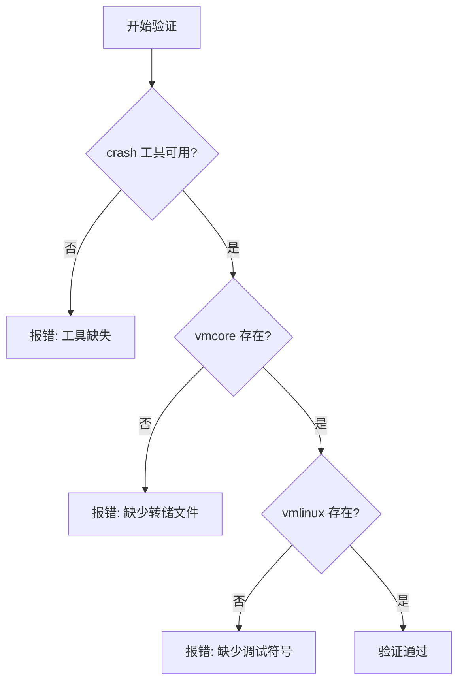
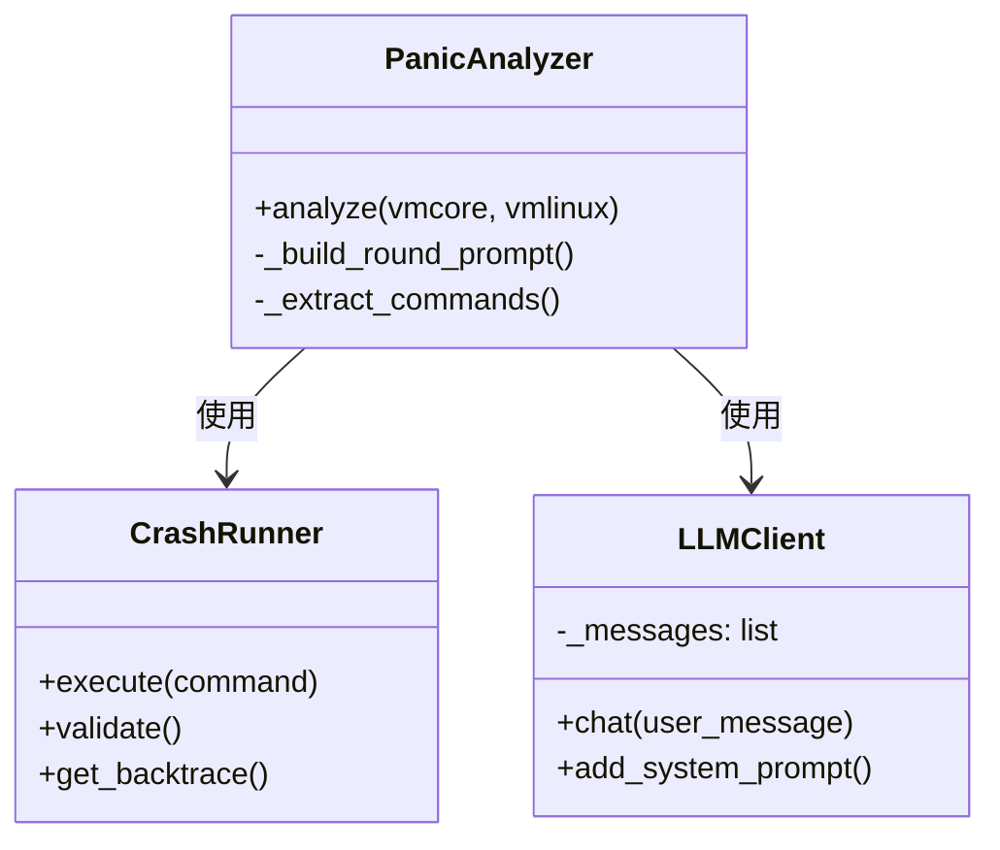
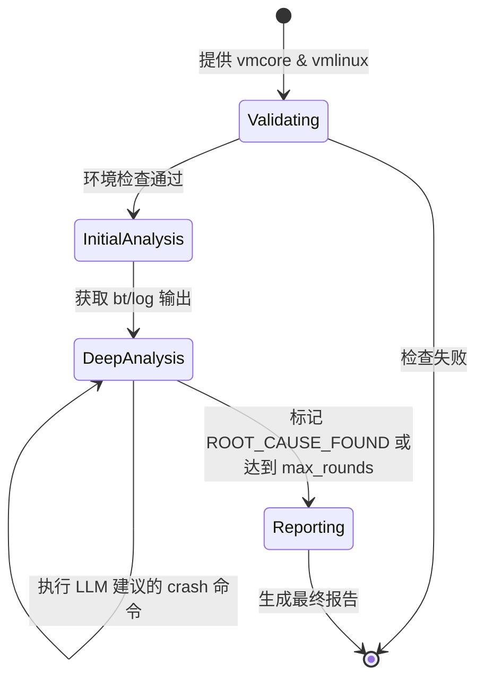
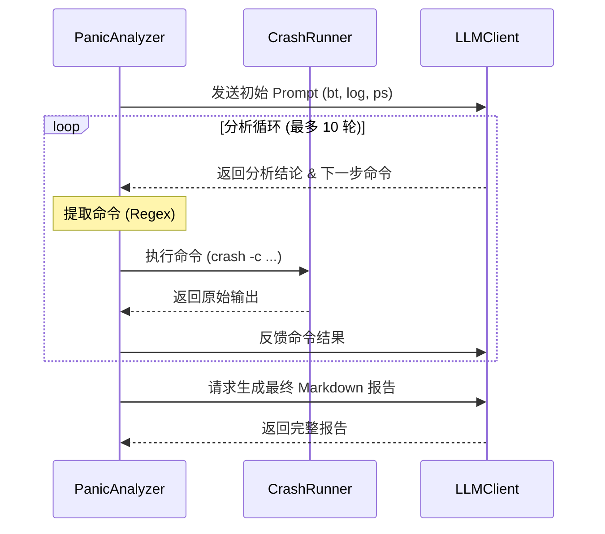
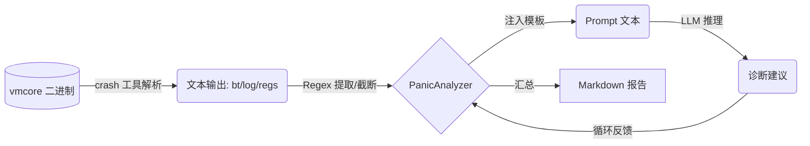

# 内核崩溃分析专项

## 目录

1. [模块概览](#模块概览)
2. [引言](#引言)
3. [环境准备](#环境准备)
   - [基础工具安装](#基础工具安装)
   - [调试符号 (debuginfo) 的重要性](#调试符号-debuginfo-的重要性)
   - [环境验证流程](#环境验证流程)
4. [核心组件实现深度解析](#核心组件实现深度解析)
   - [PanicAnalyzer：多轮对话的状态机](#panicanalyzer多轮对话的状态机)
   - [CrashRunner：内核数据的搬运工](#crashrunner内核数据的搬运工)
   - [LLMClient：轻量级推理引擎](#llmclient轻量级推理引擎)
5. [自动化分析工作流](#自动化分析工作流)
   - [分析轮次的状态迁移](#分析轮次的状态迁移)
   - [多轮迭代的闭环逻辑](#多轮迭代的闭环逻辑)
   - [命令提取的启发式算法](#命令提取的启发式算法)
   - [上下文窗口的管理策略](#上下文窗口的管理策略)
6. [LLM 诊断逻辑与提示词工程](#llm-诊断逻辑与提示词工程)
   - [角色演化：从通用模型到内核专家](#角色演化从通用模型到内核专家)
   - [提示词模板的结构化设计](#提示词模板的结构化设计)
7. [数据流与转换过程](#数据流与转换过程)
8. [实战案例：空指针解引用分析](#实战案例空指针解引用分析)
   - [场景描述](#场景描述)
   - [原始 Crash 输出与 AI 交互过程](#原始-crash-输出与-ai-交互过程)
   - [AI 诊断报告深度解读](#ai-诊断报告深度解读)
9. [报告解读与修复建议](#报告解读与修复建议)
10. [错误处理与故障排除](#错误处理与故障排除)
11. [文件参考](#文件参考)

## 模块概览

`oscopilot/panic/` 模块是 oscopilot 针对 Linux 内核崩溃（Kernel Panic）场景打造的高级自动化诊断工具。它将传统的内核调试经验与 LLM 的推理能力相结合，解决了内核分析门槛高、耗时长的问题。

- **总文件数**: 5 个 Python 源文件。
- **核心文件**:
  - `analyzer.py`: 核心逻辑调度，实现多轮分析循环。
  - `crash_runner.py`: 封装 `crash` 工具，处理底层命令执行。
  - `llm_client.py`: 独立的 LLM 通信模块，支持多轮对话上下文。
  - `prompts.py`: 存储针对内核调试优化的 Prompt 模板。
- **覆盖范围**: 本章节将从环境搭建、代码实现、算法逻辑到实战案例，全方位解析该模块的工作原理。

## 引言

内核崩溃（Kernel Panic）是 Linux 系统中最严重的故障形式，通常意味着内核检测到了无法恢复的错误。传统的分析流程依赖于运维人员手动执行 `crash` 命令（如 `bt`, `log`, `struct`），并凭借经验在数万行的内核源码中寻找蛛丝马迹。

`oscopilot/panic/` 模块通过“AI 代理”模式改变了这一现状。它不再仅仅是一个命令执行工具，而是一个具备“分析-尝试-再分析”能力的闭环系统。它能像人类专家一样，根据第一轮 `bt` 的输出发现可疑的函数，再决定是否查看寄存器或反汇编代码。这种启发式的分析方法极大地提高了定位根因的准确率。

## 环境准备

在运行内核分析之前，必须配置好底层的工具链和数据文件。

### 基础工具安装

`crash` 工具是分析 `vmcore` 的核心。它本质上是一个增强版的 `gdb`，能够识别内核的各种复杂数据结构。

```bash
# 在 Debian/Ubuntu 系统上
sudo apt-get update && sudo apt-get install -y crash

# 在 RHEL/CentOS 系统上
sudo yum install -y crash
```

### 调试符号 (debuginfo) 的重要性

没有调试符号的 `vmcore` 就像是一本没有索引的字典。`vmlinux` 文件包含了内核的所有函数名、变量名以及结构体定义。

> ⚠️ **警告**: `vmlinux` 必须与产生 `vmcore` 的内核版本严格一致。即使是微小的版本差异（如补丁号不同）也会导致符号偏移，从而产生错误的分析结果。

### 环境验证流程

在启动分析前，`CrashRunner` 会进行严格的环境自检。

```python
# crash_runner.py:L49-L62
def validate(self) -> List[str]:
    """验证环境，返回错误信息列表。"""
    errors = []
    if not self.is_available:
        errors.append("crash 工具未安装或不在 PATH 中")
    if not self.vmcore_exists:
        errors.append(f"vmcore 文件不存在: {self._vmcore_path}")
    if not self.vmlinux_exists:
        errors.append(f"vmlinux 文件不存在: {self._vmlinux_path}")
    return errors
```

下图展示了环境验证的决策逻辑：



验证流程确保了后续分析不会因为基础文件的缺失而中断。如果验证失败，`PanicAnalyzer` 将直接返回错误报告，避免浪费 LLM 的 Token。

## 核心组件实现深度解析

本模块采用典型的“三层架构”：接口层（Analyzer）、工具层（Runner）、通信层（LLMClient）。

### PanicAnalyzer：多轮对话的状态机

`PanicAnalyzer` 使用数据类（Dataclass）来记录分析的每一个步骤，这为后续生成报告提供了结构化数据。

```python
# analyzer.py:L27-L47
@dataclass
class AnalysisStep:
    """单步分析记录。"""
    round: int
    command: str
    output: str
    llm_analysis: str
    timestamp: str = field(default_factory=now_iso)

@dataclass
class AnalysisResult:
    """分析结果。"""
    success: bool
    root_cause: str = ""
    summary: str = ""
    steps: List[AnalysisStep] = field(default_factory=list)
    report: str = ""
    error: str = ""
```

这种结构化设计允许系统追溯每一轮的决策依据，例如“为什么在第 3 轮决定执行 `struct task_struct`”。

### CrashRunner：内核数据的搬运工

`CrashRunner` 的核心任务是管理 `crash` 进程的生命周期。为了防止某些复杂的命令（如全内存搜索）导致系统挂起，它设置了严格的超时机制。

```python
# crash_runner.py:L90-L104
try:
    proc = subprocess.run(
        cmd,
        capture_output=True,
        text=True,
        timeout=timeout,
        encoding="utf-8",
    )
    output = proc.stdout
    if proc.returncode != 0:
        if "ERROR" in output or "error" in output.lower():
            raise CrashRunnerError(f"crash 命令执行失败: {output.strip()}")
    return output.strip()
```

### LLMClient：轻量级推理引擎

`LLMClient` 实现了简单的对话历史管理，它将 `system`、`user` 和 `assistant` 的消息按序排列，构建成符合 OpenAI 标准的请求体。

```python
# llm_client.py:L69-L82
response = requests.post(
    f"{self._base_url}/chat/completions",
    headers={
        "Authorization": f"Bearer {self._api_key}",
        "Content-Type": "application/json",
    },
    json={
        "model": self._model,
        "messages": self._messages,
        "temperature": 0.3,  # 低温度确保分析的确定性
        "max_tokens": 4096,
    },
    timeout=self._timeout,
)
```

**组件类图**:



`PanicAnalyzer` 组合了两个下层组件，通过 `analyze` 方法驱动整个流程。

## 自动化分析工作流

### 分析轮次的状态迁移

分析过程可以看作是一个有限状态机，从初始验证开始，经过多轮循环探索，最终生成报告。



### 多轮迭代的闭环逻辑

分析流程是一个典型的反馈回路（Feedback Loop）。LLM 扮演“观察者”和“决策者”，而 `CrashRunner` 扮演“执行者”。



### 命令提取的启发式算法

由于 LLM 的输出是不可控的文本，`PanicAnalyzer` 采用了一套启发式正则匹配逻辑。

```python
# analyzer.py:L214-L252
def _extract_commands(self, text: str) -> List[str]:
    commands = []
    # 优先匹配代码块
    code_blocks = re.findall(r'```(?:bash|shell|crash)?\n?(.*?)```', text, re.DOTALL)
    # 其次匹配特定中文标签
    next_cmd_match = re.search(r'【下一步命令】[:：]\s*\n*(.*?)(?=【|$)', text, re.DOTALL)
    # 最后兜底匹配像 crash 命令的行 (bt, log, ps...)
    if not commands:
        for line in text.split('\n'):
            if re.match(r'^(bt|log|ps|regs|struct|dis|kmem|search)\b', line.strip()):
                commands.append(line.strip())
    return commands
```

### 上下文窗口的管理策略

为了保持对话的连贯性同时避免 Token 溢出，`PanicAnalyzer` 实现了精细的上下文构建逻辑。

```python
# analyzer.py:L196-L212
def _build_round_prompt(self, round_num: int, max_rounds: int) -> str:
    """构建当前轮次的提示词。"""
    if round_num == 1:
        return INITIAL_ANALYSIS_PROMPT

    # 后续轮次：汇总已知信息
    known_info_text = "\n".join(self._known_info[-10:])  # 最近 10 条
    recent_outputs = []
    for step in self._analysis_steps[-3:]:  # 最近 3 步
        recent_outputs.append(f"命令: {step.command}\n输出: {step.output[:200]}")

    return ROUND_ANALYSIS_PROMPT.format(
        round=round_num,
        max_rounds=max_rounds,
        known_info=known_info_text,
        crash_output="\n\n".join(recent_outputs) if recent_outputs else "暂无历史输出",
    )
```

## LLM 诊断逻辑与提示词工程

### 角色演化：从通用模型到内核专家

通过 `SYSTEM_PROMPT`，我们强制模型进入“资深内核专家”的角色。这种角色设定不仅改变了回复的语气，更重要的是它激活了模型内部关于内核数据结构（如 `sk_buff`, `task_struct`）的先验知识。

### 提示词模板的结构化设计

提示词采用了结构化标签（如 `【分析结论】`、`【下一步命令】`），这不仅方便程序解析，也引导模型进行逻辑思考。


## 数据流与转换过程

分析过程涉及从二进制数据到结构化报告的多次转换。



## 实战案例：空指针解引用分析

### 场景描述

一个自定义内核模块在处理 IOCTL 时发生了 Oops。

### 原始 Crash 输出与 AI 交互过程

**第 1 轮**: 自动执行 `bt`。
输出显示：`RIP: my_driver_ioctl+0x45`, `RAX: 0000000000000000`。

**第 2 轮**: AI 观察到 `RAX` 为 0，怀疑是空指针。
AI 命令：`dis my_driver_ioctl+0x40 0x50`。
输出显示：`mov rax, [rax+0x10]` —— 典型的空指针解引用汇编指令。

**第 3 轮**: AI 确认为空指针解引用，标记 `ROOT_CAUSE_FOUND`。

### AI 诊断报告深度解读

最终报告会包含以下四个关键部分：
1. **崩溃概要**: 明确指出是 `NULL pointer dereference`。
2. **根因分析**: 解释了为什么 `RAX` 会是 0（例如未检查用户态传入的指针）。
3. **证据链**: 引用了 `bt` 中的 `RIP` 和 `dis` 中的汇编指令。
4. **修复建议**: 给出具体的 C 代码修改建议，如 `if (!ptr) return -EFAULT;`。

## 报告解读与修复建议

AI 生成的报告具有极高的参考价值：
- **对于初学者**: 它是一个学习工具，解释了复杂的调用栈。
- **对于专家**: 它是一个加速工具，自动完成了繁琐的数据收集工作。

> 💡 **专家建议**: 虽然 AI 报告非常准确，但在合并内核补丁前，仍建议人工核实 AI 提到的内存地址和结构体成员。

## 错误处理与故障排除

| 错误类型 | 错误信息示例 | 解决方案 |
| :--- | :--- | :--- |
| 环境错误 | `crash 工具未安装` | 参考“环境准备”章节安装基础工具 |
| 执行超时 | `crash 命令超时（30秒）` | 检查系统 IO 负载，或在 `analyzer.py` 中增加超时时间 |
| 逻辑错误 | `ROOT_CAUSE_FOUND` 误报 | 增加 `max_rounds`，或在提示词中强调“严谨性” |
| 解析错误 | `命令执行失败: struct ...` | 检查 `vmlinux` 是否包含该结构体的调试信息 |

## 文件参考

- [oscopilot/panic/analyzer.py](oscopilot/panic/analyzer.py): 核心调度器，实现了多轮迭代逻辑。
- [oscopilot/panic/crash_runner.py](oscopilot/panic/crash_runner.py): `crash` 工具封装，处理子进程调用。
- [oscopilot/panic/llm_client.py](oscopilot/panic/llm_client.py): 独立 LLM 客户端，支持 OpenAI 兼容接口。
- [oscopilot/panic/prompts.py](oscopilot/panic/prompts.py): 包含系统提示词、初始诊断和深度分析模板。

**Section sources**:
- [analyzer.py](oscopilot/panic/analyzer.py)
- [crash_runner.py](oscopilot/panic/crash_runner.py)
- [llm_client.py](oscopilot/panic/llm_client.py)
- [prompts.py](oscopilot/panic/prompts.py)
