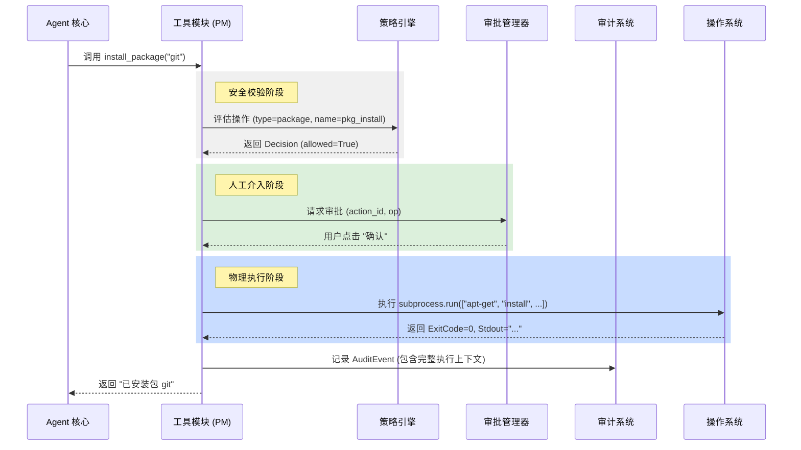
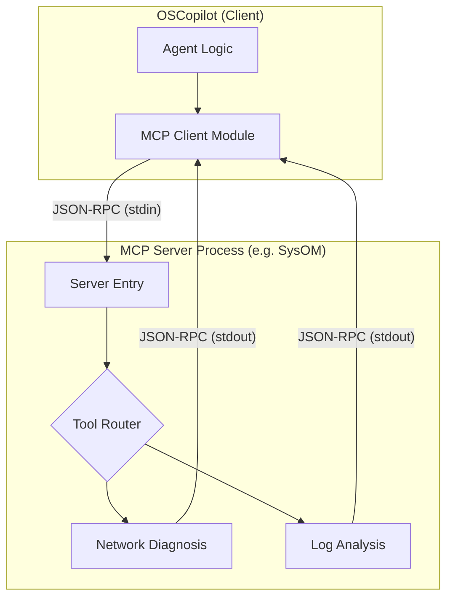

# 内置工具集与 MCP 扩展

## 目录
1. [模块概览](#模块概览)
2. [核心组件详解](#核心组件详解)
   - [文件系统工具 (files.py)](#文件系统工具-filespy)
   - [软件包管理 (package_manager.py)](#软件包管理-packagemanagerpy)
   - [系统监控与信息 (system_info.py)](#系统监控与信息-systeminfopy)
   - [Systemd 服务管理 (systemd_tools.py)](#systemd-服务管理-systemdtoolspy)
   - [MCP 客户端扩展 (mcp_client.py)](#mcp-客户端扩展-mcpclientpy)
3. [架构设计与工具执行流](#架构设计与工具执行流)
4. [数据模型与契约](#数据模型与契约)
5. [API 接口规范与详细示例](#api-接口规范与详细示例)
6. [MCP 集成与配置深度指南](#mcp-集成与配置深度指南)
7. [扩展性指南：如何开发自定义工具](#扩展性指南如何开发自定义工具)
8. [安全性、审计与风险控制](#安全性审计与风险控制)
9. [性能考量与最佳实践](#性能考量与最佳实践)
10. [关键源文件引用](#关键源文件引用)

## 模块概览

`oscopilot/tools/` 目录是整个 oscopilot 框架的“执行终端”。如果说 Agent 的大脑负责逻辑推理和决策，那么这个目录下的工具集就是 Agent 的“双手”，负责将决策转化为对操作系统的具体影响。

### 规模与范围
- **代码规模**: 包含 6 个核心功能模块，每个模块针对特定的系统领域。
- **功能覆盖**: 从基础的文件读写到复杂的软件包生命周期管理，再到现代化的 MCP 协议集成，构建了一个全方位的 Agent 能力矩阵。
- **设计哲学**: 坚持“安全第一”的原则。所有工具均不直接执行裸 shell 命令，而是通过封装好的函数，集成策略检查（Policy）、人工审批（Approval）和全量审计（Auditor）。

### 核心子模块职责
1.  **文件系统 (Files)**: 处理文件的查看、追加和编辑。它是最基础的能力，常用于配置文件修改和日志查看。
2.  **包管理 (Package Manager)**: 屏蔽了 Linux 发行版之间的差异，提供统一的安装和搜索接口。
3.  **系统信息 (System Info)**: 提供实时的性能指标，帮助 Agent 了解当前环境的资源占用情况。
4.  **服务管理 (Systemd)**: 允许 Agent 像系统管理员一样管理后台服务。
5.  **MCP 客户端 (MCP Client)**: 这是一个高度可扩展的接口，允许 Agent 突破本地限制，调用远程或第三方提供的工具服务。

## 核心组件详解

### 文件系统工具 (files.py)

在 Agent 与系统交互的过程中，文件操作是最频繁也最危险的行为之一。`files.py` 通过引入“审计意识”解决了这一问题。

- **安全读取 (`view_file`)**: 
  该函数通过 `Path.read_text` 安全地读取文件。为了防止 Agent 试图读取数 GB 的日志文件导致 OOM（内存溢出），代码中硬编码了 `_MAX_VIEW_SIZE = 1MB` 的限制。此外，它会自动记录一次“查看”事件到审计日志中，确保管理员知道 Agent 窥视了哪些敏感信息。
- **受控写入 (`append_line_with_approval`)**: 
  这是该模块中最复杂的逻辑。它不仅执行写入，还负责生成 **Unified Diff**。通过 `difflib.unified_diff`，它能清晰地展示修改前后的差异，并计算 `diff_hash`。这个哈希值贯穿了策略评估、审批和审计的整个生命周期，确保“所见即所写”。

### 软件包管理 (package_manager.py)

软件包管理通常需要高权限（root/sudo），因此其实现必须异常谨慎。

- **多后端支持**: 
  通过私有函数 `_detect_pm()`，系统会在运行时动态检测 `apt-get`、`dnf` 或 `yum`。这种设计使得 oscopilot 能够无缝运行在 Ubuntu、CentOS、Fedora 等多种主流 Linux 发行版上。
- **命令清洗**: 
  所有生成的 shell 命令在执行前都会经过 `sanitize_str_list` 的清洗。这意味着即使 Agent 试图通过包名注入恶意参数（如 `nginx; rm -rf /`），也会在清洗阶段被拦截。

### 系统监控与信息 (system_info.py)

为了避免频繁调用 `top` 或 `ps` 等外部命令带来的开销，`system_info.py` 深度集成了 `psutil` 库。

- **指标聚合**: 
  `cpu_load_and_top_processes` 函数巧妙地结合了系统负载和进程列表。它不仅返回 1/5/15 分钟的平均负载，还会根据 `cpu_percent` 对进程进行倒序排列，返回前 N 个“性能杀手”。这为 Agent 提供了极佳的诊断视野。

### Systemd 服务管理 (systemd_tools.py)

服务管理是系统运维的核心。该模块将复杂的 `systemctl` 命令封装为简单的 Python 函数。

- **状态感知**: `systemctl_status` 允许 Agent 判断某个服务（如 MySQL 或 Docker）是否正在运行，从而决定是否需要采取修复措施。
- **原子操作**: 启动、停止和重启被抽象为统一的 `_systemctl_change` 内部逻辑，确保了代码的复用性和一致的审批流。

### MCP 客户端扩展 (mcp_client.py)

MCP 是 oscopilot 迈向开放生态的关键步骤。

- **JSON-RPC 桥接**: 
  `MCPClient` 类实现了一个精简的 JSON-RPC 客户端。它通过 `subprocess.Popen` 启动 MCP 服务器进程，并利用 `stdin/stdout` 进行双向通信。这种“进程间通信”模式既保证了隔离性，又提供了极高的灵活性。
- **动态发现**: 通过 `get_mcp_client` 辅助函数，系统可以根据配置名称动态实例化客户端，支持同时连接多个不同的 MCP 服务器。

## 架构设计与工具执行流

oscopilot 的工具执行架构是一个典型的“中间件”模式。

### 交互序列图

下面的序列图展示了当 Agent 尝试安装一个软件包时，系统内部各组件是如何协作的：



**执行流深度解析**：
1.  **上下文注入**: 所有的工具函数第一个参数都是 `AppContext`。这不仅是为了获取配置，更是为了将当前的 `actor`（操作者）和 `session_id` 传递给审计系统。
2.  **闭包延迟执行**: 注意到 `install_package` 内部定义了一个 `apply` 函数。这是一个闭包，它捕获了所有的执行参数。工具模块并不会立即执行它，而是将其作为回调传递给 `Approval Manager`。只有当人类用户在 UI 上点击确认后，这个闭包才会被触发。
3.  **防御性编程**: 在 `OS` 执行阶段，代码使用了 `check=False` 并手动检查 `returncode`。这比直接抛出异常更友好，允许工具捕获 `stderr` 并返回给 Agent 进行自我修复。

## 数据模型与契约

工具模块与系统其它部分通信主要依赖于 `Operation` 和 `AuditEvent` 两个核心数据结构。

### 操作模型 (Operation)
`Operation` 定义了“想要做什么”。它包含：
- `type`: 操作类型（如 `file_write`, `package`, `shell`）。
- `name`: 具体工具名。
- `args`: 字典格式的参数，如路径、包名或命令。

### 审计模型 (AuditEvent)
`AuditEvent` 记录了“实际做了什么”。它是合规性的核心：
- `action_id`: 唯一标识符，用于关联策略、审批和执行。
- `file_diff_hash`: 如果涉及文件修改，存储修改内容的哈希。
- `result_summary`: 对执行结果的简短描述。
- `stdout/stderr`: 完整的输出捕获。

## API 接口规范与详细示例

所有的工具函数都遵循统一的签名约定，这使得它们可以被 Agent 自动发现和调用。

### 1. 安全修改文件
**函数**: `append_line_with_approval(ctx, path, line)`
- **逻辑**: 读取文件 -> 生成 Diff -> 请求审批 -> 写入 -> 审计。
- **示例代码**:
  ```python
  # 向 /etc/hosts 添加一条记录
  ctx = AppContext(...)
  result = append_line_with_approval(ctx, "/etc/hosts", "127.0.0.1 test.local")
  # 结果将是 "Approved: 已写入 /etc/hosts..." 或 "Rejected"
  ```

### 2. 跨平台包搜索
**函数**: `search_package(ctx, name)`
- **逻辑**: 自动识别 `apt/yum/dnf` -> 执行搜索命令 -> 捕获输出。
- **输出示例**:
  ```text
  nginx - high-performance HTTP server and reverse proxy
  nginx-common - small, powerful, scalable web server
  ```

### 3. 获取实时系统画像
**函数**: `cpu_load_and_top_processes(ctx, limit=5)`
- **逻辑**: 调用 `psutil` 获取负载 -> 遍历进程树 -> 排序并截断。
- **价值**: 相比执行 `ps aux`，这种方式更节省资源，且输出格式固定，易于 LLM 解析。

## MCP 集成与配置深度指南

MCP (Model Context Protocol) 是 oscopilot 的核心扩展机制。它允许开发者用任何语言（Go, Node.js, Rust）编写工具服务器，只要它们遵循 MCP 的标准。

### MCP 通信拓扑



### 详细配置说明
在 `config.yaml` 中，MCP 服务器的配置非常灵活：

```yaml
mcp:
  servers:
    my_remote_tool:
      command: "node" # 启动命令
      args: ["/path/to/server.js"] # 启动参数
      env: # 环境变量，常用于传递 API Key
        DEBUG: "mcp:*"
      cwd: "/working/dir" # 工作目录
```

### 为什么使用 MCP？
- **语言无关**: 你可以用 Python 之外的语言编写复杂的工具。
- **解耦**: 工具服务器可以独立升级，不影响 Agent 核心。
- **生态复用**: 可以直接使用 Anthropic 或社区发布的标准 MCP 服务器。

## 扩展性指南：如何开发自定义工具

oscopilot 鼓励用户根据自己的业务场景扩展工具集。

### 开发三部曲

1.  **定义逻辑**: 在 `oscopilot/tools/` 下创建新函数。务必使用 `ensure_no_invisible` 校验用户输入的路径或字符串。
2.  **集成策略与审批**: 
    - 如果是只读操作（如 `ls`），只需调用 `ctx.policy.evaluate`。
    - 如果是写操作（如 `rm`），必须使用 `ctx.approval.request_approval`。
3.  **完善审计**: 确保在函数返回前，调用 `ctx.auditor.log_event` 记录执行结果。

### 示例：添加一个“清理临时文件”的工具

```python
def cleanup_tmp_files(ctx: AppContext, pattern: str) -> str:
    # 1. 构造操作对象
    op = Operation(type="shell", name="cleanup_tmp", args={"pattern": pattern})
    
    # 2. 策略评估
    if not ctx.policy.evaluate(op).allowed:
        raise PermissionError("策略禁止清理操作")
        
    # 3. 定义执行闭包
    def do_cleanup():
        import glob, os
        files = glob.glob(f"/tmp/{pattern}")
        for f in files: os.remove(f)
        return f"已清理 {len(files)} 个文件"
        
    # 4. 发起审批并执行
    return ctx.approval.request_approval(op, apply_fn=do_cleanup)
```

## 安全性、审计与风险控制

工具模块是安全攻防的第一线。oscopilot 在这里构建了三道防线：

### 第一道防线：输入净化 (Input Sanitization)
- **命令注入防护**: 通过 `sanitize_str_list`，所有的参数都被视为字面量，无法通过 `;` 或 `|` 进行命令拼接。
- **路径穿越防护**: `ensure_no_invisible` 会拦截包含 `..` 或不可见字符的路径。

### 第二道防线：最小权限原则 (Least Privilege)
- 工具模块支持在配置中关闭 `use_sudo`。
- 策略引擎可以细粒度地控制哪些 `Operation` 是允许的。例如，可以配置为“允许 Agent 安装软件，但禁止卸载软件”。

### 第三道防线：不可篡改的审计日志
- 每一个动作都会产生一个唯一的 `action_id`。
- 审计日志记录在独立的文件或数据库中，包含了操作前后的完整上下文，为事后溯源提供了坚实证据。

## 性能考量与最佳实践

在开发和使用工具时，应注意以下性能优化点：

- **避免阻塞**: 对于耗时较长的操作（如大文件的 `apt-get upgrade`），工具应通过 `subprocess` 的非阻塞模式或分段反馈进度。
- **结果缓存**: 对于不经常变动的系统信息（如 CPU 型号、内存总量），可以在 `AppContext` 中进行短时间的缓存。
- **资源限制**: 在执行 `view_file` 等操作时，务必保持对内存和文件描述符的严格控制。
- **精准报错**: 不要只返回 "Error"，而应返回具体的 `stderr` 内容。这能显著提高 LLM 的自我纠错（Self-Correction）成功率。

## 关键源文件引用

以下是本章节内容对应的核心代码实现，建议深入阅读以了解底层机制：

- [oscopilot/tools/files.py](oscopilot/tools/files.py): 包含 `view_file` 和 `append_line_with_approval` 的核心逻辑。
- [oscopilot/tools/package_manager.py](oscopilot/tools/package_manager.py): 跨发行版包管理器的抽象层。
- [oscopilot/tools/system_info.py](oscopilot/tools/system_info.py): 基于 `psutil` 的高效系统监控实现。
- [oscopilot/tools/systemd_tools.py](oscopilot/tools/systemd_tools.py): `systemctl` 的 Python 封装。
- [oscopilot/tools/mcp_client.py](oscopilot/tools/mcp_client.py): MCP 协议的 JSON-RPC 客户端实现。
- [oscopilot/utils.py](oscopilot/utils.py): 提供 `sanitize_str_list` 和 `ensure_no_invisible` 等安全基础设施。

**Section sources**:
- [oscopilot/tools/files.py](oscopilot/tools/files.py)
- [oscopilot/tools/package_manager.py](oscopilot/tools/package_manager.py)
- [oscopilot/tools/system_info.py](oscopilot/tools/system_info.py)
- [oscopilot/tools/systemd_tools.py](oscopilot/tools/systemd_tools.py)
- [oscopilot/tools/mcp_client.py](oscopilot/tools/mcp_client.py)
- [oscopilot/utils.py](oscopilot/utils.py)
