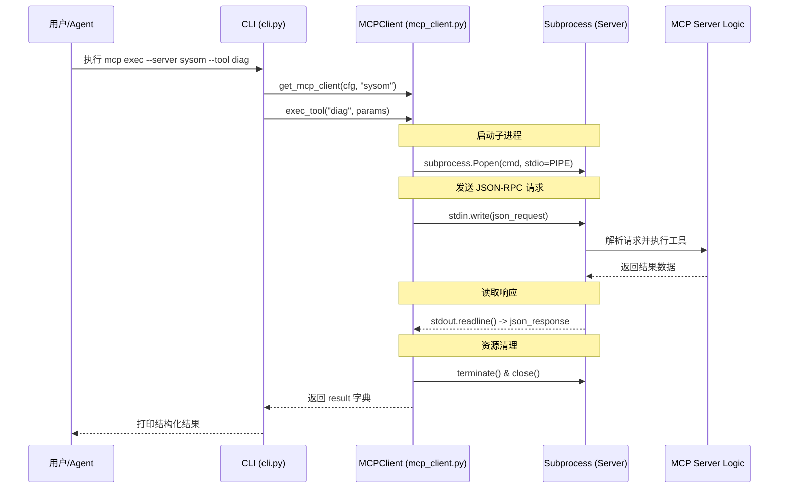
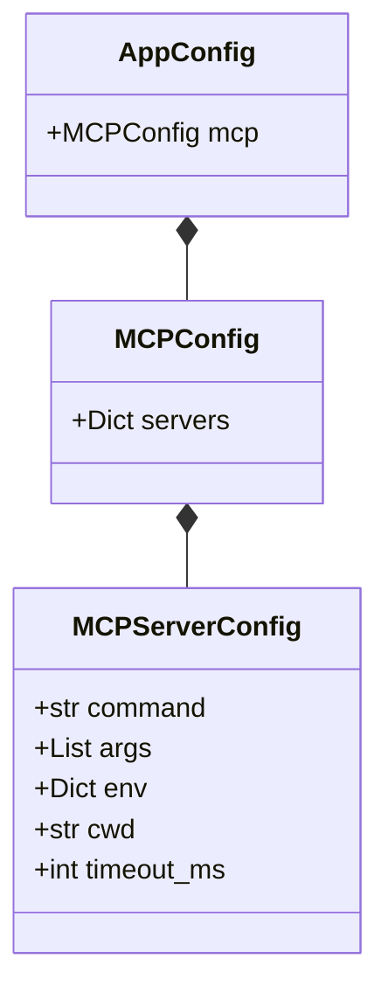
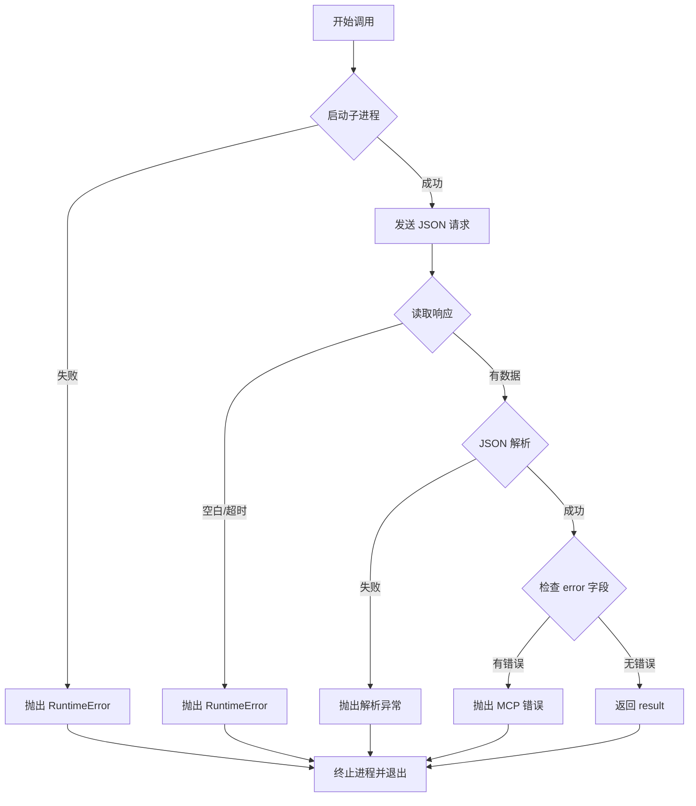

# MCP 协议集成指南

## 目录
1. [模块概览](#模块概览)
2. [MCP 协议在 oscopilot 中的角色](#mcp-协议在-oscopilot-中的角色)
3. [MCP 客户端实现深度剖析](#mcp-客户端实现深度剖析)
   - [基于 stdio 的 JSON-RPC 通信](#基于-stdio-的-json-rpc-通信)
   - [进程生命周期管理](#进程生命周期管理)
4. [工具发现与调用流程](#工具发现与调用流程)
   - [交互序列图](#交互序列图)
   - [从 Agent 到 MCP 的映射](#从-agent-到-mcp-的映射)
5. [配置指南](#配置指南)
   - [config.yaml 参数详述](#configyaml-参数详述)
   - [环境变量与工作目录](#环境变量与工作目录)
6. [集成示例：SysOM MCP 服务器](#集成示例sysom-mcp-服务器)
7. [错误处理与资源清理](#错误处理与资源清理)
   - [超时机制](#超时机制)
   - [异常捕获与解析错误](#异常捕获与解析错误)
8. [核心组件](#核心组件)
9. [文件引用](#文件引用)

## 模块概览

在 `oscopilot` 的架构中，`oscopilot/tools/mcp_client.py` 扮演着“能力连接器”的关键角色。它通过实现 Model Context Protocol (MCP) 协议，使得 `oscopilot` 能够无缝集成外部开发的诊断工具和服务。

该模块虽然代码量精简（约 60 行 Python 代码），但其设计思想体现了高度的解耦与扩展性：
- **文件总数**: 1 个核心 Python 文件。
- **核心类**: `MCPClient`，负责与外部 MCP 服务器进行基于标准输入输出（stdio）的 JSON-RPC 通信。
- **覆盖范围**: 涵盖了从配置加载、客户端实例化到工具远程执行的全流程。

通过 MCP 客户端，`oscopilot` 不再局限于本地内置的 `files.py` 或 `system_info.py` 等工具，而是可以调用由 Go、Node.js、Rust 等任何语言编写的专业诊断服务器（如 SysOM），极大地丰富了 Agent 的“工具箱”。

**Section sources**:
- [oscopilot/tools/mcp_client.py](oscopilot/tools/mcp_client.py)

## MCP 协议在 oscopilot 中的角色

Model Context Protocol (MCP) 是由 Anthropic 提出的一种开放标准，旨在标准化 AI 模型与外部数据源、工具之间的交互。在 `oscopilot` 这一面向 Linux 运维的 Agent 框架中，MCP 的引入解决了以下核心痛点：

1.  **语言无关性**: 许多专业的 Linux 诊断工具（如基于 eBPF 的监控）可能使用 C 或 Go 编写。通过 MCP，这些工具可以封装为独立的服务器进程，`oscopilot` 只需通过标准协议与其通信，无需进行复杂的跨语言绑定。
2.  **环境隔离**: MCP 服务器运行在独立的子进程中。这种隔离机制确保了即使外部工具发生崩溃或内存泄漏，也不会直接导致 `oscopilot` 主进程挂掉，增强了系统的健壮性。
3.  **动态扩展**: 用户只需在 `config.yaml` 中添加几行配置，即可引入一套全新的诊断能力。这种“插拔式”的设计使得 `oscopilot` 能够快速适应不同的运维场景，如内核分析、网络排查或数据库调优。

在 `oscopilot` 中，MCP 客户端被定位为一个“轻量级网桥”。它不负责复杂的逻辑推理，只负责将 Agent 的调用意图准确地翻译成 MCP 规范的 JSON-RPC 请求，并捕获服务器的返回结果。

**Section sources**:
- [oscopilot/tools/mcp_client.py](oscopilot/tools/mcp_client.py)

## MCP 客户端实现深度剖析

`oscopilot` 的 MCP 客户端实现采用了最基础但也最可靠的 **JSON-RPC over stdio** 模式。这种模式不需要复杂的网络编程（如 Socket 或 HTTP），仅依赖于操作系统的管道（Pipe）机制。

### 基于 stdio 的 JSON-RPC 通信

`MCPClient.exec_tool` 方法是通信的核心。当调用该方法时，它会构造一个符合 JSON-RPC 2.0 规范的请求对象。

```python
req = {
    "jsonrpc": "2.0",
    "id": 1,
    "method": tool,
    "params": params,
}
```

这个请求包含了：
- `jsonrpc`: 协议版本号。
- `id`: 请求标识符，用于匹配响应。
- `method`: 远程工具的名称。
- `params`: 传递给工具的参数字典。

### 进程生命周期管理

目前的实现采用了一种“单次调用（One-shot）”的策略。这意味着对于每一次工具执行，客户端都会经历“启动进程 -> 发送请求 -> 获取响应 -> 终止进程”的完整周期。

这种设计的优缺点非常明显：
- **优点**: 实现极其简单，无需维护长连接的心跳、重连等复杂逻辑；每个工具执行环境都是干净的，不存在状态污染。
- **缺点**: 对于频繁调用的场景，频繁创建子进程会带来一定的系统开销。但在典型的诊断场景（如每分钟执行几次诊断）中，这种开销是可以接受的。

客户端使用 `subprocess.Popen` 来启动服务器，并通过 `stdin.write` 和 `stdout.readline` 完成数据交换。

**Section sources**:
- [oscopilot/tools/mcp_client.py:L14-L52](oscopilot/tools/mcp_client.py#L14-L52)

## 工具发现与调用流程

了解工具是如何从配置转化为可执行能力的，对于排查集成问题至关重要。

### 交互序列图

下面的序列图展示了当用户通过 CLI 或 Agent 发起一个 MCP 工具调用时，系统内部的流转过程：



该流程始于 `cli.py` 中的 `mcp_exec` 命令。它首先根据配置文件获取对应的 `MCPClient` 实例，然后调用 `exec_tool`。在 `exec_tool` 内部，`subprocess` 模块负责与外部世界建立联系。这种流水线式的处理保证了调用的原子性。

### 从 Agent 到 MCP 的映射

在 `oscopilot` 的高级用法中，Agent 会根据 LLM 的意图自动选择工具。虽然当前的 `mcp_client.py` 提供了底层执行能力，但将其暴露给 Agent 还需要在 `AppContext` 中进行注册。

当 Agent 扫描可用工具时，它会读取 `config.yaml` 中的 `mcp.servers` 部分。每一个配置好的服务器都会被视为一个潜在的能力来源。Agent 会通过 MCP 协议中的 `list_tools`（虽然当前简易客户端直接由用户指定 method）来了解服务器提供的具体功能。

**Section sources**:
- [oscopilot/cli.py:L61-L103](oscopilot/cli.py#L61-L103)
- [oscopilot/tools/mcp_client.py:L55-L58](oscopilot/tools/mcp_client.py#L55-L58)

## 配置指南

要启用 MCP 功能，必须在 `oscopilot` 的全局配置文件 `config.yaml` 中定义 `mcp` 段落。

### config.yaml 参数详述

配置结构如下所示，它由 `AppConfig` 类中的 `mcp` 字段映射：



每个服务器配置包含以下关键项：
- **`command`**: 启动 MCP 服务器的可执行程序路径（如 `python`, `node`, `uv`）。
- **`args`**: 传递给启动命令的参数列表。对于 Python 编写的服务器，通常包含脚本路径和 `--stdio` 标志。
- **`env`**: 注入子进程的环境变量。这对于传递 API 密钥或调试开关非常有用。
- **`cwd`**: 子进程的工作目录。如果服务器依赖于特定的本地资源，设置此项非常重要。
- **`timeout_ms`**: 调用超时时间（单位：毫秒）。

### 环境变量与工作目录

在集成复杂的诊断工具时，环境变量往往是配置的难点。`MCPClient` 在启动进程时，会将配置中的 `env` 与当前进程的环境变量合并，确保子进程拥有必要的运行上下文。

```yaml
mcp:
  servers:
    sysom_mcp:
      command: "uv"
      args: ["run", "python", "sysom_main_mcp.py", "--stdio"]
      env:
        SYSOM_API_KEY: "your-secret-key"
      cwd: "/opt/sysom-tools"
```

**Section sources**:
- [oscopilot/config.py:L49-L60](oscopilot/config.py#L49-L60)
- [oscopilot/config.py:L152-L163](oscopilot/config.py#L152-L163)

## 集成示例：SysOM MCP 服务器

SysOM 是一个强大的操作系统运维平台。将其集成到 `oscopilot` 中，可以让 Agent 具备深度内核诊断能力。

**步骤 1：准备服务器脚本**
假设你有一个 `sysom_main_mcp.py`，它实现了 MCP 协议并提供了一个名为 `net_diag` 的工具。

**步骤 2：修改配置**
在 `~/.config/oscopilot/config.yaml` 中添加：
```yaml
mcp:
  servers:
    sysom:
      command: "python3"
      args: ["/path/to/sysom_main_mcp.py", "--stdio"]
```

**步骤 3：通过 CLI 测试调用**
```bash
oscopilot mcp exec sysom net_diag '{"host": "google.com"}'
```

**步骤 4：查看输出**
`oscopilot` 将启动 SysOM 进程，发送 JSON 请求，并输出如下结果：
```json
{
  "status": "success",
  "latency": "25ms",
  "packet_loss": "0%"
}
```

这个例子展示了如何通过简单的配置将复杂的网络诊断逻辑引入到 `oscopilot` 生态中。

**Section sources**:
- [oscopilot/cli.py:L61-L103](oscopilot/cli.py#L61-L103)

## 错误处理与资源清理

在分布式工具调用中，错误处理是保证系统可靠性的关键。`mcp_client.py` 在这方面做了多层防御。

### 超时机制

虽然当前的 `subprocess.Popen` 调用在 `MCPClient` 中没有直接应用 `timeout` 参数（配置中有 `timeout_ms` 但尚未在 `exec_tool` 中通过 `proc.wait(timeout=...)` 实现），但这是一个重要的扩展点。在实际生产环境中，建议增加对 `proc.stdout.readline()` 的超时控制，防止恶意工具导致 Agent 永久挂起。

### 异常捕获与解析错误

客户端对以下情况进行了显式处理：
1.  **解析失败**: 如果服务器返回的不是合法的 JSON，会抛出 `RuntimeError("MCP 响应解析失败: ...")`。
2.  **协议错误**: 如果响应中包含 `error` 字段，客户端会将其提取并作为 Python 异常抛出。
3.  **资源清理**: 无论调用成功与否，客户端都会执行 `proc.terminate()`。这确保了不会留下僵尸进程。



这种严谨的错误处理流程确保了 `oscopilot` 能够优雅地处理外部工具的各种异常状态。

**Section sources**:
- [oscopilot/tools/mcp_client.py:L41-L52](oscopilot/tools/mcp_client.py#L41-L52)

## 核心组件

以下是 `MCPClient` 的核心实现代码，展示了其简洁而高效的设计：

```python
@dataclass
class MCPClient:
    server_name: str
    server_cfg: MCPServerConfig

    def exec_tool(self, tool: str, params: Dict[str, Any]) -> Dict[str, Any]:
        # 1. 构造 JSON-RPC 请求
        req = {
            "jsonrpc": "2.0",
            "id": 1,
            "method": tool,
            "params": params,
        }
        
        # 2. 准备启动命令与环境
        cmd = [self.server_cfg.command, *self.server_cfg.args]
        env = {**self.server_cfg.env, **{}}
        
        # 3. 启动子进程并建立管道
        proc = subprocess.Popen(
            cmd,
            stdin=subprocess.PIPE,
            stdout=subprocess.PIPE,
            stderr=subprocess.PIPE,
            text=True,
            cwd=self.server_cfg.cwd or None,
            env=env or None,
        )
        
        # 4. 数据交互
        assert proc.stdin and proc.stdout
        proc.stdin.write(json.dumps(req) + "\n")
        proc.stdin.flush()
        line = proc.stdout.readline()
        
        # 5. 资源清理
        proc.stdin.close()
        proc.terminate()
        
        # 6. 结果解析与错误检查
        if not line:
            raise RuntimeError("MCP 服务器未返回数据")
        resp = json.loads(line)
        if "error" in resp:
            raise RuntimeError(f"MCP 错误: {resp['error']}")
        return resp.get("result") or {}
```

> 💡 **提示**: 在生产环境中集成时，务必确保 MCP 服务器脚本具有可执行权限，并且其依赖的运行环境（如 Python 虚拟环境）已正确配置在 `command` 或 `env` 中。

**Section sources**:
- [oscopilot/tools/mcp_client.py:L14-L52](oscopilot/tools/mcp_client.py#L14-L52)

## 文件引用

本指南涉及的关键源代码文件如下：

- [oscopilot/tools/mcp_client.py](oscopilot/tools/mcp_client.py): MCP 客户端的核心实现。
- [oscopilot/config.py](oscopilot/config.py): 定义了 MCP 相关的配置数据结构。
- [oscopilot/cli.py](oscopilot/cli.py): 提供了通过命令行调用 MCP 工具的入口。
- [oscopilot/utils.py](oscopilot/utils.py): 提供了输入净化工具，确保工具调用的安全性。

**Section sources**:
- [oscopilot/tools/mcp_client.py](oscopilot/tools/mcp_client.py)
- [oscopilot/config.py](oscopilot/config.py)
- [oscopilot/cli.py](oscopilot/cli.py)
- [oscopilot/utils.py](oscopilot/utils.py)
