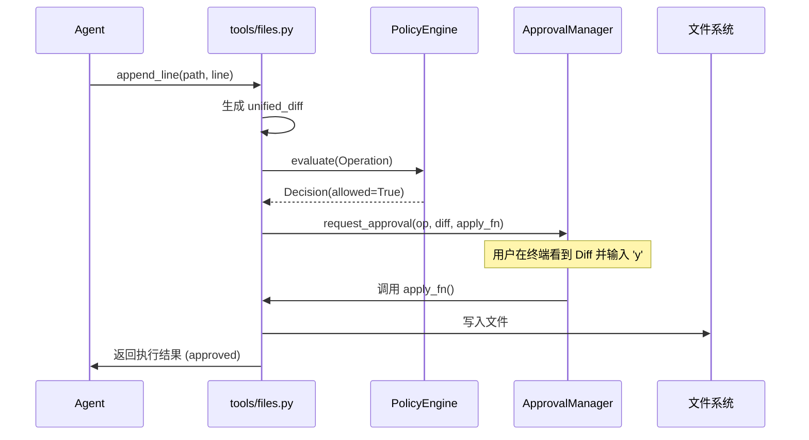
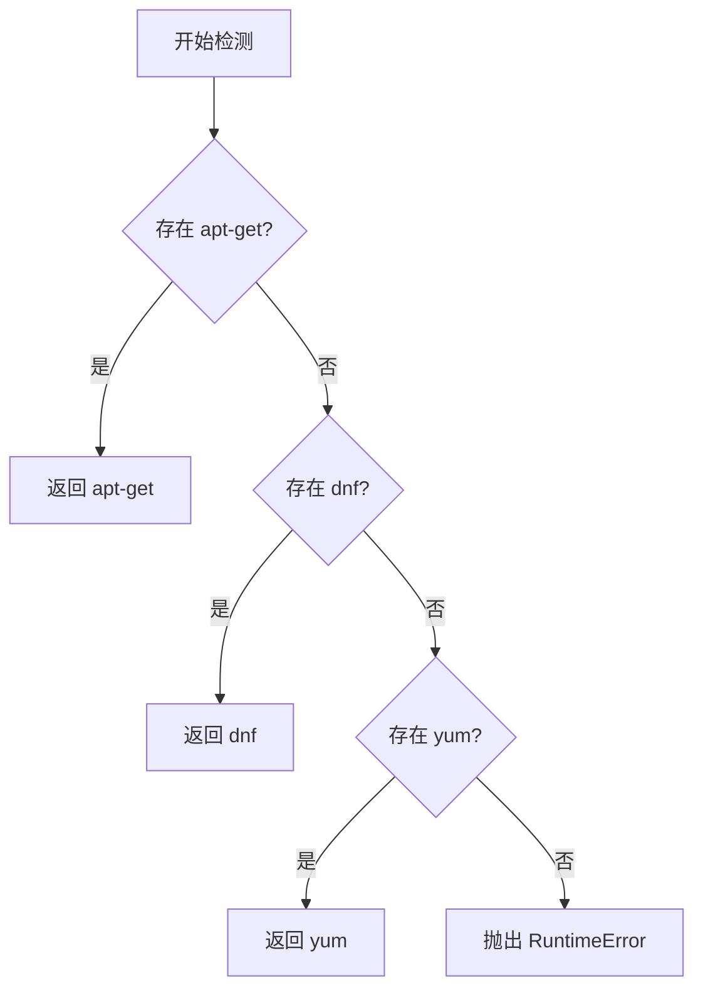
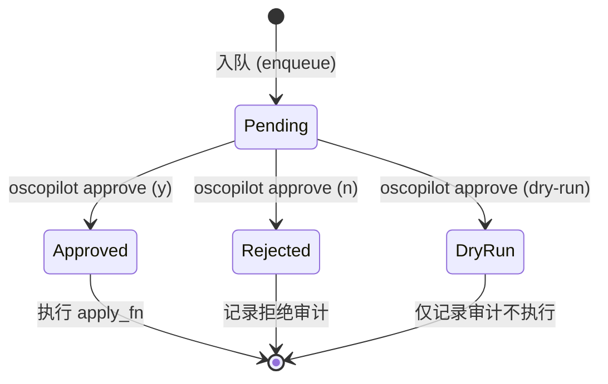
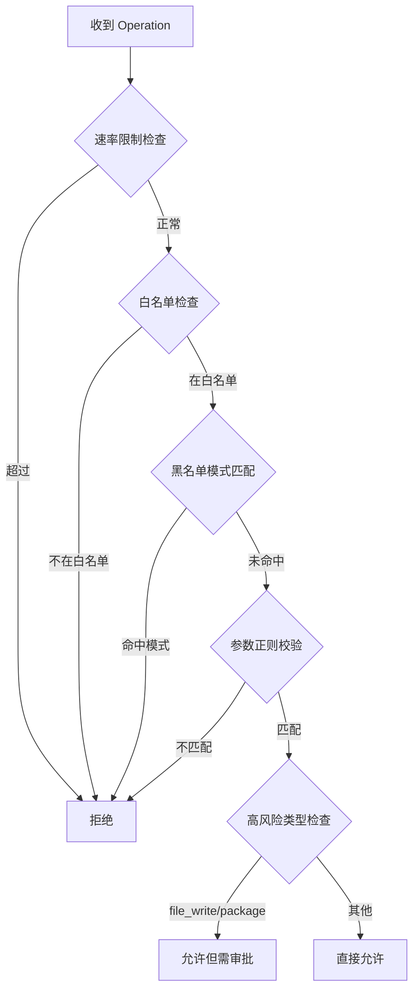

# 文件与包管理工具

## 目录
1. [模块概览](#模块概览)
2. [引言：安全第一的设计哲学](#引言安全第一的设计哲学)
3. [文件系统操作工具](#文件系统操作工具)
   - [文件查看：1MB 安全限制](#文件查看1mb-安全限制)
   - [安全编辑：Diff 预览与审批](#安全编辑diff-预览与审批)
   - [防御性检查：不可见字符过滤](#防御性检查不可见字符过滤)
4. [软件包管理工具](#软件包管理工具)
   - [跨发行版自动检测](#跨发行版自动检测)
   - [包搜索与安装逻辑](#包搜索与安装逻辑)
   - [Sudo 权限处理](#sudo-权限处理)
5. [核心机制：人工审批流](#核心机制人工审批流)
   - [审批模式：交互式与队列式](#审批模式交互式与队列式)
   - [审批生命周期与审计闭环](#审批生命周期与审计闭环)
6. [策略引擎与安全约束](#策略引擎与安全约束)
   - [操作评估流程](#操作评估流程)
   - [策略配置示例](#策略配置示例)
7. [文件参考](#文件参考)

## 模块概览

在 `oscopilot` 项目中，文件操作与包管理是 Agent 与操作系统交互最频繁且风险最高的两个领域。本模块通过严密的策略检查、强制的人工审批以及详尽的审计日志，构建了一个“安全第一”的操作环境。

**模块统计信息：**
- **核心文件数**：2 个工具实现文件（`files.py`, `package_manager.py`），4 个核心支撑文件。
- **主要子模块**：
  - `oscopilot.tools`：包含文件与包管理的具体工具实现。
  - `oscopilot.approval`：负责所有高风险操作的人工确认逻辑。
  - `oscopilot.policy`：定义操作是否允许及是否需要审批的准则。
- **覆盖范围**：本页面将深入分析文件读写、包管理命令映射、不可见字符防御以及完整的审批闭环流程。

## 引言：安全第一的设计哲学

`oscopilot` 的设计核心在于“人类作为最终决策者”。对于文件修改（`file_write`）和软件包安装（`package`）等具有持久化影响的操作，系统不提供“自动批准”模式。

这种设计哲学体现在：
1. **透明性**：在修改文件前生成 `unified_diff`，让用户清晰看到每一行的变化。
2. **防御性**：预先过滤可能导致提示词注入或欺骗的零宽字符。
3. **不可抵赖性**：每一个操作从策略评估到用户审批，再到执行结果，都会被 `AuditLogger` 记录。

## 文件系统操作工具

文件操作工具位于 `oscopilot/tools/files.py`，主要提供文件查看和带审批的内容追加功能。

### 文件查看：1MB 安全限制

为了防止 Agent 读取超大型文件（如日志文件或二进制数据）导致上下文溢出或内存崩溃，`view_file` 函数设置了 1MB 的硬性限制。

```python
_MAX_VIEW_SIZE = 1024 * 1024  # 1MB

def view_file(ctx: AppContext, path: str) -> str:
    ensure_no_invisible(path, field="path")
    p = Path(path)
    if not p.is_file():
        raise FileNotFoundError(f"文件不存在: {path}")
    content = p.read_text(encoding="utf-8", errors="ignore")
    if len(content) > _MAX_VIEW_SIZE:
        content = content[:_MAX_VIEW_SIZE] + "\n... (truncated)"
    # ... 审计日志记录 ...
    return content
```

当文件内容超过 `_MAX_VIEW_SIZE` 时，系统会截断内容并添加 `... (truncated)` 标记。这不仅保护了 LLM 的上下文窗口，也避免了因处理巨型字符串而产生的性能抖动。

### 安全编辑：Diff 预览与审批

`append_line_with_approval` 是 `oscopilot` 安全编辑的典范。它不是简单地追加字符串，而是经历了一个“读取-对比-生成哈希-请求审批-审计执行”的过程。

下图展示了文件追加操作的完整数据流向：



**数据流说明**：
1. **Diff 生成**：使用 Python 标准库 `difflib.unified_diff` 生成新旧内容的对比。
2. **哈希校验**：对 Diff 内容进行 SHA256 哈希，确保审批的内容与最终执行的内容完全一致。
3. **策略介入**：在请求用户审批前，首先由 `PolicyEngine` 检查该路径是否在黑名单中。
4. **延迟执行**：真正的磁盘写入逻辑被封装在 `apply_fn` 闭包中，只有在用户批准后才会被调用。

### 防御性检查：不可见字符过滤

在处理 LLM 生成的参数时，`oscopilot` 使用了 `ensure_no_invisible` 工具函数。这是为了防御一种隐蔽的攻击方式：在命令或路径中嵌入零宽字符（如 `\u200B`）。这些字符在终端显示中是不可见的，但可能改变 shell 的解析逻辑或绕过简单的字符串匹配策略。

```python
# oscopilot/utils.py
INVISIBLE_CHARS_RE = re.compile(r"[\u200B-\u200F\u202A-\u202E\u2060-\u206F]")

def ensure_no_invisible(text: str, field: str = "input") -> str:
    if INVISIBLE_CHARS_RE.search(text):
        raise InputSanitizationError(f"字段 {field} 含有不可见字符，已拒绝。")
    return text
```

该检查被强制应用于所有文件路径和包名称参数，从源头上杜绝了此类安全风险。

**Section sources**:
- [oscopilot/tools/files.py](oscopilot/tools/files.py)
- [oscopilot/utils.py](oscopilot/utils.py)

## 软件包管理工具

软件包管理工具位于 `oscopilot/tools/package_manager.py`，它通过抽象层屏蔽了不同 Linux 发行版之间的差异。

### 跨发行版自动检测

Agent 不需要关心系统是 Ubuntu 还是 CentOS。`_detect_pm` 函数会根据系统路径中存在的二进制文件自动选择合适的包管理器。



这种检测逻辑确保了工具的通用性，使得同一个 Agent 指令可以在多种 Linux 环境下无缝运行。

### 包搜索与安装逻辑

针对不同的包管理器，系统维护了一套命令映射关系。例如，在进行包搜索时：

| 包管理器 | 搜索命令 | 安装命令 |
| :--- | :--- | :--- |
| **apt-get** | `apt-cache search <name>` | `apt-get install -y <name>` |
| **dnf** | `dnf search <name>` | `dnf install -y <name>` |
| **yum** | `yum search <name>` | `yum install -y <name>` |

搜索操作（`search_package`）通常被视为低风险，因此它只经过策略检查和审计，不触发人工审批。而安装操作（`install_package`）则必须通过审批流。

### Sudo 权限处理

由于安装软件包通常需要 root 权限，`oscopilot` 允许通过配置项 `ctx.config.tools.use_sudo` 来决定是否在命令前添加 `sudo` 前缀。

```python
def install_package(ctx: AppContext, name: str) -> str:
    pm = _detect_pm()
    base_cmd = [pm, "install", "-y", name]
    if ctx.config.tools.use_sudo:
        cmd = ["sudo", *base_cmd]
    else:
        cmd = base_cmd
    # ... 策略检查与审批 ...
```

这种灵活性允许 Agent 在受限环境（如 Docker 容器内部，通常已有 root 权限）或标准多用户 Linux 系统中都能正常工作。

**Section sources**:
- [oscopilot/tools/package_manager.py](oscopilot/tools/package_manager.py)

## 核心机制：人工审批流

`ApprovalManager` 是 `oscopilot` 安全体系的守门人。它位于 `oscopilot/approval.py`，支持多种审批模式。

### 审批模式：交互式与队列式

1. **交互式审批（Interactive）**：
   这是默认模式。当 Agent 尝试执行敏感操作时，终端会暂停并显示操作详情（包括 Diff）。用户实时输入 `y` 或 `n`。
2. **队列式审批（Queue）**：
   在某些自动化场景下，用户可能希望 Agent 连续运行并收集所有待处理的操作，最后再集中审批。此时，操作会被写入一个 JSONL 格式的队列文件。



**状态说明**：
- **Pending**：操作已生成但尚未确认，保存在 `approval_queue.jsonl` 中。
- **Approved**：用户在集中处理时批准了该操作，系统将从队列中读取 `new_content` 并写入磁盘。
- **DryRun**：一种特殊的批准状态，用于测试。系统记录“如果执行会发生什么”，但并不实际更改系统状态。

### 审批生命周期与审计闭环

每次审批请求都会生成一个唯一的 `action_id`。无论审批结果如何，该 ID 都会关联到 `AuditLogger` 中的一条记录。

以 `append_line_with_approval` 为例，审批过程中的 Diff 预览示例：

```text
============================================================
操作类型: file_write
操作名称: append_line
参数: {"path": "/etc/hosts", "line": "127.0.0.1 test.local", "diff_hash": "..."}
变更 Diff 预览:
--- /etc/hosts (before)
+++ /etc/hosts (after)
@@ -1,2 +1,3 @@
 127.0.0.1 localhost
 ::1       localhost
+127.0.0.1 test.local
============================================================
是否批准? [y/N]: 
```

这种高度可视化的反馈机制极大地降低了用户误操作的概率。

**Section sources**:
- [oscopilot/approval.py](oscopilot/approval.py)
- [oscopilot/context.py](oscopilot/context.py)

## 策略引擎与安全约束

`PolicyEngine` 负责在审批前进行第一轮自动化过滤。它通过多重检查确保操作符合安全基线。

### 操作评估流程

下图展示了 `PolicyEngine.evaluate` 方法的内部逻辑流程：



**流程说明**：
1. **速率限制**：防止 Agent 陷入死循环或进行暴力尝试（默认为每分钟 10 次操作）。
2. **白名单/黑名单**：针对命令名称和参数内容进行字符串匹配。
3. **参数正则**：对特定参数（如 `path`）进行精细化的格式约束。
4. **风险判定**：即使通过了所有检查，`file_write` 和 `package` 类型仍被强制标记为 `requires_approval=True`。

### 策略配置示例

以下是针对文件和包管理操作的典型策略配置：

```yaml
# policy_config.yaml 示例
max_operations_per_minute: 10
blacklist_patterns:
  - "/etc/shadow"          # 严禁读取或修改影子文件
  - "rm -rf /"             # 严禁危险的删除操作
  - "apt-get remove"       # 策略禁止卸载软件包
parameter_regex:
  path: "^/home/user/.*"   # 限制文件操作只能在用户目录下
  name: "^[a-zA-Z0-9-_]+$" # 限制安装包名称只能包含安全字符
whitelist_commands:
  - pkg_search
  - pkg_install
  - view_file
  - append_line
```

当 Agent 尝试访问 `/etc/shadow` 时，`PolicyEngine` 会直接拒绝，甚至不会触发人工审批流，从而实现了“双重保险”。

**Section sources**:
- [oscopilot/policy.py](oscopilot/policy.py)

## 文件参考

以下是本模块涉及的核心源文件：

- `oscopilot/tools/files.py`：文件查看与带 Diff 的安全追加工具。
- `oscopilot/tools/package_manager.py`：支持多发行版的软件包管理工具。
- `oscopilot/approval.py`：实现交互式与队列式人工审批的核心逻辑。
- `oscopilot/policy.py`：定义操作类型、白名单及参数正则约束。
- `oscopilot/utils.py`：提供不可见字符检查及 ID 生成等基础工具。
- `oscopilot/context.py`：将配置、审计、策略与审批实例整合为统一上下文。
