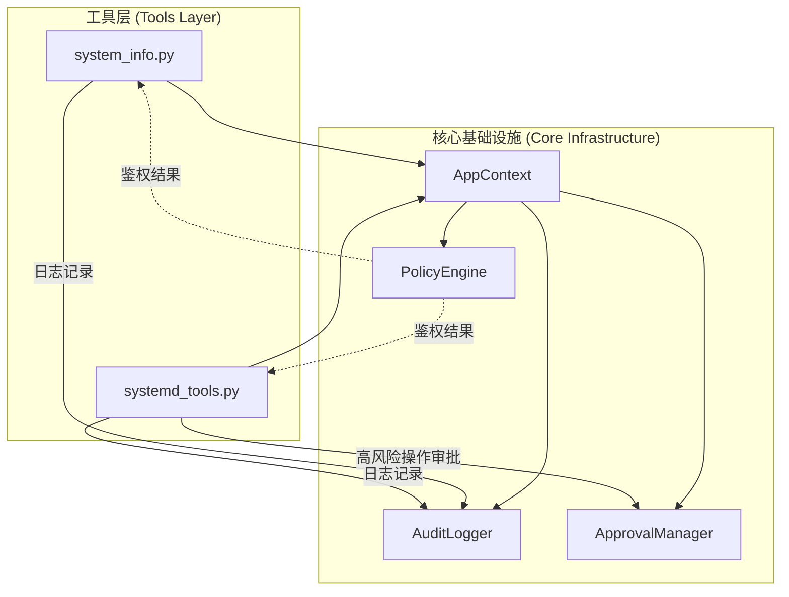
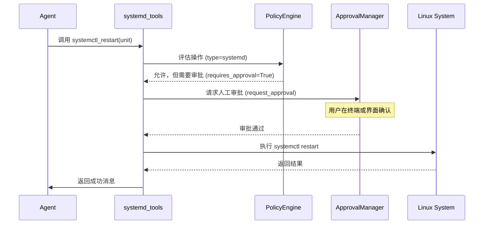
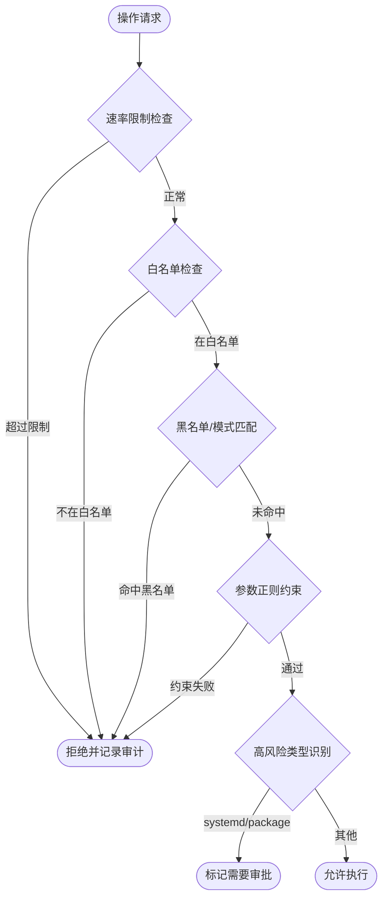

# 系统与服务管理工具

## 目录

1. [模块概览](#模块概览)
2. [引言](#引言)
3. [架构设计与交互流程](#架构设计与交互流程)
4. [系统状态监控：system_info](#系统状态监控system_info)
   - [为什么选择 psutil](#为什么选择-psutil)
   - [核心能力与 API](#核心能力与-api)
5. [服务管理工具：systemd_tools](#服务管理工具systemd_tools)
   - [安全封装与命令净化](#安全封装与命令净化)
   - [高风险操作的人工审批](#高风险操作的人工审批)
   - [核心能力与 API](#核心能力与-api-1)
6. [安全与审计集成机制](#安全与审计集成机制)
   - [策略鉴权流程](#策略鉴权流程)
   - [审计日志记录](#审计日志记录)
7. [配置与特权管理](#配置与特权管理)
8. [文件参考](#文件参考)

## 模块概览

本模块主要负责 `oscopilot` 对宿主系统的实时状态监控以及系统服务的生命周期管理。通过对系统底层接口的封装，Agent 能够以安全、可控的方式获取系统运行数据并执行管理任务。

**范围评估**：
- **核心文件**：2 个 Python 文件，直接实现监控与服务管理逻辑。
- **关联组件**：深入集成 `oscopilot/context.py`（上下文）、`oscopilot/policy.py`（策略引擎）和 `oscopilot/auditing.py`（审计模块）。
- **主要子模块**：
  - `system_info.py`: 基于 `psutil` 的系统监控工具。
  - `systemd_tools.py`: 基于 `systemctl` 的服务管理工具。

本页面将重点介绍这两个工具的实现细节、安全防御机制以及它们如何与核心安全框架协同工作。

## 引言

在自动化运维和智能 Agent 场景中，获取系统状态（如 CPU 负载、内存占用）和管理服务（如重启 Web 服务）是极其常见的任务。然而，直接执行 Shell 命令往往伴随着巨大的安全风险，如命令注入、未授权操作以及缺乏可追溯性。

`oscopilot` 的系统与服务管理工具层旨在解决这些问题。它不仅提供了高级抽象的 API，更在每一处工具调用中嵌入了严格的**策略检查**和**审计记录**。无论是简单的状态查询，还是敏感的服务停止操作，都必须经过策略引擎的合规性评估，并在审计日志中留下永久记录。

## 架构设计与交互流程

`oscopilot` 的工具层并不是孤立存在的，它深度依赖于 `AppContext` 提供的基础设施。每一个工具函数在执行前，都会通过上下文对象访问策略引擎进行鉴权，并在执行后（或失败后）将结果反馈给审计员。

下图展示了工具层与核心组件之间的交互关系：



**架构说明**：
- **工具层**：作为 Agent 能力的直接提供者，通过 `AppContext` 获取必要的运行环境信息。
- **策略引擎 (PolicyEngine)**：负责根据预设规则（白名单、黑名单、正则约束）判定操作是否允许。
- **审计员 (AuditLogger)**：记录每一次操作的输入、输出、耗时及策略判定结果，确保所有行为可审计。
- **审批管理器 (ApprovalManager)**：对于 `systemd` 等高风险操作，引入人工确认环节，防止 Agent 误操作导致系统故障。

**Diagram sources**: 
- [system_info.py](oscopilot/tools/system_info.py)
- [systemd_tools.py](oscopilot/tools/systemd_tools.py)
- [context.py](oscopilot/context.py)

## 系统状态监控：system_info

`system_info.py` 模块专注于提供系统的实时运行指标。它为 Agent 提供了一种“感知”宿主环境的能力，使其能够根据负载情况做出决策。

### 为什么选择 psutil

在传统的脚本编写中，开发者常使用 `top`、`ps` 或 `uptime` 等命令并通过正则表达式解析其输出。`oscopilot` 选择了 `psutil` 库，主要基于以下考虑：
1. **安全性**：避免了直接调用 Shell 命令带来的注入风险。
2. **准确性**：`psutil` 直接读取 `/proc` 文件系统或调用系统 API，数据结构化程度高，无需复杂的字符串解析。
3. **跨平台**：虽然 `oscopilot` 目前侧重 Linux，但 `psutil` 的跨平台特性为未来扩展提供了便利。
4. **性能**：相比于派生新的进程执行 Shell 命令，`psutil` 的资源开销更小。

### 核心能力与 API

目前该模块提供的核心函数是 `cpu_load_and_top_processes`。

**API 定义**：
- **函数名**：`cpu_load_and_top_processes(ctx: AppContext, limit: int = 5)`
- **输入参数**：
  - `ctx`: `AppContext` 实例，用于鉴权和审计。
  - `limit`: 返回高负载进程的数量，默认为 5。
- **输出格式**：包含 CPU 1/5/15 分钟负载以及前 N 个进程详情的字符串。

**实现细节分析**：
在执行实际查询前，函数会创建一个 `Operation` 对象并提交给策略引擎。如果策略拒绝，会立即记录审计日志并抛出 `RuntimeError`，阻断后续操作。

```python
# oscopilot/tools/system_info.py L17-L41 (简化版)
def cpu_load_and_top_processes(ctx: AppContext, limit: int = 5) -> str:
    # 1. 策略鉴权
    op = Operation(type="shell", name="psutil_cpu", args={"limit": limit})
    decision = ctx.policy.evaluate(op)
    
    if not decision.allowed:
        # 记录拒绝审计并抛出异常
        ctx.auditor.log_event(AuditEvent(..., policy_decision="denied"))
        raise RuntimeError(f"策略拒绝: {decision.reason}")

    # 2. 执行安全查询
    load1, load5, load15 = psutil.getloadavg()
    # ... 获取进程列表 ...
    
    # 3. 记录成功审计并返回结果
    ctx.auditor.log_event(AuditEvent(..., policy_decision="allow"))
    return summary
```

**代码来源**: [system_info.py:L17-L77](oscopilot/tools/system_info.py#L17-L77)

## 服务管理工具：systemd_tools

`systemd_tools.py` 封装了 Linux 系统中最常用的服务管理命令 `systemctl`。由于服务管理涉及系统状态的变更，该工具在安全性上做了多重防护。

### 安全封装与命令净化

为了防止 Agent 被诱导执行恶意命令（例如 `systemctl stop ssh; rm -rf /`），该模块引入了 `sanitize_str_list` 工具函数。

**防御机制**：
- **不可见字符检查**：通过 `ensure_no_invisible` 检查输入参数中是否包含零宽字符或其他控制字符，这些字符常被用于绕过基于正则的策略检查。
- **结构化参数**：命令以列表形式传递给 `subprocess.run`，避免了 Shell 解析带来的注入风险。

### 高风险操作的人工审批

对于 `start`、`stop`、`restart` 等可能导致服务中断的操作，`oscopilot` 强制要求进入审批流。

下面的序列图展示了执行 `systemctl restart` 时的审批逻辑：



**流程解析**：
1. **策略预判**：策略引擎识别出 `type="systemd"` 的操作属于高风险类型，因此在 `PolicyDecision` 中标记 `requires_approval=True`。
2. **挂起执行**：工具层接收到信号后，不会立即执行命令，而是将执行逻辑（`apply_fn`）封装并提交给 `ApprovalManager`。
3. **闭环审计**：无论用户批准还是拒绝，该动作的最终结果都会被记录在审计日志中。

**Diagram sources**: 
- [systemd_tools.py:L62-L94](oscopilot/tools/systemd_tools.py#L62-L94)
- [policy.py:L53-L92](oscopilot/policy.py#L53-L92)

### 核心能力与 API

该模块提供了查询和变更两类接口。

| 函数名 | 功能说明 | 是否需要审批 |
| :--- | :--- | :--- |
| `systemctl_status` | 查询指定 Unit 的运行状态 | 否 |
| `systemctl_start` | 启动指定服务 | 是 |
| `systemctl_stop` | 停止指定服务 | 是 |
| `systemctl_restart` | 重启指定服务 | 是 |

**示例：systemctl_status 输出**
```text
● nginx.service - A high performance web server and a reverse proxy server
   Loaded: loaded (/lib/systemd/system/nginx.service; enabled; vendor preset: enabled)
   Active: active (running) since Mon 2023-10-23 10:00:00 UTC; 1h ago
```

## 安全与审计集成机制

工具层的安全性不仅取决于其自身的实现，更取决于它如何与 `oscopilot` 的核心安全框架集成。

### 策略鉴权流程

每一次工具调用都会触发策略引擎的评估流程。下图展示了操作请求是如何被过滤的：



**流程说明**：
- **多层过滤**：请求依次经过速率限制、白名单、黑名单和参数正则四道关卡。
- **动态风险评估**：即使通过了所有安全检查，系统仍会根据操作类型（如 `systemd`）动态决定是否需要人工介入。

**Diagram sources**: 
- [policy.py:L53-L92](oscopilot/policy.py#L53-L92)

### 审计日志记录

审计日志是 `oscopilot` 的合规性基石。每一条审计记录（`AuditEvent`）都包含以下关键字段：
- `action_id`: 唯一的动作标识符，贯穿策略评估、审批和执行全过程。
- `policy_decision`: 策略引擎的判定结果（`allow` 或 `denied`）。
- `approval_result`: 人工审批的结果。
- `stdout`/`stderr`: 执行后的完整输出，便于事后溯源。

**审计记录示例 (JSONL)**:
```json
{
  "timestamp": "2023-10-23T10:05:00Z",
  "actor": "oscopilot",
  "tool": "systemctl_restart",
  "args": {"unit": "mysql"},
  "policy_decision": "allow",
  "approval_result": "approved",
  "result_summary": "systemctl restart mysql 成功"
}
```

## 配置与特权管理

在 `AppConfig` 中，`ToolsConfig` 提供了 `use_sudo` 配置项，这直接影响了工具的执行权限。

**配置说明**：
- `use_sudo: true`: 工具在执行命令时会尝试前缀 `sudo`。这通常需要系统已配置免密 sudo，或者 Agent 运行在具备相应权限的用户下。
- `use_sudo: false`: 工具以当前用户身份执行。对于 `systemctl status` 等只读操作通常足够，但对于变更操作可能会因权限不足而失败。

> 💡 **提示**：在生产环境中，建议通过 `polkit` 为 Agent 用户配置细粒度的 `systemd` 操作权限，而不是简单地赋予全量 sudo 权限。

## 文件参考

以下是实现上述功能的关键源代码文件：

- `oscopilot/tools/system_info.py`: 系统监控工具的核心实现。
- `oscopilot/tools/systemd_tools.py`: systemd 服务管理工具的核心实现。
- `oscopilot/context.py`: 提供工具运行所需的上下文环境。
- `oscopilot/policy.py`: 负责操作的合规性评估。
- `oscopilot/auditing.py`: 负责记录所有工具调用的审计日志。
- `oscopilot/utils.py`: 提供输入净化等安全辅助函数。
- `oscopilot/config.py`: 定义了 `use_sudo` 等关键配置项。

**Section sources**:
- [system_info.py](oscopilot/tools/system_info.py)
- [systemd_tools.py](oscopilot/tools/systemd_tools.py)
- [policy.py](oscopilot/policy.py)
- [auditing.py](oscopilot/auditing.py)
- [utils.py](oscopilot/utils.py)
- [config.py](oscopilot/config.py)
