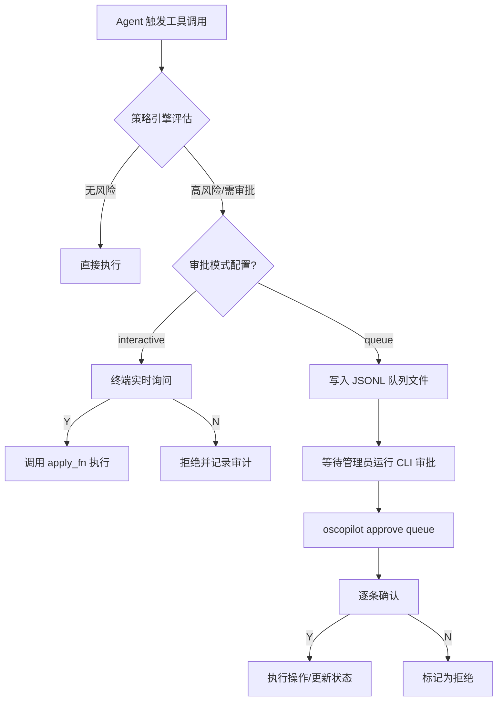
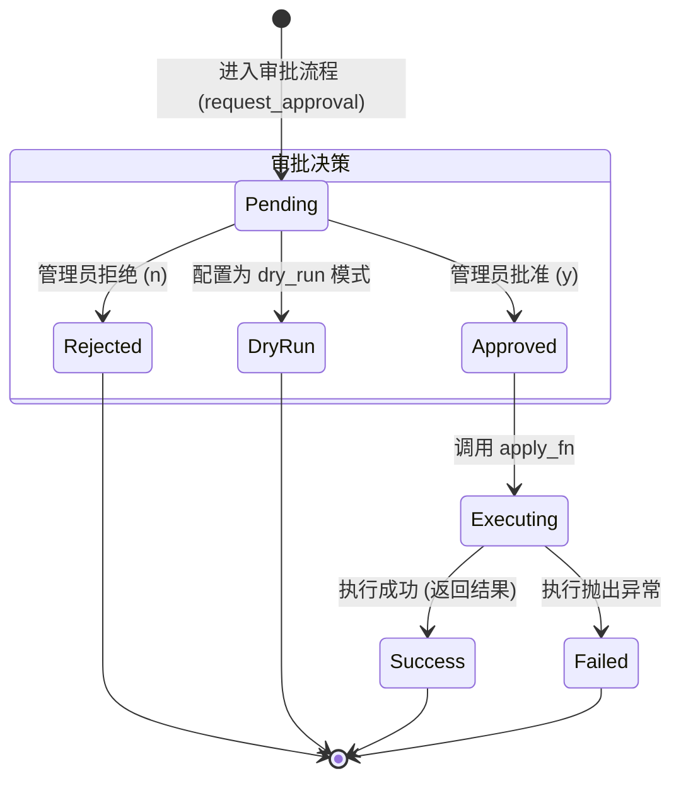
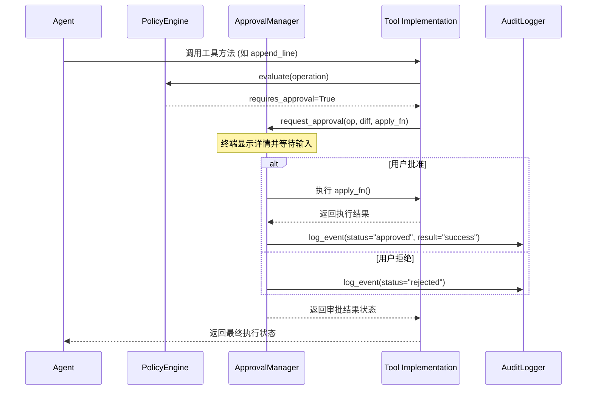

# 人工审批工作流

## 目录
1. [模块概览](#模块概览)
2. [简介](#简介)
3. [核心组件](#核心组件)
4. [审批模式详解](#审批模式详解)
   - [交互式审批 (Interactive Mode)](#交互式审批-interactive-mode)
   - [队列审批 (Queue Mode)](#队列审批-queue-mode)
5. [变更预览与 Diff 机制](#变更预览与-diff-机制)
6. [审批状态机与执行流](#审批状态机与执行流)
7. [Dry-run 与安全演练](#dry-run-与安全演练)
8. [审计与反馈循环](#审计与反馈循环)
9. [文件参考](#文件参考)

## 模块概览

本模块负责 OS-Copilot 中的“人机协作审批”（Human-in-the-loop, HITL）流程。在自动化运维场景中，AI Agent 可能会执行具有破坏性的操作（如修改配置文件、重启服务、删除包等）。为了确保系统安全，OS-Copilot 引入了强制性的审批机制，确保所有高风险操作在执行前都经过人工确认。

**统计信息**：
- **涉及文件总数**：约 20 个 Python 文件。
- **核心子模块**：
  - `oscopilot/approval.py`：审批逻辑的核心实现，包含 `ApprovalManager`。
  - `oscopilot/config.py`：审批相关的配置定义 `ApprovalConfig`。
  - `oscopilot/policy.py`：策略引擎，决定哪些操作需要进入审批流。
  - `oscopilot/auditing.py`：审计模块，记录审批过程中的所有决策和执行结果。

本页面将深度解析审批流的内部机制、状态转换逻辑以及如何通过 CLI 进行交互式或异步审批。

## 简介

在 OS-Copilot 的设计哲学中，**安全（Safety）** 是首要原则。虽然 LLM 具有强大的推理和工具使用能力，但在处理复杂的 Linux 系统变更时，依然存在误操作的风险。人机协作审批机制的作用在于：

1.  **风险拦截**：通过策略引擎（Policy Engine）识别高风险操作，强制中断自动化流程，等待人工介入。
2.  **透明性**：为管理员提供清晰的操作预览，包括命令参数、文件变更 Diff 等，消除“黑盒”执行。
3.  **责任溯源**：每一个审批决策（批准、拒绝、忽略）都会被永久记录在审计日志中。
4.  **柔性控制**：支持实时交互（Interactive）和异步队列（Queue）两种模式，适应不同的运维节奏。

## 核心组件

审批模块由几个关键的数据结构和管理类组成，它们共同协作完成从请求到执行的全过程。

### 1. ApprovalConfig
在 `oscopilot/config.py` 中定义，控制审批模块的行为。

```python
@dataclass
class ApprovalConfig:
    enabled: bool = True           # 是否启用审批（高风险操作强制启用）
    dry_run: bool = False          # 是否为测试模式（批准后不实际执行）
    mode: str = "interactive"      # 模式：interactive (实时) 或 queue (异步队列)
    queue_path: str = "./logs/approval_queue.jsonl"  # 队列文件路径
    prompt_prefix: str = "即将执行如下高风险操作，请确认："
```

### 2. ApprovalQueueEntry
定义了审批队列中的单条记录结构，用于持久化待审批的操作。

```python
@dataclass
class ApprovalQueueEntry:
    id: str               # 唯一操作 ID
    enqueued_at: str      # 入队时间（ISO 格式）
    status: str           # 状态：pending | approved | rejected | dry_run | failed
    operation: Operation  # 包含类型、名称和参数的操作对象
    diff: Optional[str] = None  # 可选的变更预览文本
```

### 3. ApprovalManager
这是审批流的控制器，负责分发审批请求、维护队列以及触发执行函数。

**核心方法**：
- `request_approval(...)`：主入口，由工具（Tools）调用。
- `process_queue(...)`：处理队列中的积压记录，通常由 CLI 触发。
- `_interactive_confirm(...)`：实现 CLI 终端的 `[y/N]` 交互。

**Section sources**:
- [oscopilot/config.py](oscopilot/config.py)
- [oscopilot/approval.py](oscopilot/approval.py)

## 审批模式详解

OS-Copilot 提供了两种互补的审批模式，以平衡实时性和批量处理的需求。

### 交互式审批 (Interactive Mode)

这是默认模式。当 Agent 运行在交互式终端时，每当触发一个需要审批的操作，程序会暂停并打印操作详情，等待用户输入。

**交互流程**：
1.  Agent 准备执行一个 `file_write` 操作。
2.  调用 `ApprovalManager.request_approval`。
3.  终端显示操作类型、参数及 Diff 预览。
4.  用户输入 `y` 或 `n`。
5.  如果批准，则立即调用 `apply_fn` 执行并记录审计；如果拒绝，则抛出异常或返回拒绝状态。

### 队列审批 (Queue Mode)

在非交互式环境（如后台任务或大规模自动化流水线）中，实时等待人工确认是不现实的。此时可以使用 `queue` 模式。

**队列流程**：
1.  Agent 将操作详情序列化为 JSON 并追加到 `approval_queue.jsonl` 文件中。
2.  Agent 继续执行后续不依赖该操作的任务（或根据逻辑挂起）。
3.  管理员在方便时运行 `oscopilot approve queue` 指令。
4.  系统逐条读出 `pending` 状态的记录，供管理员批量审核。

下图展示了审批请求在不同模式下的流转逻辑：



**Section sources**:
- [oscopilot/approval.py:L40-L115](oscopilot/approval.py#L40-L115)
- [oscopilot/cli.py:L106-L115](oscopilot/cli.py#L106-L115)

## 变更预览与 Diff 机制

为了让管理员能够做出明智的决策，审批界面必须提供足够的上下文。对于文件修改操作，OS-Copilot 会生成标准的 Unified Diff 格式预览。

### Diff 生成逻辑
在 `oscopilot/tools/files.py` 中，`append_line_with_approval` 函数演示了这一过程：

1.  读取文件的原始内容（Old Content）。
2.  计算修改后的内容（New Content）。
3.  使用 `difflib.unified_diff` 生成差异文本。
4.  计算 Diff 的 SHA256 哈希值，用于审计追踪，防止在审批期间文件被篡改。

```python
def _unified_diff(old: str, new: str, path: str) -> str:
    return "\n".join(
        difflib.unified_diff(
            old.splitlines(),
            new.splitlines(),
            fromfile=f"{path} (before)",
            tofile=f"{path} (after)",
            lineterm="",
        )
    )
```

### 界面展示示例
当运行 `oscopilot demo-hosts` 时，管理员会看到如下界面：

```text
即将执行如下高风险操作，请确认：
操作类型: file_write
操作名称: append_line
参数: {"path": "/etc/hosts", "line": "127.0.0.1 test.local", "diff_hash": "..."}
变更 Diff 预览:
--- /etc/hosts (before)
+++ /etc/hosts (after)
@@ -1,1 +1,2 @@
 127.0.0.1 localhost
+127.0.0.1 test.local

是否批准? [y/N]: 
```

这种直观的展示极大地降低了误操作的概率。

**Section sources**:
- [oscopilot/tools/files.py:L49-L85](oscopilot/tools/files.py#L49-L85)

## 审批状态机与执行流

审批过程是一个严谨的状态转换过程。每一条审批记录或请求都有其生命周期，状态的流转直接影响到最终的执行结果和审计记录。

### 状态转换图



### 执行流时序图
下图展示了从 Agent 触发操作到最终审计完成的完整时序。



通过这种分层设计，工具实现者只需要提供一个 `apply_fn` 闭包，而无需关心审批的交互细节。

**Section sources**:
- [oscopilot/approval.py:L61-L186](oscopilot/approval.py#L61-L186)

## Dry-run 与安全演练

OS-Copilot 支持 `dry_run` 模式，这在生产环境上线前的安全演练中非常有用。

### 工作原理
当 `ApprovalConfig.dry_run = True` 时：
1.  审批流照常进行（包括策略评估、Diff 展示、人工确认）。
2.  如果管理员选择了“批准”，`ApprovalManager` **不会** 调用真正的 `apply_fn`。
3.  系统会在审计日志中记录该操作为 `dry_run` 状态。
4.  Agent 接收到的返回值为 `dry_run`，可以据此模拟后续逻辑。

这种模式允许管理员在不改变系统状态的前提下，完整地测试 Agent 的决策路径和审批流程。

> 💡 **提示**：在进行大规模系统变更前，建议先开启 `dry_run` 模式运行一遍，通过审计日志检查 Agent 的所有意图是否符合预期。

**Section sources**:
- [oscopilot/approval.py:L138-L156](oscopilot/approval.py#L138-L156)

## 审计与反馈循环

审批模块与审计模块（`Auditor`）深度集成。每一个审批动作都是一个重要的审计事件（`AuditEvent`）。

### 关键审计字段
在审批过程中，以下字段会被重点记录：
- `approval_result`：记录最终审批结果（`approved`, `rejected`, `queued`, `dry_run`, `failed`）。
- `policy_decision`：记录策略引擎的初步判断（`allow`, `denied`, `pending`）。
- `action_id`：全局唯一 ID，用于关联审批请求、执行过程和审计日志。
- `file_diff_hash`：针对文件操作，记录变更的哈希值。

### 反馈循环
审批结果会实时反馈给 Agent：
- 如果审批被拒绝，Agent 通常会收到一个异常或特定的错误码，从而调整其后续计划（例如寻找替代方案或向用户报告失败）。
- 如果审批通过但执行失败（`failed` 状态），详细的错误堆栈会被记录在审计日志中，并反馈给 Agent 进行“自我修复”尝试。

**Section sources**:
- [oscopilot/auditing.py:L21-L35](oscopilot/auditing.py#L21-L35)
- [oscopilot/approval.py:L158-L186](oscopilot/approval.py#L158-L186)

## 文件参考

本模块涉及的核心文件及其职责如下：

- `oscopilot/approval.py`：审批管理器的核心实现，处理交互、队列和执行。
- `oscopilot/config.py`：定义 `ApprovalConfig` 数据结构。
- `oscopilot/policy.py`：定义 `Operation` 和 `PolicyDecision`，驱动审批触发。
- `oscopilot/auditing.py`：定义 `AuditEvent`，负责审批过程的持久化记录。
- `oscopilot/cli.py`：提供 `approve queue` 命令的 CLI 入口。
- `oscopilot/tools/files.py`：演示了如何在文件编辑工具中集成 Diff 预览和审批。
- `oscopilot/tools/package_manager.py`：在包管理操作中调用审批流。
- `oscopilot/tools/systemd_tools.py`：在服务管理操作中调用审批流。
