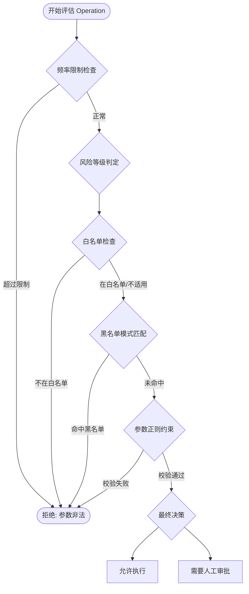
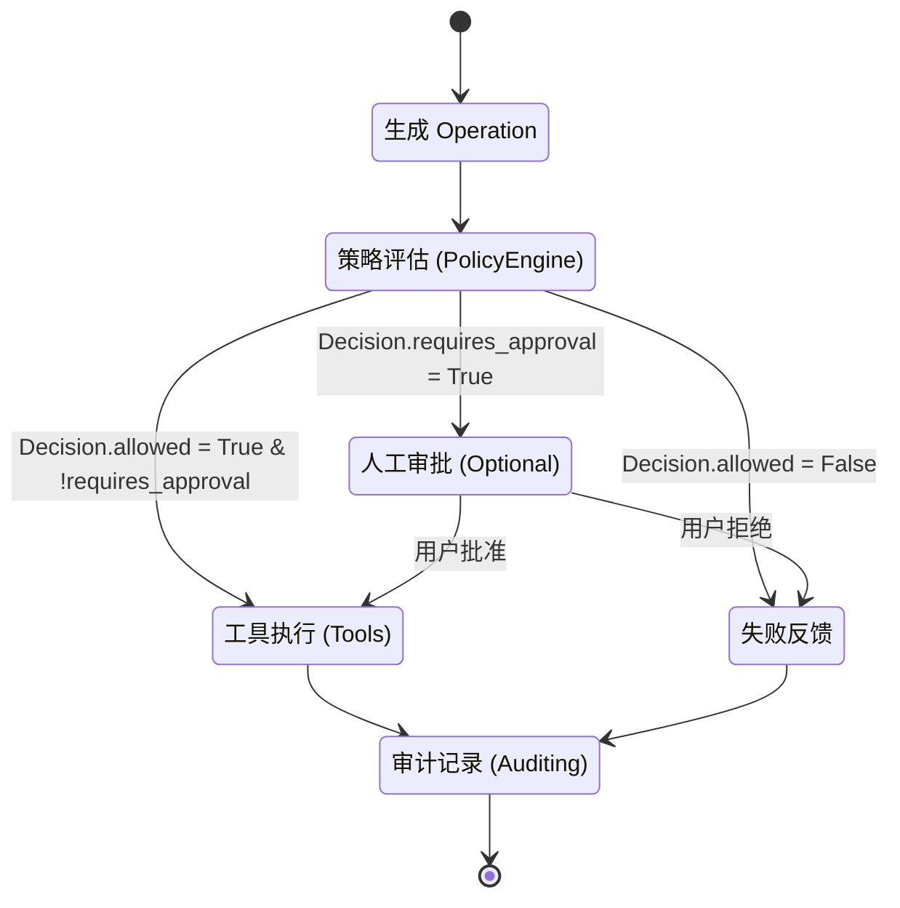
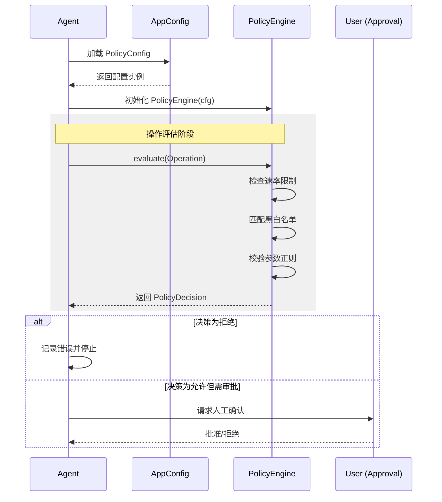
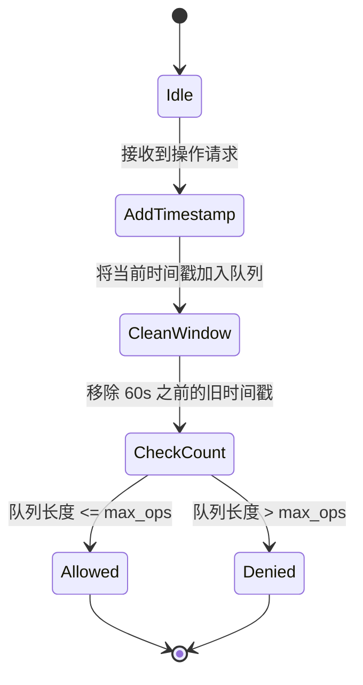
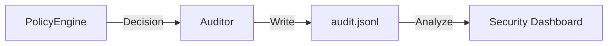

# 策略引擎与命令过滤

## 目录
1. [模块概览](#模块概览)
2. [引言](#引言)
3. [核心组件](#核心组件)
   - [Operation 数据类](#operation-数据类)
   - [PolicyDecision 数据类](#policydecision-数据类)
   - [PolicyEngine 类](#policyengine-类)
4. [架构设计与工作流](#架构设计与工作流)
   - [策略评估流程](#策略评估流程)
   - [操作生命周期](#操作生命周期)
   - [组件交互图](#组件交互图)
5. [关键机制深度解析](#关键机制深度解析)
   - [白名单与黑名单过滤](#白名单与黑名单过滤)
   - [参数正则约束与路径安全](#参数正则约束与路径安全)
   - [操作频率限制 (Rate Limiting)](#操作频率限制-rate-limiting)
   - [风险等级判定与审批触发](#风险等级判定与审批触发)
6. [配置参考](#配置参考)
   - [PolicyConfig 结构](#policyconfig-结构)
   - [YAML 配置示例](#yaml-配置示例)
7. [集成与扩展开发](#集成与扩展开发)
   - [手动校验示例](#手动校验示例)
   - [自定义操作类型](#自定义操作类型)
8. [性能与安全性考量](#性能与安全性考量)
   - [正则匹配性能](#正则匹配性能)
   - [安全局限性与对策](#安全局限性与对策)
9. [审计与监控](#审计与监控)
10. [文件引用](#文件引用)

## 模块概览

本模块主要涉及 `oscopilot` 核心库中的策略管理与安全过滤逻辑。通过对 `oscopilot/policy.py` 和 `oscopilot/config.py` 的深入分析，我们能够理解系统如何构建其安全防线。

- **总文件数**：经过对 `oscopilot` 目录的扫描，共发现 20 个 Python 源代码文件。
- **子模块**：
  - `panic/`：包含系统崩溃分析与恢复逻辑（5 个文件）。
  - `tools/` : 包含各种系统操作工具，如文件管理、软件包管理等（6 个文件）。
- **覆盖范围**：本章节将深度解析 `oscopilot/policy.py` 中的策略引擎实现，并结合 `oscopilot/config.py` 说明其配置机制。其他子模块如 `tools/` 将作为策略执行的对象被简要提及。

## 引言

在 AI Agent 操作系统（OS-Copilot）的语境下，安全性是系统的生命线。由于大语言模型（LLM）生成的指令具有不可预测性，直接在宿主系统上执行这些指令可能导致灾难性的后果。例如，Agent 可能会因为误解用户意图而执行 `rm -rf /`，或者在死循环中不断安装无效的软件包。

`oscopilot` 的策略引擎（Policy Engine）被设计为系统安全的第一道防线。它位于 Agent 决策层与系统执行层之间，充当了一个“安全网关”。每当 Agent 试图执行一个操作（Operation）时，该操作必须首先通过策略引擎的评估。策略引擎会根据预定义的规则（白名单、黑名单、正则约束、频率限制等）来决定该操作是否被允许执行，或者是否需要人工干预（审批）。

本章节将详细探讨策略引擎的内部构造、评估逻辑、性能影响以及如何通过配置文件灵活定义系统的行为边界。我们将从源码级别分析其实现细节，并提供实际的配置建议。

## 核心组件

策略引擎的实现依赖于几个核心的数据结构和类。这些组件共同定义了操作的描述方式、决策的结果以及评估的执行逻辑。

### Operation 数据类

`Operation` 是策略引擎处理的原子单位。它封装了一个待执行操作的所有元数据，包括操作类型、名称以及具体的参数。

```python
@dataclass
class Operation:
    type: str  # shell | file_write | mcp_tool | systemd | package
    name: str
    args: Dict[str, Any]
```

- **type**：定义了操作的类别。这是策略引擎进行第一步分类的基础。不同的类别触发不同的过滤逻辑。例如，`shell` 类型主要受白名单和黑名单限制，而 `file_write` 类型则默认被视为高风险，无论其内容如何。
- **name**：操作的具体名称。对于 `shell` 类型，这通常是可执行文件的名称（如 `ls`）；对于 `mcp_tool`，则是工具函数的名称。
- **args**：一个字典，包含操作执行所需的参数。策略引擎会对这些参数进行正则校验。例如，在文件写入操作中，`args` 可能包含 `path` 和 `content` 两个键。

### PolicyDecision 数据类

`PolicyDecision` 封装了策略引擎对某个 `Operation` 的评估结果。它不仅告诉系统是否可以执行，还决定了是否需要中断流程等待人工确认。

```python
@dataclass
class PolicyDecision:
    allowed: bool
    requires_approval: bool
    reason: str = ""
```

- **allowed**：布尔值。如果为 `False`，表示该操作违反了安全策略（如命中黑名单或频率超限），系统应立即停止执行并向 Agent 返回错误。
- **requires_approval**：布尔值。如果为 `True`，表示该操作虽然符合基本策略，但属于高风险范畴，必须经过用户确认后才能继续。
- **reason**：字符串。详细说明了决策的原因。这对于调试和审计非常重要，同时也可以反馈给 LLM，让它理解为什么某些操作被拒绝。

### PolicyEngine 类

`PolicyEngine` 是策略评估的核心入口。它是一个有状态的类，主要负责加载配置、预编译正则表达式以及维护频率限制所需的时间戳队列。

```python
class PolicyEngine:
    def __init__(self, cfg: PolicyConfig) -> None:
        self.cfg = cfg
        self._timestamps: Deque[float] = deque()
        # 预编译正则表达式以提高 evaluate 的执行效率
        self._compiled_blacklist = [re.compile(p) for p in cfg.blacklist_patterns]
        self._compiled_param = {k: re.compile(v) for k, v in cfg.parameter_regex.items()}
```

在初始化阶段，策略引擎会预编译所有的黑名单模式和参数正则。这是一种性能优化手段，因为 `evaluate` 方法可能会在 Agent 的运行循环中被频繁调用。

**Section sources**:
- [policy.py](oscopilot/policy.py)

## 架构设计与工作流

策略引擎的设计遵循“深度防御”的原则，通过多层过滤机制确保安全性。

### 策略评估流程

当 `evaluate` 方法被调用时，它会按顺序执行一系列检查。这种顺序设计非常关键，因为它可以尽早拦截非法请求，减少后续复杂检查的开销。

下面的流程图展示了 `evaluate` 方法的决策优先级逻辑：



在该流程中，**速率限制**是第一道防线，防止 Agent 陷入死循环或恶意攻击导致系统资源耗尽。接着是**风险等级判定**，它决定了操作是否需要审批。随后是**白名单**和**黑名单**过滤，这针对的是命令本身及其文本内容。最后是**参数正则约束**，提供了更细粒度的控制。

### 操作生命周期

一个操作从生成到执行（或被拦截）经历了一个完整的生命周期。理解这个周期有助于开发者在正确的位置插入自定义逻辑。



在 `oscopilot` 中，`PolicyEngine` 的职责仅限于 `Eval` 阶段。它不负责弹窗请求用户审批，也不负责实际调用 `subprocess` 执行命令。这种职责分离（Separation of Concerns）使得策略引擎可以非常容易地被替换或扩展。

### 组件交互图

策略引擎与配置模块、Agent 核心以及审批模块的交互如下：



**Diagram sources**:
- [policy.py:L53-L92](oscopilot/policy.py#L53-L92)
- [config.py:L25-L30](oscopilot/config.py#L25-L30)

## 关键机制深度解析

### 白名单与黑名单过滤

`oscopilot` 同时支持白名单和黑名单机制，它们适用于 `shell`、`systemd` 和 `package` 等类型的操作。

1.  **白名单 (Whitelist)**：
    如果配置了 `whitelist_commands`，则只有列表中的命令才被允许执行。这是一种“默认拒绝”的策略，安全性最高。
    ```python
    if op.type in {"shell", "systemd", "package"}:
        if self.cfg.whitelist_commands and op.name not in self.cfg.whitelist_commands:
            return PolicyDecision(
                allowed=False,
                requires_approval=False,
                reason=f"命令 {op.name} 不在白名单内",
            )
    ```
    白名单检查是基于 `op.name` 的精确匹配。这意味着如果你将 `ls` 加入白名单，Agent 可以执行 `ls /tmp`，但不能执行未在列表中的 `dir`。

2.  **黑名单 (Blacklist)**：
    黑名单使用正则表达式匹配操作的完整文本（命令名 + 所有参数）。这可以有效拦截已知的危险模式。
    ```python
    full_text = op.name + " " + " ".join(str(v) for v in op.args.values())
    for pat in self._compiled_blacklist:
        if pat.search(full_text):
            return PolicyDecision(
                allowed=False,
                requires_approval=False,
                reason=f"命令/参数命中黑名单模式: {pat.pattern}",
            )
    ```
    黑名单检查是基于“全文搜索”的。例如，如果黑名单包含 `rm -rf /`，那么任何包含该字符串的操作都会被拦截。

### 参数正则约束与路径安全

参数正则约束（Parameter Regex Constraints）是 `oscopilot` 安全策略中最具威力的功能之一。它允许管理员针对特定的参数名定义合法的取值范围。

```python
# policy.py 实现逻辑
for key, regex in self._compiled_param.items():
    if key in op.args:
        if not regex.fullmatch(str(op.args[key])):
            return PolicyDecision(
                allowed=False,
                requires_approval=False,
                reason=f"参数 {key} 不符合策略约束 {regex.pattern}",
            )
```

这种机制特别适用于路径安全。例如，为了防止 Agent 读写系统敏感文件，我们可以强制要求所有 `path` 参数必须匹配特定的正则表达式。

**示例场景**：限制 Agent 只能在 `/tmp/oscopilot/` 目录下操作。
- 配置：`parameter_regex: {"path": "^/tmp/oscopilot/.*$"}`
- Agent 尝试执行：`write_file(path="/etc/passwd", content="...")`
- 结果：策略引擎发现 `path` 参数不匹配正则，立即拦截。

### 操作频率限制 (Rate Limiting)

为了防止 AI 代理失控，策略引擎实现了基于滑动窗口的速率限制。



实现代码使用了 `collections.deque` 来维护一个时间戳窗口：
```python
def _check_rate_limit(self) -> Optional[str]:
    if self.cfg.max_operations_per_minute <= 0:
        return None
    now = time.time()
    window = 60.0 # 窗口大小固定为 60 秒
    self._timestamps.append(now)
    # 移除过期的记录
    while self._timestamps and now - self._timestamps[0] > window:
        self._timestamps.popleft()
    # 检查当前窗口内的操作数
    if len(self._timestamps) > self.cfg.max_operations_per_minute:
        return "超过策略配置的每分钟最大操作次数限制"
    return None
```
这种算法的优点是平滑且对内存友好。即使 Agent 在一秒钟内尝试发起 100 次请求，它也会在达到阈值后被立即封禁，直到窗口滑动。

### 风险等级判定与审批触发

策略引擎内部硬编码了一些高风险的操作类型。即使这些操作符合黑白名单和正则约束，它们也会被标记为 `requires_approval=True`。

```python
# policy.py
high_risk_types = {"file_write", "systemd", "package"}
requires_approval = op.type in high_risk_types
```

这种设计的初衷是：
- **文件写入**可能破坏系统配置或注入恶意脚本。
- **Systemd 操作**可能导致关键服务中断。
- **软件包管理**可能引入不安全的第三方软件。

目前这些类型是硬编码的，但在未来的版本中，这可能会变成可配置的风险矩阵。

**Section sources**:
- [policy.py:L41-L92](oscopilot/policy.py#L41-L92)

## 配置参考

策略引擎的行为完全由 `PolicyConfig` 驱动。用户可以通过修改 `config.yaml` 来调整安全策略。

### PolicyConfig 结构

在 `oscopilot/config.py` 中，`PolicyConfig` 定义了如下字段：

| 字段名 | 类型 | 默认值 | 说明 |
| :--- | :--- | :--- | :--- |
| `whitelist_commands` | `List[str]` | `[]` | 允许执行的 Shell/Systemd/Package 命令白名单。 |
| `blacklist_patterns` | `List[str]` | `[]` | 禁止执行的正则表达式模式列表。 |
| `parameter_regex` | `Dict[str, str]` | `{}` | 针对特定参数名（如 `path`）的正则表达式约束。 |
| `max_operations_per_minute` | `int` | `30` | 每分钟允许的最大操作次数，设为 0 则禁用限制。 |

### YAML 配置示例

以下是一个典型的 `config.yaml` 片段，展示了如何配置严苛的安全策略：

```yaml
policy:
  # 仅允许基础的查看命令
  whitelist_commands:
    - ls
    - cat
    - grep
    - ps
    - systemctl status
  
  # 禁止任何包含敏感文件路径的指令
  blacklist_patterns:
    - "/etc/shadow"
    - "/etc/passwd"
    - "rm -rf /"
  
  # 约束文件路径参数必须在 workspace 目录下
  parameter_regex:
    path: "^/home/user/workspace/.*$"
    file_path: "^/home/user/workspace/.*$"
  
  # 限制频率，防止 AI 刷屏
  max_operations_per_minute: 10
```

**Section sources**:
- [config.py:L25-L30](oscopilot/config.py#L25-L30)
- [config.py:L128-L134](oscopilot/config.py#L128-L134)

## 集成与扩展开发

### 手动校验示例

下面的代码片段展示了如何在代码中手动构造一个 `Operation` 并使用 `PolicyEngine` 进行校验。这对于开发新的工具或扩展 Agent 功能非常有用。

```python
from oscopilot.policy import PolicyEngine, Operation
from oscopilot.config import PolicyConfig

# 1. 准备配置
cfg = PolicyConfig(
    whitelist_commands=["ls", "cat"],
    blacklist_patterns=[r"rm\s+-rf"],
    parameter_regex={"path": r"^/tmp/.*$"},
    max_operations_per_minute=5
)

# 2. 初始化引擎
engine = PolicyEngine(cfg)

# 3. 构造一个合法的操作
op1 = Operation(
    type="shell",
    name="ls",
    args={"path": "/tmp/test"}
)
decision1 = engine.evaluate(op1)
print(f"操作 1 结果: {decision1.allowed}, 原因: {decision1.reason}") 

# 4. 构造一个违反频率限制的操作
for i in range(10):
    engine.evaluate(op1)
decision_limit = engine.evaluate(op1)
print(f"频率超限结果: {decision_limit.allowed}, 原因: {decision_limit.reason}")
```

### 自定义操作类型

如果你正在开发一个新的工具集（例如数据库管理工具），你可以定义一个新的操作类型。

1.  在调用 `evaluate` 前，将操作封装为 `Operation(type="database", name="drop_table", args={"table": "users"})`。
2.  策略引擎目前会将未知类型视为“低风险”且不适用白名单。
3.  如果需要将其标记为高风险，需要修改 `policy.py` 中的 `high_risk_types` 集合。

## 性能与安全性考量

### 正则匹配性能

策略引擎在 `evaluate` 方法中使用了正则表达式匹配。虽然 Python 的 `re` 模块性能不错，但如果黑名单列表非常庞大，或者正则表达式写得非常复杂（例如存在回溯问题），可能会显著增加操作的延迟。

**优化建议**：
- 始终保持黑名单列表精简。
- 避免使用过于复杂的嵌套正则。
- 策略引擎已经通过 `re.compile` 进行了预编译，不要在循环中动态创建正则对象。

### 安全局限性与对策

策略引擎主要基于静态的文本和规则匹配，它存在一些固有的局限性：

1.  **Shell 混淆**：Agent 可能会执行 `VAR="/etc/pas"; cat ${VAR}swd` 来绕过针对 `/etc/passwd` 的黑名单。
2.  **符号链接**：Agent 可能会创建一个指向敏感文件的符号链接，然后操作该链接。

**对策**：
- **沙箱化**：策略引擎应与 Linux 容器（如 Docker）或命名空间配合使用，从底层限制文件系统的访问。
- **最小权限原则**：运行 `oscopilot` 的用户不应具有 `sudo` 权限，或者只能通过 `sudoers` 限制执行特定的命令。
- **人工审批**：对于所有具有副作用（Side Effects）的操作，务必开启审批。

## 审计与监控

策略引擎的所有决策都应该被记录下来，以便事后分析。在 `oscopilot` 中，这通常通过 `Auditor` 类完成。



审计日志通常包含：
- 时间戳
- 操作详情（Operation）
- 策略决策（PolicyDecision）
- Agent 的当前上下文

通过分析这些日志，安全管理员可以发现 Agent 是否在尝试“试探”边界，并据此更新黑白名单。

## 文件引用

以下是本章节涉及的核心源文件：

- [oscopilot/policy.py](oscopilot/policy.py)：策略引擎的核心实现类 `PolicyEngine` 及其评估逻辑。
- [oscopilot/config.py](oscopilot/config.py)：定义了 `PolicyConfig` 数据结构以及如何从 YAML 加载配置。
- [oscopilot/approval.py](oscopilot/approval.py)：处理策略引擎标记为 `requires_approval` 的操作。
- [oscopilot/auditing.py](oscopilot/auditing.py)：记录策略决策的结果以供后续审计。
