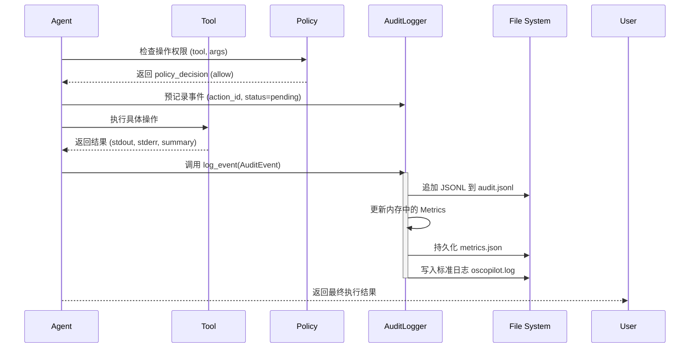
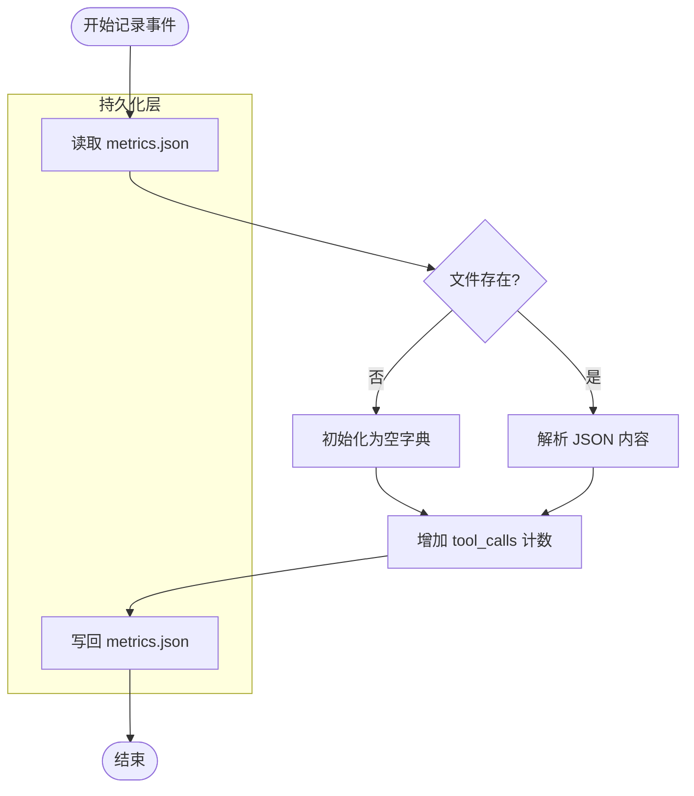
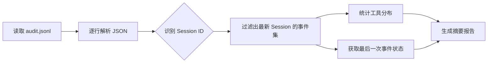
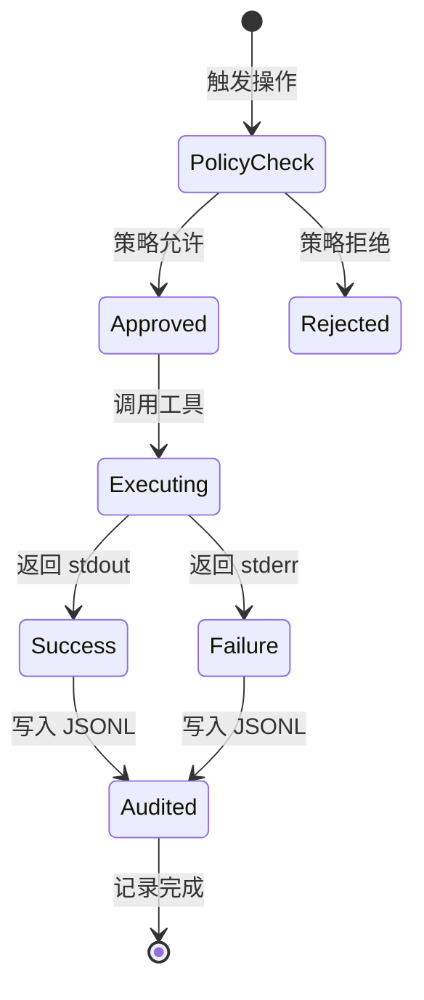

# 结构化审计与日志追踪

## 目录
1. [模块概览](#模块概览)
2. [简介](#简介)
3. [核心组件](#核心组件)
   - [AuditEvent 数据类](#auditevent-数据类)
   - [AuditLogger 记录器](#auditlogger-记录器)
4. [审计日志格式与字段详解](#审计日志格式与字段详解)
   - [JSON Lines 格式的优势](#json-lines-格式的优势)
   - [审计字段定义](#审计字段定义)
   - [完整日志示例](#完整日志示例)
5. [架构设计与数据流](#架构设计与数据流)
   - [审计事件记录流程](#审计事件记录流程)
   - [度量统计更新机制](#度量统计更新机制)
6. [会话摘要与分析](#会话摘要与分析)
   - [会话摘要提取逻辑](#会话摘要提取逻辑)
   - [操作生命周期追踪](#操作生命周期追踪)
7. [日志回溯与实用工具](#日志回溯与实用工具)
   - [使用 jq 进行高效查询](#使用-jq-进行高效查询)
8. [文件参考](#文件参考)

## 模块概览

本模块负责 `oscopilot` 项目中的结构化审计记录与操作度量统计。通过对 AI 驱动的系统操作进行全生命周期的记录，系统能够提供完整的可追溯性和合规性证明。

- **总文件数**：相关核心文件共 3 个（`auditing.py`, `config.py`, `audit_example.jsonl`）。
- **主要子模块**：
    - `AuditLogger`：核心记录引擎，负责 I/O 操作与度量更新。
    - `AuditEvent`：标准化的审计事件数据结构。
- **覆盖范围**：涵盖了从配置加载、事件定义到持久化存储及后期分析的全流程。

## 简介

在 AI 代理（Agent）执行系统级操作（如修改配置文件、重启服务、查询敏感信息）时，透明度与可追溯性是确保系统安全与合规的基石。`oscopilot` 的审计系统不仅记录了“谁在什么时候做了什么”，还详细记录了操作的上下文（参数）、执行结果（输出/错误）以及安全决策（策略判定/人工审批）。

该模块的主要目标包括：
1. **合规性证明**：为所有高风险操作提供不可篡改的证据链。
2. **故障排查**：通过详细的 `stdout` 和 `stderr` 记录，帮助开发者快速定位 Agent 执行失败的原因。
3. **性能监控**：通过 `metrics.json` 自动统计工具调用频率，识别系统瓶颈。
4. **安全审计**：记录 `policy_decision` 和 `approval_result`，确保所有操作都经过了预定义的策略检查或人工授权。

## 核心组件

### AuditEvent 数据类

`AuditEvent` 是审计系统的核心数据模型，采用 Python 的 `dataclass` 实现。它定义了一个审计条目必须包含的最小字段集。

```python
@dataclass
class AuditEvent:
    timestamp: str          # ISO 8601 格式的时间戳
    actor: str              # 执行者标识，通常为 "oscopilot"
    session_id: str         # 会话 ID，用于关联同一批次的操作
    action_id: str          # 操作 ID，单次工具调用的唯一标识
    tool: str               # 调用的工具名称
    args: Dict[str, Any]    # 工具调用的输入参数
    result_summary: str = "" # 执行结果的简短摘要
    stdout: str = ""        # 标准输出内容
    stderr: str = ""        # 错误输出内容
    file_diff_hash: Optional[str] = None # 文件变更的哈希值（如有）
    policy_decision: Optional[str] = None # 策略引擎的决定（allow/deny）
    approval_result: Optional[str] = None # 人工审批结果
```

每个字段都承载了特定的语义。例如，`action_id` 允许我们在海量日志中精确定位某一次特定的操作，而 `session_id` 则帮助我们构建出 Agent 完成某个复杂任务的完整路径。

### AuditLogger 记录器

`AuditLogger` 类是审计系统的执行主体。它在初始化时会根据 `AuditConfig` 自动创建必要的目录，并配置标准日志记录器。

```python
class AuditLogger:
    def __init__(self, cfg: AuditConfig) -> None:
        self.cfg = cfg
        # 自动创建日志、审计和度量文件所在的目录
        Path(self.cfg.audit_path).parent.mkdir(parents=True, exist_ok=True)
        Path(self.cfg.log_path).parent.mkdir(parents=True, exist_ok=True)
        Path(self.cfg.metrics_path).parent.mkdir(parents=True, exist_ok=True)
        self._logger = self._init_logger()

    def log_event(self, event: AuditEvent) -> None:
        # 将事件序列化为 JSON 行并追加到审计文件
        line = json.dumps(asdict(event), ensure_ascii=False)
        with open(self.cfg.audit_path, "a", encoding="utf-8") as f:
            f.write(line + "\n")
        # 同时在标准日志中记录简要信息
        self._logger.info(
            "tool=%s session=%s action=%s result=%s",
            event.tool, event.session_id, event.action_id, event.result_summary,
        )
        # 更新度量统计
        self._increment_metric("tool_calls", event.tool)
```

`AuditLogger` 采用了“双写”策略：一方面将完整的结构化数据写入 `.jsonl` 文件供后续分析，另一方面将关键摘要信息写入标准的 `.log` 文件供实时监控。

**Section sources**:
- [oscopilot/auditing.py](oscopilot/auditing.py)
- [oscopilot/config.py](oscopilot/config.py)

## 审计日志格式与字段详解

### JSON Lines 格式的优势

`oscopilot` 选择 **JSON Lines (JSONL)** 作为审计日志的存储格式，主要基于以下考虑：
1. **流式处理友好**：每一行都是一个独立的 JSON 对象，无需读取整个文件即可进行解析，非常适合处理大规模日志。
2. **易于追加**：新日志只需简单地追加到文件末尾，不存在并发写入破坏 JSON 结构的问题（相比于标准的 JSON 数组格式）。
3. **工具链成熟**：可以使用 `grep`、`awk`、`jq` 等标准 Unix 工具进行高效过滤和查询。

### 审计字段定义

下表详细列出了 `AuditEvent` 中各个字段的数据类型及其具体含义：

| 字段名 | 数据类型 | 说明 |
| :--- | :--- | :--- |
| `timestamp` | `string` | 操作发生的 ISO 8601 时间戳（如 `2026-03-04T10:00:00Z`）。 |
| `actor` | `string` | 执行操作的实体名称，默认为 `oscopilot`。 |
| `session_id` | `string` | 逻辑会话 ID，用于将一系列相关的操作串联起来。 |
| `action_id` | `string` | 单次操作的全局唯一标识符。 |
| `tool` | `string` | 被调用的工具或函数名称（如 `psutil_cpu`, `bash`）。 |
| `args` | `object` | 传递给工具的参数字典，包含所有输入细节。 |
| `result_summary` | `string` | 对执行结果的人类可读简短描述。 |
| `stdout` | `string` | 工具执行后的标准输出流捕获。 |
| `stderr` | `string` | 工具执行过程中的错误输出流捕获。 |
| `file_diff_hash` | `string?` | 如果操作涉及文件修改，此处记录差异的哈希值。 |
| `policy_decision` | `string?` | 策略引擎的预检结果（`allow` 或 `deny`）。 |
| `approval_result` | `string?` | 人工审批的状态（`approved`, `rejected` 或 `n/a`）。 |

### 完整日志示例

以下是一个典型的审计日志条目，展示了 Agent 在执行文件修改操作时的记录详情：

```json
{
  "timestamp": "2026-03-04T10:01:00Z",
  "actor": "oscopilot",
  "session_id": "sess-demo-1",
  "action_id": "act-2",
  "tool": "append_line",
  "args": {
    "path": "/etc/hosts",
    "line": "127.0.0.1 example.local",
    "diff_hash": "deadbeef"
  },
  "result_summary": "文件追加操作完成",
  "stdout": "",
  "stderr": "",
  "file_diff_hash": "deadbeef",
  "policy_decision": "allow",
  "approval_result": "approved"
}
```

**Section sources**:
- [examples/audit_example.jsonl](examples/audit_example.jsonl)
- [oscopilot/auditing.py](oscopilot/auditing.py)

## 架构设计与数据流

审计系统在 `oscopilot` 中处于横切关注点（Cross-cutting Concern）的位置。无论 Agent 调用哪个工具，都会经过审计层的记录。

### 审计事件记录流程

下面的序列图展示了一个典型的工具调用如何被审计系统捕获并持久化。



在这个流程中，`AuditLogger` 确保了即使工具执行失败，之前的策略决策和当前的错误信息也能被完整记录。这种“先决策、后执行、全记录”的模式是系统安全性的重要保障。

**Diagram sources**: 
- [oscopilot/auditing.py:L54-L65](oscopilot/auditing.py#L54-L65)
- [oscopilot/agent_langchain.py](oscopilot/agent_langchain.py) (推断调用关系)

### 度量统计更新机制

审计系统不仅记录单个事件，还会自动维护一个全局的度量文件 `metrics.json`。该文件记录了各个工具的累计调用次数。



这种机制使得管理员可以快速了解哪些工具被频繁使用，从而针对性地优化策略或加强安全审计。

**Diagram sources**:
- [oscopilot/auditing.py:L67-L84](oscopilot/auditing.py#L67-L84)

## 会话摘要与分析

### 会话摘要提取逻辑

为了方便管理员快速回顾最近的操作，`AuditLogger` 提供了一个 `summarize_last_session` 方法。它会扫描审计文件，提取最后一个 `session_id` 的所有相关操作并进行统计。



生成的摘要报告包含以下字段：
- `session_id`: 会话标识。
- `event_count`: 该会话中的总操作数。
- `tools`: 一个字典，记录了每个工具被调用的次数。
- `last_event`: 该会话中最后发生的完整事件对象。

这种设计允许系统在任务结束时自动输出一份“工作简报”，极大地提高了人机交互的效率。

**Diagram sources**:
- [oscopilot/auditing.py:L86-L121](oscopilot/auditing.py#L86-L121)

### 操作生命周期追踪

通过 `session_id` 和 `action_id`，我们可以追踪一个复杂操作的完整生命周期。例如，Agent 可能先查询系统负载，然后根据结果决定是否重启某个服务。



在审计日志中，这一系列状态转换都被精确地记录在 `policy_decision`、`result_summary` 以及 `stderr` 字段中。通过 `action_id`，审计员可以回溯到该操作最初的触发原因及其最终的系统影响。

**Diagram sources**:
- [oscopilot/auditing.py:L21-L33](oscopilot/auditing.py#L21-L33)

## 日志回溯与实用工具

### 使用 jq 进行高效查询

由于审计日志采用标准 JSONL 格式，功能强大的命令行工具 `jq` 成为了分析这些日志的首选。以下是一些实用的查询示例：

1. **查看最近 5 条操作的工具和结果**：
   ```bash
   tail -n 5 logs/audit.jsonl | jq '{timestamp, tool, result_summary}'
   ```

2. **筛选出所有失败的操作（带有 stderr 的记录）**：
   ```bash
   cat logs/audit.jsonl | jq 'select(.stderr != "")'
   ```

3. **统计特定会话中各个工具的使用频率**：
   ```bash
   cat logs/audit.jsonl | jq -s 'map(select(.session_id == "sess-123")) | group_by(.tool) | map({tool: .[0].tool, count: length})'
   ```

4. **查找所有涉及文件修改且被人工审批的操作**：
   ```bash
   cat logs/audit.jsonl | jq 'select(.file_diff_hash != null and .approval_result == "approved")'
   ```

通过这些简单的命令，管理员可以快速从海量审计数据中提取出关键的安全信息或性能指标。

**Section sources**:
- [examples/audit_example.jsonl](examples/audit_example.jsonl)
- [oscopilot/auditing.py](oscopilot/auditing.py)

## 文件参考

以下是本模块涉及的核心源文件及其作用：

- [oscopilot/auditing.py](oscopilot/auditing.py): 审计系统的核心实现，包含 `AuditEvent` 和 `AuditLogger`。
- [oscopilot/config.py](oscopilot/config.py): 定义了审计日志和度量文件的存储路径配置。
- [examples/audit_example.jsonl](examples/audit_example.jsonl): 提供了结构化审计日志的参考示例。
- `logs/metrics.json`: 系统自动生成的度量统计文件（位于配置的路径下）。
- `logs/audit.jsonl`: 系统自动生成的审计追踪文件（位于配置的路径下）。
