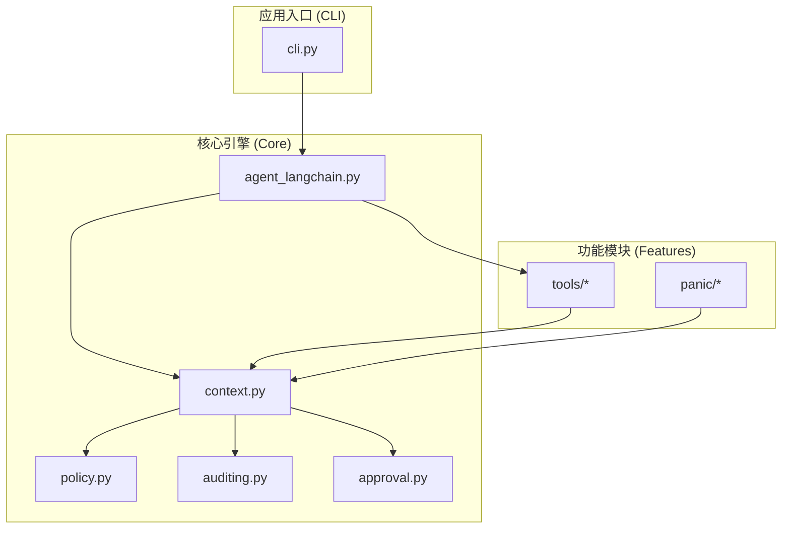
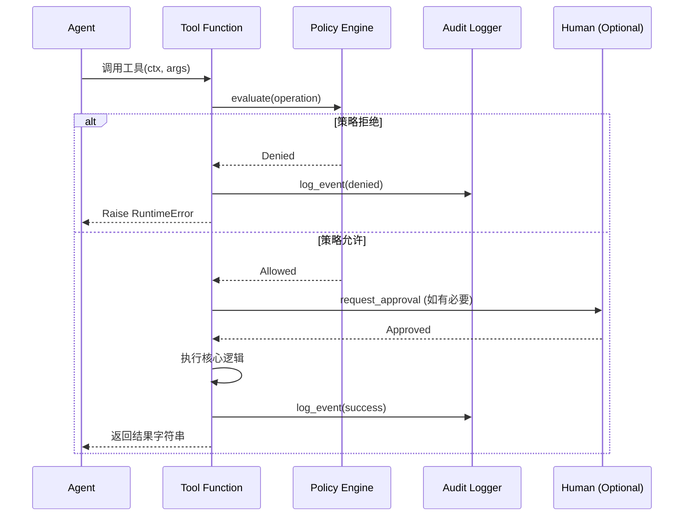
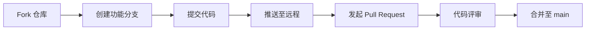

# 开发者指南与贡献

## 目录
1. [模块概览](#模块概览)
2. [源码结构解析](#源码结构解析)
3. [新工具开发规范](#新工具开发规范)
   - [工具函数模板](#工具函数模板)
   - [安全与审计集成](#安全与审计集成)
4. [测试驱动开发](#测试驱动开发)
   - [测试框架选型](#测试框架选型)
   - [单元测试示例](#单元测试示例)
5. [贡献流程与规范](#贡献流程与规范)
   - [Git 工作流](#git-工作流)
   - [代码风格规范](#代码风格规范)
6. [关键文件参考](#关键文件参考)

## 模块概览

`oscopilot` 项目是一个基于 Python 的 Linux 操作系统辅助 Agent。在进行深度开发或贡献之前，了解项目的整体规模和模块划分是至关重要的。

经过对工作区的扫描，项目核心代码库主要集中在 `oscopilot/` 目录下，包含以下关键指标：
- **总文件数**：约 20 个 Python 源码文件。
- **核心子目录**：
    - `oscopilot/tools/`：工具集实现，是开发者最常参与贡献的区域。
    - `oscopilot/panic/`：专注于系统崩溃分析与诊断的专用模块。
    - `oscopilot/`（根）：包含 Agent 引擎、策略引擎、审计日志和审批流程等核心逻辑。

本指南将重点介绍如何扩展 `oscopilot/tools/` 模块，并遵循项目既定的安全与审计规范。

## 源码结构解析

`oscopilot` 采用模块化设计，确保核心引擎与具体工具实现解耦。这种结构使得系统能够灵活地扩展新功能，同时保持高度的安全管控。

以下是项目的核心架构图，展示了各组件之间的依赖关系：



在上述架构中：
- **`cli.py`**：作为用户交互的起点，负责解析命令行参数并初始化 `AppContext`。
- **`context.py`**：定义了 `AppContext` 类，它是整个系统的“粘合剂”，承载了配置、审计器、策略引擎和审批管理器。几乎所有的工具函数都需要接收一个 `AppContext` 实例。
- **`policy.py`**：负责安全策略的评估。任何具有副作用的操作（如文件写入、包安装）都必须经过策略引擎的校验。
- **`auditing.py`**：实现了结构化的审计日志记录，确保 Agent 的每一步操作都可追溯。
- **`tools/`**：存放具体的原子工具。每个工具都是一个独立的 Python 函数，通过 `AppContext` 与核心引擎交互。

**Section sources**:
- [oscopilot/context.py](oscopilot/context.py)
- [oscopilot/cli.py](oscopilot/cli.py)
- [oscopilot/policy.py](oscopilot/policy.py)

## 新工具开发规范

为 `oscopilot` 开发新工具是贡献者最常见的任务。为了确保工具能被 Agent 正确调用，并符合项目的安全审计标准，开发者必须遵循特定的编写规范。

### 工具函数模板

一个标准的工具函数应该具备清晰的类型注解、详细的 Docstring（用于 LLM 的工具描述发现）以及必要的安全检查。

以下是一个新增工具的参考模板：

```python
from __future__ import annotations
from ..context import AppContext
from ..policy import Operation
from ..auditing import AuditEvent, now_iso
from ..utils import generate_action_id

def my_new_tool(ctx: AppContext, param1: str, param2: int = 10) -> str:
    """
    这里是工具的描述，LLM 会根据这段文字决定是否调用该工具。
    
    Args:
        ctx: 应用上下文，必传。
        param1: 参数 1 的描述。
        param2: 参数 2 的描述，默认值为 10。
        
    Returns:
        执行结果的字符串总结。
    """
    # 1. 定义操作类型，用于策略评估
    op = Operation(type="shell", name="my_tool_action", args={"p1": param1, "p2": param2})
    
    # 2. 策略评估
    decision = ctx.policy.evaluate(op)
    action_id = generate_action_id()
    
    if not decision.allowed:
        # 记录拒绝审计并抛出异常
        ctx.auditor.log_event(AuditEvent(
            timestamp=now_iso(),
            actor=ctx.actor,
            session_id=ctx.session_id,
            action_id=action_id,
            tool=op.name,
            args=op.args,
            result_summary=f"策略拒绝: {decision.reason}",
            policy_decision="denied",
            approval_result="rejected"
        ))
        raise RuntimeError(f"Access Denied: {decision.reason}")

    # 3. 执行核心逻辑 (建议使用 psutil 或原生 Python 库，避免裸 shell)
    try:
        # 模拟执行逻辑
        result_data = f"Executed with {param1}"
        status = "success"
    except Exception as e:
        status = "failed"
        result_data = str(e)

    # 4. 记录执行审计
    ctx.auditor.log_event(AuditEvent(
        timestamp=now_iso(),
        actor=ctx.actor,
        session_id=ctx.session_id,
        action_id=action_id,
        tool=op.name,
        args=op.args,
        result_summary="工具执行完成",
        stdout=result_data,
        policy_decision="allow",
        approval_result="n/a"
    ))
    
    return result_data
```

### 安全与审计集成

在 `oscopilot` 中，安全不是事后补丁，而是工具实现的一部分。



如上图所示，工具的生命周期被严格控制在 `AppContext` 提供的服务之下。开发者需要注意以下几点：
1. **输入净化**：使用 `oscopilot.utils.ensure_no_invisible` 检查输入字符串，防止提示词注入攻击。
2. **最小权限**：在 `Operation` 中准确描述操作类型（如 `shell`, `file_write`, `package_manage`），以便策略引擎进行精确匹配。
3. **幂等性**：工具应尽可能设计为幂等的，特别是在涉及系统变更的操作中。

**Section sources**:
- [oscopilot/tools/system_info.py](oscopilot/tools/system_info.py)
- [oscopilot/tools/files.py](oscopilot/tools/files.py)
- [oscopilot/utils.py](oscopilot/utils.py)

## 测试驱动开发

虽然目前项目根目录下尚未建立统一的 `tests/` 目录，但我们强烈建议贡献者在提交代码前编写单元测试，以确保代码质量。

### 测试框架选型

项目推荐使用 `pytest` 作为测试框架。由于 `oscopilot` 高度依赖 `AppContext`，在编写测试时，通常需要 Mock 掉审计器和策略引擎。

### 单元测试示例

以下是一个针对工具函数的测试示例，展示了如何构造 Mock 上下文：

```python
import pytest
from unittest.mock import MagicMock
from oscopilot.context import AppContext
from oscopilot.tools.system_info import cpu_load_and_top_processes

def test_cpu_load_tool():
    # 1. 构造 Mock 环境
    mock_ctx = MagicMock(spec=AppContext)
    mock_ctx.policy.evaluate.return_value.allowed = True
    mock_ctx.actor = "test_user"
    mock_ctx.session_id = "test_session"
    
    # 2. 执行工具
    result = cpu_load_and_top_processes(mock_ctx, limit=2)
    
    # 3. 断言
    assert "CPU load" in result
    assert "Top processes" in result
    # 验证审计日志是否被调用
    assert mock_ctx.auditor.log_event.called
```

为了运行测试，开发者可以在本地安装测试依赖：
```bash
pip install pytest pytest-mock
pytest tests/
```

## 贡献流程与规范

我们欢迎所有形式的贡献，包括修复 Bug、改进文档或增加新功能。

### Git 工作流

项目遵循标准的 GitHub Flow：



1. **Fork**: 将 `oscopilot` 仓库 fork 到你的个人账号。
2. **Branch**: 基于最新的 `main` 分支创建功能分支，命名规范为 `feat/your-feature-name` 或 `fix/issue-id`。
3. **Commit**: 编写清晰的提交信息，建议遵循 [Conventional Commits](https://www.conventionalcommits.org/) 规范。
4. **PR**: 在发起 PR 时，请详细描述你的修改内容及测试情况。

### 代码风格规范

为了保持代码库的整洁和可维护性，请遵循以下规范：
- **PEP 8**: 严格遵守 Python 官方代码风格指南。
- **Type Hints**: 所有新编写的函数必须包含完整的类型注解。
- **Docstrings**: 使用 Google 风格的 Docstring 格式。
- **依赖管理**: 如果引入了新的第三方库，请务必更新 `pyproject.toml` 中的 `dependencies` 列表。

## 关键文件参考

在开发过程中，你可能需要频繁参考以下文件：

- **`pyproject.toml`**: 项目元数据与依赖定义。
- **`oscopilot/__init__.py`**: 顶层导出逻辑，决定了哪些组件可以被外部直接访问。
- **`oscopilot/tools/__init__.py`**: 工具模块的注册中心。
- **`oscopilot/context.py`**: 核心上下文对象的定义。
- **`oscopilot/auditing.py`**: 审计事件的数据结构定义。

**Section sources**:
- [pyproject.toml](pyproject.toml)
- [oscopilot/__init__.py](oscopilot/__init__.py)
- [oscopilot/tools/__init__.py](oscopilot/tools/__init__.py)
