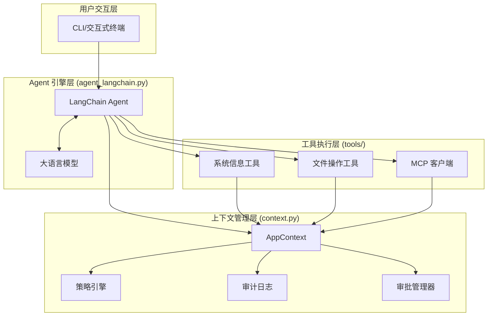
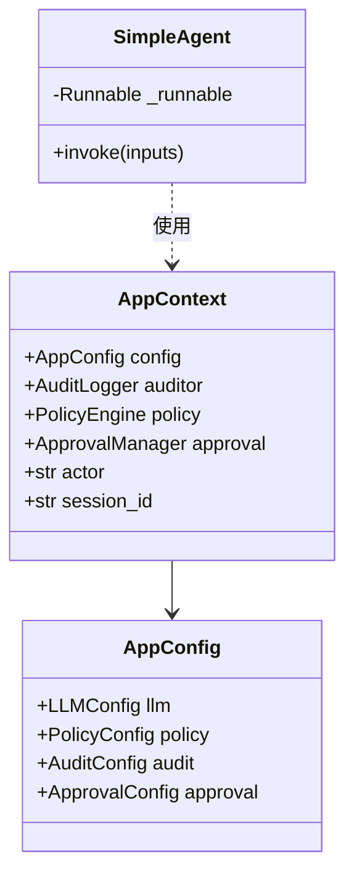
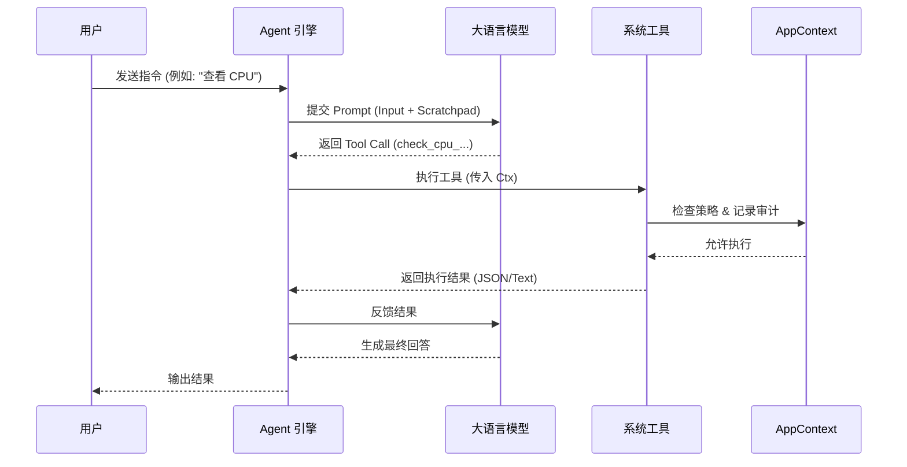
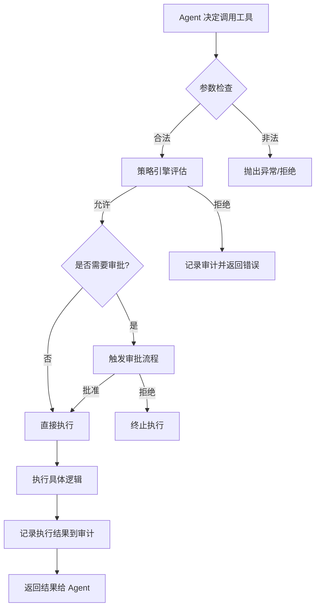

# 核心架构与 Agent 引擎

## 目录
1. [模块概览](#模块概览)
2. [简介](#简介)
3. [核心架构](#核心架构)
   - [架构组件关系](#架构组件关系)
   - [核心类图结构](#核心类图结构)
4. [Agent 引擎实现](#agent-引擎实现)
   - [基于 LangChain 的 Agent 构建](#基于-langchain-的-agent-构建)
   - [执行生命周期](#执行生命周期)
5. [上下文与状态管理](#上下文与状态管理)
   - [AppContext 核心数据结构](#appcontext-核心数据结构)
   - [会话与操作追踪](#会话与操作追踪)
6. [任务分解与工具执行流](#任务分解与工具执行流)
   - [工具调度机制](#工具调度机制)
   - [安全执行流水线](#安全执行流水线)
7. [异常处理与自愈机制](#异常处理与自愈机制)
   - [输入净化与防御](#输入净化与防御)
   - [执行期异常捕获](#执行期异常捕获)
8. [文件参考](#文件参考)

## 模块概览

在对 `oscopilot` 核心代码库进行深度探索后，我们确定了本章节涵盖的范围和规模。该模块是整个系统的“大脑”，负责连接自然语言理解与底层操作系统操作。

- **文件总数**：约 20 个 Python 源文件。
- **核心子目录**：
  - `oscopilot/`: 包含 Agent 引擎、上下文管理及核心逻辑。
  - `oscopilot/tools/`: 包含 Agent 可调用的具体操作系统工具实现。
  - `oscopilot/panic/`: 包含针对复杂任务（如内核 Panic 分析）的专门处理逻辑。
- **重点覆盖范围**：
  - `agent_langchain.py`: Agent 引擎的核心实现。
  - `context.py`: 全局上下文与状态管理。
  - `utils.py`: 通用工具函数与安全检查。
  - `tools/`: 工具调度与审计集成。

本章节将深入分析这些组件如何协同工作，确保 Agent 在执行复杂系统任务时的智能性、连续性与安全性。

## 简介

`oscopilot` 的 Agent 引擎是系统的核心调度中枢。它的主要任务是将用户的自然语言指令（如“检查系统负载并找出占用 CPU 最高的进程”）转化为一系列可执行的系统工具调用。不同于通用的聊天机器人，`oscopilot` 的 Agent 运行在高度敏感的操作系统环境中，因此其设计不仅关注“如何完成任务”，更关注“如何安全、可审计地完成任务”。

该引擎基于 LangChain 框架构建，利用了现代大语言模型（LLM）的 **Tool Calling**（工具调用）能力。通过将操作系统功能封装为标准的 LangChain 工具，Agent 可以根据当前系统状态动态决定下一步操作。同时，通过引入 `AppContext`（应用上下文），引擎确保了在多轮对话和复杂任务执行过程中，安全策略、审计日志和审批流程能够始终贯穿其中。

## 核心架构

`oscopilot` 采用了分层且解耦的架构设计，确保了 Agent 逻辑与具体工具实现、安全策略之间的清晰边界。

### 架构组件关系

下图展示了 Agent 引擎与其他核心组件之间的交互关系。`AppContext` 作为中心枢纽，连接了配置、策略、审计和工具层。



在上述架构中，用户通过 CLI 输入指令。`Agent` 引擎接收指令并咨询 `LLM`。当 `LLM` 决定调用某个工具时，该工具会访问 `AppContext` 来检查 `Policy`（策略）是否允许执行，并根据需要触发 `Approval`（审批）。所有的执行过程都会被记录到 `Audit`（审计）日志中。

### 核心类图结构

`AppContext` 是维持系统运行状态的关键数据结构。它不仅承载了静态配置，还管理着动态的会话信息。



`AppContext` 对象在系统启动时被初始化，并贯穿整个 Agent 的生命周期。`SimpleAgent` 是对 LangChain 原生 Agent 的薄封装，旨在简化输入参数的处理（如自动填充 `intermediate_steps`）。

**Section sources**:
- [oscopilot/context.py](oscopilot/context.py)
- [oscopilot/agent_langchain.py](oscopilot/agent_langchain.py)

## Agent 引擎实现

`oscopilot` 的 Agent 引擎利用 LangChain 的 `create_tool_calling_agent` 来实现。这种模式允许 LLM 直接输出结构化的工具调用请求，而不是解析复杂的 ReAct 提示词。

### 基于 LangChain 的 Agent 构建

在 `agent_langchain.py` 中，Agent 的构建过程包括工具注册、提示词模板定义和模型绑定。

```python
# oscopilot/agent_langchain.py

def _build_agent(ctx: AppContext):
    llm = ChatOpenAI(
        base_url=ctx.config.llm.base_url,
        api_key=ctx.config.llm.api_key,
        model=ctx.config.llm.model,
        timeout=ctx.config.llm.timeout,
    )
    tools = _build_tools(ctx)

    system_prompt = (
        "你是一个 Linux OS Copilot 助手，专注于安全的系统诊断。"
        "在调用任何会修改系统状态的工具前，务必给出中文解释，并只调用已经注册的工具。"
    )

    prompt = ChatPromptTemplate.from_messages(
        [
            ("system", system_prompt),
            ("user", "{input}"),
            MessagesPlaceholder(variable_name="agent_scratchpad"),
        ]
    )

    inner = create_tool_calling_agent(llm, tools, prompt)
    # ... 封装为 SimpleAgent
```

这里的关键在于 `_build_tools(ctx)`。它将底层的系统操作（如 `system_info.cpu_load_and_top_processes`）包装成 LangChain 的 `@tool`。通过闭包，`AppContext` 被注入到每个工具中，使得工具在执行时能够访问全局的审计和策略引擎。

### 执行生命周期

Agent 的执行遵循“接收指令 -> 模型推理 -> 工具调用 -> 结果反馈”的循环。



在执行过程中，`agent_scratchpad` 占位符用于存储中间步骤（`intermediate_steps`），这确保了 LLM 能够看到之前的工具执行结果，从而进行多步推理。

**Section sources**:
- [oscopilot/agent_langchain.py:L39-L74](oscopilot/agent_langchain.py#L39-L74)

## 上下文与状态管理

上下文管理是 `oscopilot` 能够处理复杂、多步骤任务的基础。它不仅涉及对话历史，还涉及系统权限、安全状态和审计追踪。

### AppContext 核心数据结构

`AppContext` 是一个中心化的数据容器，它在 `oscopilot/context.py` 中定义：

```python
@dataclass
class AppContext:
    config: AppConfig       # 全局配置
    auditor: AuditLogger    # 审计记录器
    policy: PolicyEngine    # 策略评估引擎
    approval: ApprovalManager # 审批管理器
    actor: str              # 执行者身份
    session_id: str         # 唯一会话 ID
```

- **会话一致性**：通过 `session_id`，系统可以将属于同一个任务的所有操作关联起来。
- **安全隔离**：`actor` 标识了当前是谁在操作（例如 `oscopilot` 自身或特定用户），这为后续的权限控制提供了依据。
- **组件集成**：`AppContext` 使得工具层不需要关心配置是如何加载的，也不需要关心审计日志是如何存储的，只需要调用 `ctx.auditor.log_event()` 即可。

### 会话与操作追踪

为了实现精确的审计和回溯，`oscopilot` 引入了 `session_id` 和 `action_id`。

- **Session ID**：在 Agent 启动时生成，代表一次完整的交互过程。
- **Action ID**：在每个具体工具执行前生成，代表一次原子操作。

这种双层追踪机制使得管理员可以轻松查出：“在 Session A 中，Agent 为了完成任务 X，先后执行了 Action 1 (查询) 和 Action 2 (修改)”。

**Section sources**:
- [oscopilot/context.py:L14-L38](oscopilot/context.py#L14-L38)
- [oscopilot/utils.py:L31-L36](oscopilot/utils.py#L31-L36)

## 任务分解与工具执行流

当用户输入一个复杂指令时，Agent 需要将其分解为多个子任务。例如，“如果 CPU 负载过高，则清理临时文件”涉及监控和操作两个阶段。

### 工具调度机制

`oscopilot` 并不直接执行 shell 命令，而是通过封装好的 Python 函数进行调度。这种方式比直接执行字符串命令更安全，也更容易进行参数校验。



### 安全执行流水线

以文件追加操作为例（`append_line_with_approval`），执行流包含了完整的安全闭环：

1.  **Diff 生成**：在修改文件前，先生成 `unified_diff`，计算 `diff_hash`。
2.  **策略评估**：调用 `ctx.policy.evaluate(op)`。如果策略规定 `/etc/hosts` 不可写，则直接拦截。
3.  **动态审批**：如果策略允许但风险较高，`ApprovalManager` 会根据配置决定是弹出交互式确认，还是加入审批队列。
4.  **原子执行**：只有在获得批准后，才会调用 `apply()` 函数执行真正的落盘操作。

这种“先评估、再审批、后执行”的流水线，是 `oscopilot` 区别于普通 Agent 的核心竞争力。

**Section sources**:
- [oscopilot/tools/files.py:L65-L131](oscopilot/tools/files.py#L65-L131)
- [oscopilot/tools/system_info.py:L17-L77](oscopilot/tools/system_info.py#L17-L77)

## 异常处理与自愈机制

在操作系统环境中，错误是常态（如权限不足、文件不存在、网络超时）。Agent 引擎必须具备鲁棒的异常处理能力。

### 输入净化与防御

为了防止 **Prompt Injection**（提示词注入）攻击，`oscopilot/utils.py` 提供了输入净化功能。

```python
def ensure_no_invisible(text: str, field: str = "input") -> str:
    """防御零宽字符等不可见字符注入。"""
    if INVISIBLE_CHARS_RE.search(text):
        raise InputSanitizationError(f"字段 {field} 含有不可见字符，已拒绝。")
    return text
```

这是第一道防线，确保 LLM 接收到的指令不包含恶意隐藏字符。

### 执行期异常捕获

在工具执行过程中，`oscopilot` 捕获底层异常（如 `psutil.AccessDenied` 或 `FileNotFoundError`），并将其转化为 LLM 可以理解的错误描述。

```python
# 示例：系统信息查询中的异常处理
for p in psutil.process_iter(attrs=["pid", "name", "username", "cpu_percent"]):
    try:
        procs.append(p.info)
    except (psutil.NoSuchProcess, psutil.AccessDenied):
        # 优雅跳过无法访问的进程，不中断整体流程
        continue
```

通过将这些错误反馈给 LLM，Agent 可以尝试采取替代方案（例如：如果无法查看进程 A，尝试查看进程 B，或者向用户报告权限限制）。

**Section sources**:
- [oscopilot/utils.py:L17-L29](oscopilot/utils.py#L17-L29)
- [oscopilot/tools/system_info.py:L44-L48](oscopilot/tools/system_info.py#L44-L48)

## 文件参考

以下是本章节分析的核心源代码文件：

- `oscopilot/agent_langchain.py`: Agent 引擎实现，定义了基于 LangChain 的调度逻辑。
- `oscopilot/context.py`: 核心上下文对象 `AppContext` 的定义与初始化。
- `oscopilot/utils.py`: 提供输入净化、ID 生成等基础工具函数。
- `oscopilot/config.py`: 定义了 LLM、策略、审计等模块的配置结构。
- `oscopilot/tools/system_info.py`: 系统信息查询工具的实现示例。
- `oscopilot/tools/files.py`: 文件安全操作工具的实现示例。
- `oscopilot/panic/analyzer.py`: 展示了复杂多轮任务分析的特殊实现模式。
- `oscopilot/cli.py`: 命令行入口，展示了如何初始化上下文并启动 Agent。
