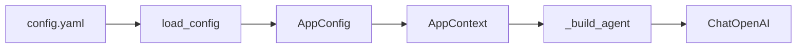
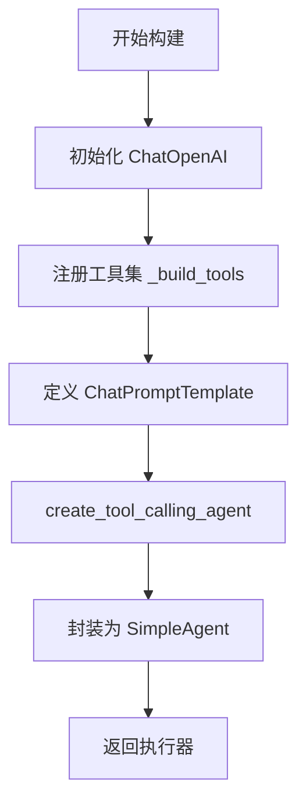
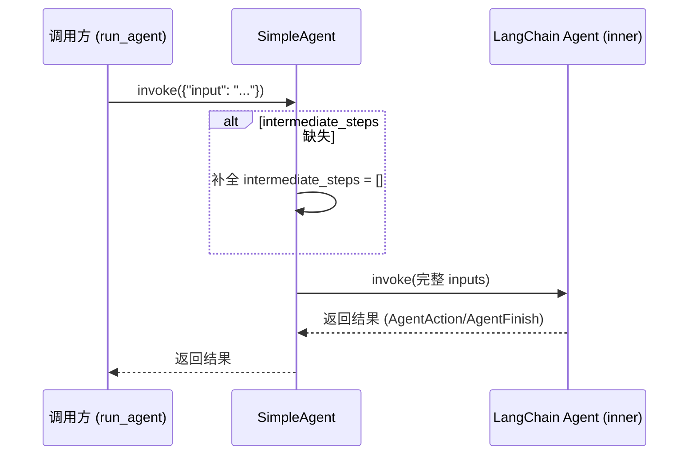
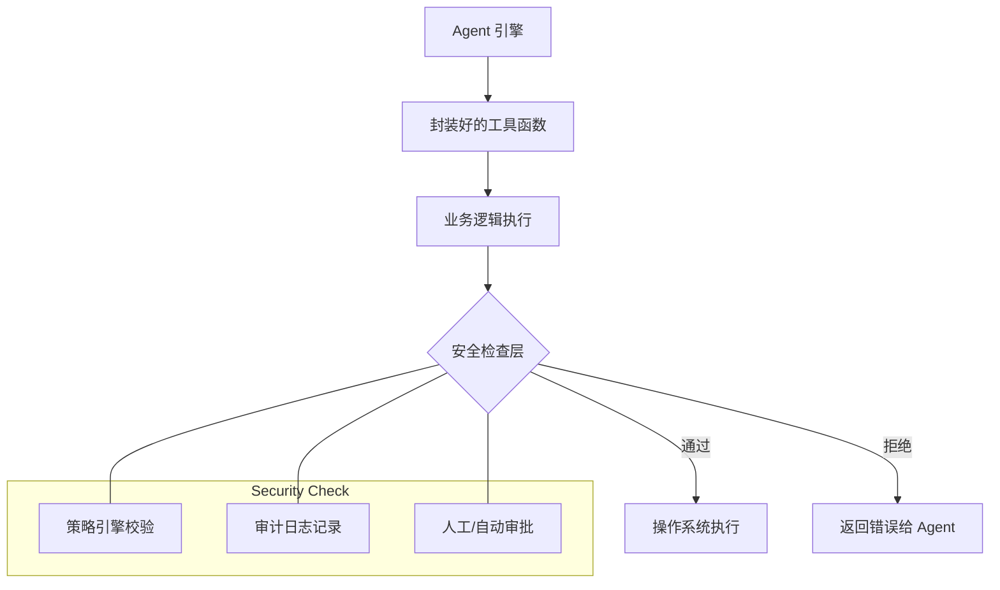
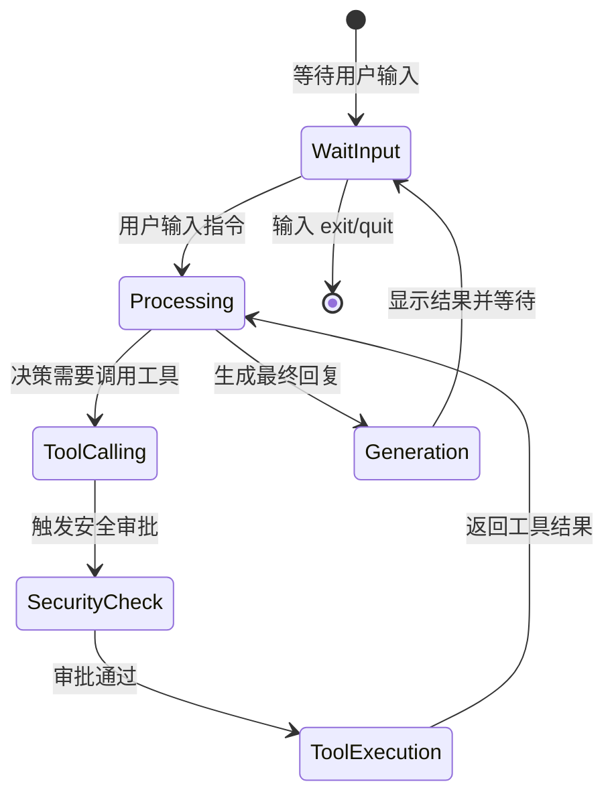
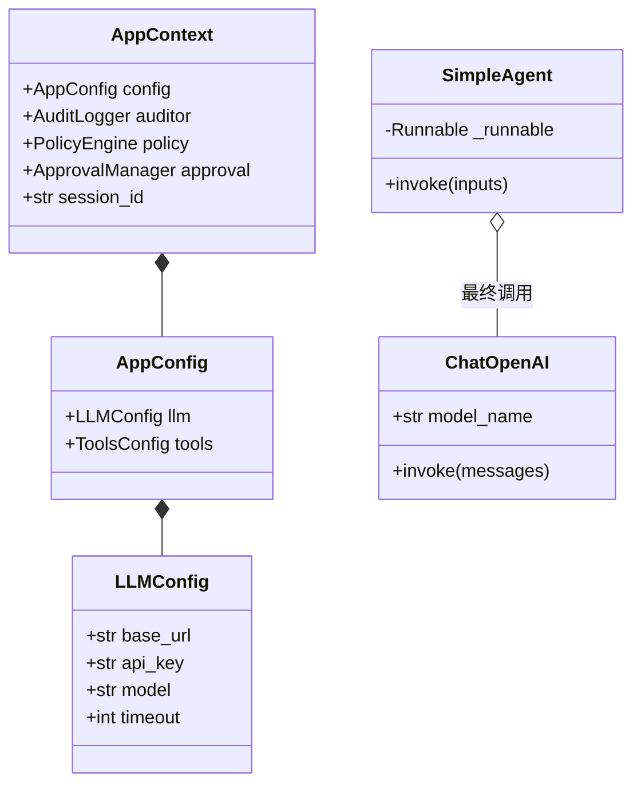
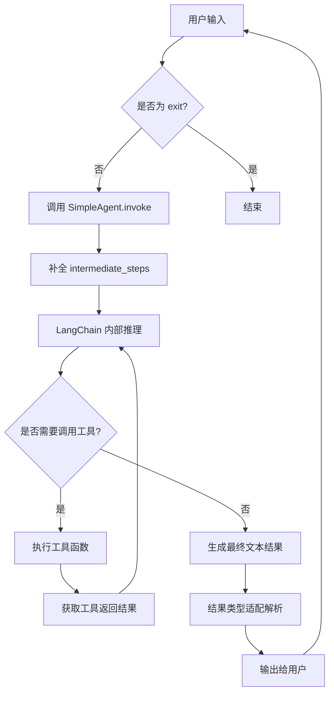

# Agent 核心逻辑实现

## 目录
1. [模块概览](#模块概览)
2. [引言](#引言)
3. [LLM 绑定与配置注入](#llm-绑定与配置注入)
4. [提示词工程与系统指令设计](#提示词工程与系统指令设计)
5. [Agent 引擎构建机制](#agent-引擎构建机制)
6. [SimpleAgent 包装类深度解析](#simpleagent-包装类深度解析)
7. [工具绑定与安全约束](#工具绑定与安全约束)
8. [执行生命周期与交互模式](#执行生命周期与交互模式)
9. [核心组件类图与逻辑流](#核心组件类图与逻辑流)
10. [文件参考](#文件参考)

## 模块概览

在 `oscopilot` 项目中，Agent 核心逻辑主要集中在 `oscopilot/` 根目录下，通过集成 LangChain 框架实现了智能化的 Linux 系统运维助手。

根据对代码库的初步扫描，该模块涉及的核心文件及其规模如下：
- **总文件数**：约 20 个 Python 文件。
- **核心子模块**：
    - `oscopilot/panic/`：负责系统崩溃（Panic）分析的专用 Agent。
    - `oscopilot/tools/`：提供 Agent 可调用的底层系统工具集（如文件编辑、系统信息查询等）。
- **覆盖范围**：
    - 本章节将深入剖析 `oscopilot/agent_langchain.py`，这是 Agent 引擎的实现核心。
    - 同时会涉及 `oscopilot/config.py` 和 `oscopilot/context.py`，它们为 Agent 提供了必要的运行上下文和配置支持。

## 引言

`oscopilot` 的核心定位是一个智能 Linux 操作系统助手（OS Copilot）。为了实现这一目标，它不仅需要具备强大的自然语言理解能力，还需要能够安全地与底层操作系统进行交互。

该模块通过 `langchain_openai` 库与 OpenAI 兼容的 LLM 接口进行绑定，利用 LangChain 的 `create_tool_calling_agent` 机制，将大模型的推理能力与预定义的系统工具集相结合。其核心设计思想是“安全优先”与“可解释性”，通过严格的提示词工程约束 Agent 的行为，并引入 `SimpleAgent` 包装类来适配复杂的工具调用链路。

## LLM 绑定与配置注入

Agent 的第一步是建立与大语言模型（LLM）的通信。`oscopilot` 采用了灵活的配置机制，允许用户通过 YAML 文件自定义 LLM 的各项参数。

### 配置结构分析

在 `oscopilot/config.py` 中，`LLMConfig` 数据类定义了连接 LLM 所需的关键信息：

```python
@dataclass
class LLMConfig:
    base_url: str
    api_key: str
    model: str
    timeout: int = 30
```

这些参数在 `load_config` 函数中从配置文件（如 `~/.config/oscopilot/config.yaml`）中读取，并最终通过 `AppContext` 传递给 Agent 构建函数。

### ChatOpenAI 初始化

在 `oscopilot/agent_langchain.py` 的 `_build_agent` 函数中，利用这些配置初始化 `ChatOpenAI` 实例：

```python
def _build_agent(ctx: AppContext):
    llm = ChatOpenAI(
        base_url=ctx.config.llm.base_url,
        api_key=ctx.config.llm.api_key,
        model=ctx.config.llm.model,
        timeout=ctx.config.llm.timeout,
    )
    # ... 后续构建逻辑
```

这种注入方式确保了 Agent 引擎与具体的 LLM 提供商解耦。只要提供商支持 OpenAI 兼容的 API 格式，`oscopilot` 就能无缝切换不同的后端模型（如 GPT-4, Claude 3.5, 或本地部署的 Llama 3）。

**配置流向图**：

该图展示了配置信息如何从磁盘文件流向最终的 LLM 客户端实例。



配置加载过程从读取物理 YAML 文件开始，通过 `load_config` 将原始字典转换为类型安全的 `AppConfig` 对象。随后，该对象被封装在 `AppContext` 中，作为全局上下文在各个模块间传递。在 `_build_agent` 阶段，具体的 `LLMConfig` 字段被提取并用于实例化 `ChatOpenAI` 客户端。

**Section sources**:
- [oscopilot/config.py](oscopilot/config.py)
- [oscopilot/agent_langchain.py](oscopilot/agent_langchain.py)

## 提示词工程与系统指令设计

提示词（Prompt）是控制 Agent 行为的核心。`oscopilot` 使用 `ChatPromptTemplate` 构建了一个结构化的提示词体系。

### 系统提示词（System Prompt）

系统提示词定义了 Agent 的身份和行为准则：

```python
system_prompt = (
    "你是一个 Linux OS Copilot 助手，专注于安全的系统诊断。"
    "在调用任何会修改系统状态的工具前，务必给出中文解释，并只调用已经注册的工具。"
)
```

**设计意图分析**：
1. **身份锚定**：明确其作为“Linux OS Copilot 助手”的身份，使其输出更符合运维场景。
2. **安全诊断**：强调“专注安全”，暗示 Agent 应避免执行破坏性操作。
3. **中文解释**：强制要求在操作前提供中文解释，增强了系统的透明度和可审计性，方便人类管理员理解 Agent 的意图。
4. **工具约束**：明确限制只能调用已注册的工具，防止 Agent 尝试执行未授权的命令。

### 提示词结构

`ChatPromptTemplate` 将系统提示词、用户输入和 Agent 的“便签本”（Scratchpad）组合在一起：

```python
prompt = ChatPromptTemplate.from_messages(
    [
        ("system", system_prompt),
        ("user", "{input}"),
        MessagesPlaceholder(variable_name="agent_scratchpad"),
    ]
)
```

其中 `agent_scratchpad` 是一个非常关键的占位符。在 LangChain 的工具调用 Agent 中，它用于存储模型在多步推理过程中的中间思考、工具调用请求及其返回结果。如果没有这个占位符，Agent 将无法记住自己之前做过什么，从而导致逻辑断裂。

**提示词结构图**：

展示了最终发送给 LLM 的消息序列组成。

```mermaid
graph TD
    subgraph "ChatPromptTemplate"
        SP[System Message: 身份与安全准则]
        UM[User Message: 用户指令 {input}]
        AS[MessagesPlaceholder: agent_scratchpad]
    end
    SP --> FinalPrompt
    UM --> FinalPrompt
    AS --> FinalPrompt
    FinalPrompt --> LLM
```

提示词模板由三个核心部分组成：顶层的系统消息确立了全局的行为边界和语言偏好；中间的用户消息承载了当前具体的任务请求；底层的 `agent_scratchpad` 动态注入了多轮交互中的中间步骤（Intermediate Steps）。这种分层设计确保了 Agent 既能遵循长期的安全策略，又能灵活应对瞬时的任务需求。

**Section sources**:
- [oscopilot/agent_langchain.py](oscopilot/agent_langchain.py)

## Agent 引擎构建机制

`oscopilot` 利用 LangChain 提供的 `create_tool_calling_agent` 高级 API 来快速构建具备工具调用能力的 Agent。

### 核心构建逻辑

在 `_build_agent` 函数中，Agent 的创建过程如下：

```python
def _build_agent(ctx: AppContext):
    # 1. 初始化 LLM
    llm = ChatOpenAI(...)
    
    # 2. 注册工具集
    tools = _build_tools(ctx)
    
    # 3. 定义提示词模板
    prompt = ChatPromptTemplate(...)
    
    # 4. 创建内部 Agent
    inner = create_tool_calling_agent(llm, tools, prompt)
    
    # 5. 包装并返回
    return SimpleAgent(inner)
```

`create_tool_calling_agent` 的作用是将 LLM、工具列表和提示词绑定在一起，生成一个 `Runnable` 对象。这个对象知道如何将 `agent_scratchpad` 中的中间步骤格式化为模型可理解的消息，并解析模型返回的工具调用指令。

**Agent 构建流程图**：



构建流程是一个标准的流水线作业。首先建立基础的通信通道（LLM），然后定义 Agent 的“手”（Tools）和“大脑准则”（Prompt）。`create_tool_calling_agent` 充当了粘合剂的角色，将这些异构组件整合为一个统一的逻辑单元。最后，通过 `SimpleAgent` 进行适配，确保其能够直接被上层应用调用。

**Section sources**:
- [oscopilot/agent_langchain.py](oscopilot/agent_langchain.py)

## SimpleAgent 包装类深度解析

在 `agent_langchain.py` 中，定义了一个内部类 `SimpleAgent`。这个类虽然代码量不多，但对于整个系统的稳定性至关重要。

### 为什么需要 SimpleAgent？

LangChain 的 `create_tool_calling_agent` 生成的 Agent 在被调用时，期望输入字典中包含 `intermediate_steps` 字段。如果该字段缺失，Agent 将无法处理多步推理。

`SimpleAgent` 的实现如下：

```python
class SimpleAgent:
    """适配 create_tool_calling_agent 的 runnable，自动补充 intermediate_steps。"""

    def __init__(self, runnable):
        self._runnable = runnable

    def invoke(self, inputs, **kwargs):
        if "intermediate_steps" not in inputs:
            inputs = {**inputs, "intermediate_steps": []}
        return self._runnable.invoke(inputs, **kwargs)
```

### 核心功能：输入完整性保障

1. **自动补全**：在 `invoke` 方法中，它检查 `inputs` 字典。如果调用方只传了 `{"input": "..."}`，`SimpleAgent` 会自动补上空列表 `intermediate_steps: []`。
2. **接口适配**：它保持了与 LangChain `Runnable` 接口的一致性，使得上层代码（如 `run_agent`）可以透明地调用 `invoke`。
3. **状态隔离**：通过在每一轮调用时初始化中间步骤，确保了 Agent 在交互模式下的每一轮对话都是独立且输入完备的。

**SimpleAgent 调用逻辑图**：



`SimpleAgent` 扮演了防御式编程的角色。它拦截了发往底层 Agent 的请求，通过检查并补全必要的上下文参数，消除了因调用方疏忽而导致运行时错误的风险。这种设计模式极大地简化了上层业务逻辑，使其无需关心底层 Agent 引擎复杂的输入规范。

**Section sources**:
- [oscopilot/agent_langchain.py](oscopilot/agent_langchain.py)

## 工具绑定与安全约束

Agent 的威力在于它能调用工具。`oscopilot` 通过 `_build_tools` 函数将 Python 函数转换为 LangChain 可识别的工具。

### 工具注册示例

```python
def _build_tools(ctx: AppContext):
    @tool("check_cpu_and_top_processes")
    def check_cpu_and_top_processes() -> str:
        """检查 CPU 负载并列出前 5 个高 CPU 进程。"""
        return system_info.cpu_load_and_top_processes(ctx, limit=5)

    @tool("append_hosts_mapping")
    def append_hosts_mapping(ip: str, hostname: str) -> str:
        """向 /etc/hosts 追加一条 IP 与主机名映射（高风险操作，需审批与审计）。"""
        line = f"{ip} {hostname}"
        return files.append_line_with_approval(ctx, "/etc/hosts", line=line)

    return [check_cpu_and_top_processes, append_hosts_mapping]
```

### 安全机制集成

注意到这些工具函数都接收 `AppContext` 作为参数。这使得工具内部可以访问：
- **审批管理器 (`approval`)**：对于 `append_hosts_mapping` 这种写操作，工具内部会调用 `files.append_line_with_approval`，从而触发审批流程。
- **审计日志 (`auditor`)**：所有操作都会被记录。
- **策略引擎 (`policy`)**：检查操作是否符合预定义的白名单或黑名单规则。

这种设计确保了 Agent 即使产生了错误的决策，也会在工具执行层面被最后一层防线（审批与策略）拦截。

**工具调用安全链路图**：



工具调用的安全性并不是由 Agent 模型本身保证的，而是通过在工具执行路径中嵌入多重校验机制来实现的。当 Agent 发起工具调用请求时，该请求首先进入 `oscopilot` 的安全沙箱。策略引擎会检查命令的合规性，审计系统会记录操作意图，而高风险操作则会挂起等待审批。只有通过所有检查的操作才会最终下发到操作系统执行。

**Section sources**:
- [oscopilot/agent_langchain.py](oscopilot/agent_langchain.py)
- [oscopilot/tools/system_info.py](oscopilot/tools/system_info.py)
- [oscopilot/tools/files.py](oscopilot/tools/files.py)

## 执行生命周期与交互模式

`run_agent` 函数是 Agent 的入口，它支持“一次性指令”和“交互式对话”两种模式。

### 结果解析逻辑

由于 Agent 调用的返回结果可能是多种类型（`AgentFinish`, `dict`, `list` 等），`run_agent` 包含了一套健壮的解析逻辑：

```python
# 提取并打印 output 内容
output = None
if hasattr(result, "return_values"):
    output = result.return_values.get("output")
elif isinstance(result, dict):
    output = result.get("output")
elif isinstance(result, list):
    for item in reversed(result):
        if hasattr(item, "return_values"):
            output = item.return_values.get("output")
            break
# ...
```

这种处理方式兼容了 LangChain 不同版本或不同配置下可能产生的输出差异，确保了用户总能看到最终的执行结果。

### 交互循环

在交互模式下，系统通过一个 `while True` 循环不断接收用户输入，并调用 `executor.invoke`。每一轮交互都是一个完整的推理周期，Agent 会根据用户指令决定是否需要调用工具，并将最终生成的回复打印在终端。

**交互模式生命周期图**：



交互模式的生命周期是一个典型的“感知-决策-行动”循环。Agent 持续监听用户指令，一旦接收到任务，便进入处理状态。在处理过程中，Agent 可能多次往返于工具调用和推理之间，直到收集到足够的信息来生成最终回复。安全检查作为生命周期中的关键环节，确保了每一次行动的合规性。

**Section sources**:
- [oscopilot/agent_langchain.py](oscopilot/agent_langchain.py)

## 核心组件类图与逻辑流

为了更直观地理解 Agent 的内部构造，以下是核心组件的类关系图。

### 类关系图 (Class Diagram)

展示了 `AppContext`、配置类与 Agent 包装类之间的组合关系。



类图揭示了系统的层次化配置结构。`AppContext` 作为顶层容器，聚合了所有核心服务实例。`SimpleAgent` 通过组合模式持有了底层的 `Runnable`（通常最终指向 `ChatOpenAI`），实现了对执行逻辑的封装。这种结构清晰地分离了配置管理、上下文维护和执行引擎。

### 核心方法逻辑流 (Logical Flow)

展示了 `run_agent` 执行一次任务的详细步骤。



逻辑流图详细描绘了从用户输入到结果输出的全过程。重点突出了 `SimpleAgent` 对输入参数的预处理，以及 LangChain 内部推理循环（ReAct 模式）与工具执行的交互。最后的类型适配解析确保了无论底层引擎返回何种数据结构，用户界面都能获得一致的文本反馈。

**Section sources**:
- [oscopilot/agent_langchain.py](oscopilot/agent_langchain.py)
- [oscopilot/context.py](oscopilot/context.py)

## 文件参考

以下是本章节涉及的核心源代码文件，建议在深入研究时参考：

- `oscopilot/agent_langchain.py`: Agent 引擎的核心实现，包含 `SimpleAgent` 和工具绑定逻辑。
- `oscopilot/context.py`: 应用上下文 `AppContext` 的定义，承载了全局状态。
- `oscopilot/config.py`: 配置加载与数据结构定义，涉及 LLM 和工具的安全配置。
- `oscopilot/tools/system_info.py`: 系统信息查询工具的具体实现。
- `oscopilot/tools/files.py`: 文件操作工具的具体实现，包含安全审批逻辑。
