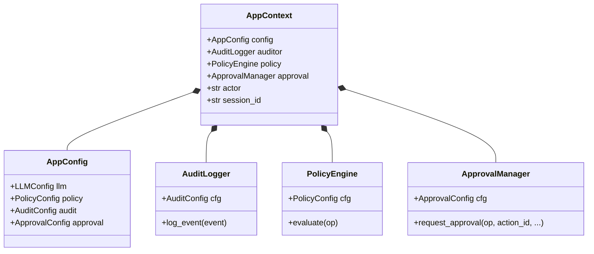
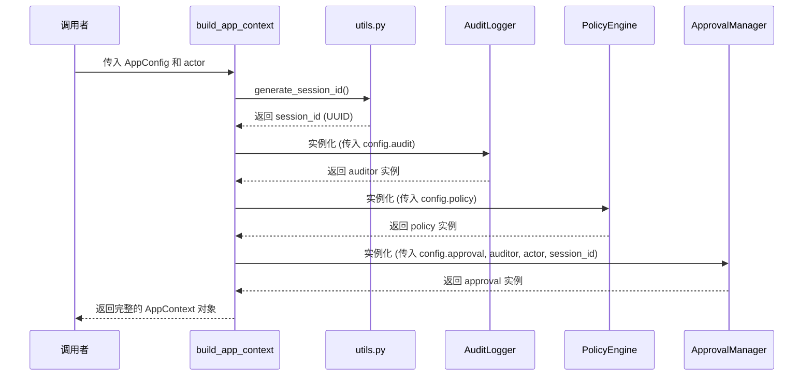
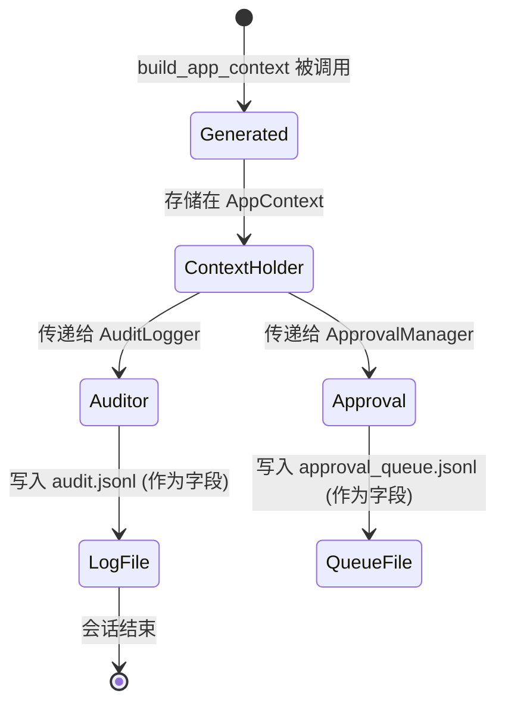
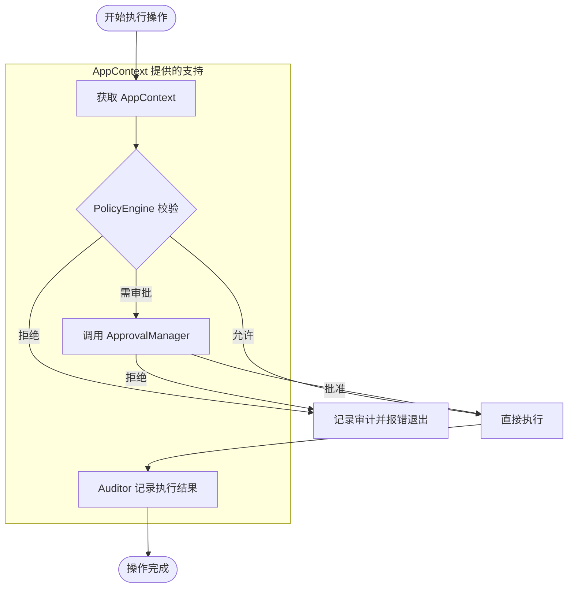

# 上下文与状态管理

## 目录
1. [模块概览](#模块概览)
2. [AppContext 数据结构](#appcontext-数据结构)
3. [上下文构建流程](#上下文构建流程)
4. [会话管理与全局追踪](#会话管理与全局追踪)
5. [上下文传播与“单真源”设计](#上下文传播与单真源设计)
6. [安全组件的协同工作](#安全组件的协同工作)
7. [设计哲学与最佳实践](#设计哲学与最佳实践)
8. [核心源码参考](#核心源码参考)

## 模块概览

在 `oscopilot` 系统中，上下文与状态管理是确保系统安全、可追溯且逻辑一致的核心基石。作为一个拥有操作系统级操作权限的智能 Agent，`oscopilot` 执行的每一条指令都可能对宿主系统产生深远影响。因此，系统必须在一个严密的安全框架内运行，这就需要一个统一的机制来协调配置加载、策略校验、审计记录和人工审批。

`oscopilot/context.py` 模块通过定义 `AppContext` 数据类，实现了这种“单真源”（Single Source of Truth）的设计模式。它不仅是一个简单的对象容器，更是连接各个安全子系统的“神经中枢”。通过 `AppContext`，系统能够确保在整个会话生命周期内，所有的操作都遵循同一套安全策略，所有的审计日志都指向同一个会话 ID，且所有的审批流程都具备完整的前后文信息。

本模块涉及的核心文件及其职责如下：
- `oscopilot/context.py`: 定义 `AppContext` 结构及其工厂函数 `build_app_context`。
- `oscopilot/config.py`: 定义多层级的配置结构，为上下文提供静态数据支持。
- `oscopilot/utils.py`: 提供 UUID 生成等基础工具，支撑会话 ID 的唯一性。
- `oscopilot/auditing.py`: 实现结构化审计日志记录，为系统提供“黑匣子”功能。
- `oscopilot/policy.py`: 实现基于规则的策略引擎，作为安全的第一道防线。
- `oscopilot/approval.py`: 实现人机协作的审批逻辑，作为高风险操作的最终闸口。

通过对这些组件的深度集成，`oscopilot` 构建了一个稳健的运行时环境，有效地降低了 LLM 生成指令可能带来的误操作或恶意攻击风险。

## AppContext 数据结构

`AppContext` 是 `oscopilot` 运行时的核心数据模型，采用了 Python 的 `dataclass` 进行定义。这种设计不仅提供了清晰的类型声明，还利用了 `dataclass` 自动生成的构造函数和属性访问特性，极大地提升了工程质量。

### 成员变量及其职责

`AppContext` 包含了系统运行所需的六个关键成员，每个成员在安全闭环中都扮演着不可或缺的角色：

| 成员变量 | 类型 | 职责描述 |
| :--- | :--- | :--- |
| `config` | `AppConfig` | 承载系统的全局配置，包括 LLM 参数、审计路径、白名单命令等静态策略。 |
| `auditor` | `AuditLogger` | 负责记录所有关键事件的审计日志，确保操作的“事后可追溯性”。 |
| `policy` | `PolicyEngine` | 负责对操作进行合规性校验，决定操作是“直接放行”、“拦截”还是“需要审批”。 |
| `approval` | `ApprovalManager` | 管理人工审批逻辑，支持即时交互和异步队列模式，实现“人机共治”。 |
| `actor` | `str` | 标识当前操作的发起者（如 "oscopilot" 或特定的管理员账号），用于审计归因。 |
| `session_id` | `str` | 唯一标识当前运行会话的 ID，是串联整个操作链条的“灵魂索引”。 |

### 设计优势分析

使用 `dataclass` 的核心优势在于**结构化与透明性**。在复杂的 Agent 逻辑中，如果使用传统的字典（dict）传递上下文，很容易因为键名拼写错误或缺失而导致难以调试的 Bug。`AppContext` 通过强类型定义，使得开发者在编写代码时就能获得 IDE 的自动补全和静态分析工具的检查。

此外，`AppContext` 的设计体现了**职责分离（SoC）**原则。它本身不包含复杂的业务逻辑，而仅仅是一个“持有者”。这种设计使得底层的 `AuditLogger` 或 `PolicyEngine` 可以根据需要独立升级，只要它们保持对 `AppContext` 中相关配置项的兼容即可。

下面的类图展示了 `AppContext` 与其关联组件之间的组合关系：



在上述架构中，`AppContext` 充当了“聚合根”角色。它将离散的安全组件聚合在一起，为上层 Agent 逻辑提供了一个统一的、一致的访问接口。

**Section sources**:
- [oscopilot/context.py](oscopilot/context.py)
- [oscopilot/config.py](oscopilot/config.py)

## 上下文构建流程

上下文的构建是系统启动时的首要任务。`oscopilot` 通过 `build_app_context` 函数来协调各个组件的初始化过程。这个过程不仅仅是简单的对象实例化，还涉及到复杂的依赖注入和循环依赖的处理。

### 构建逻辑分析

`build_app_context` 接收一个已加载的 `AppConfig` 对象，并按照特定的拓扑顺序初始化各个子系统。其核心逻辑如下：

1. **生成会话 ID**: 首先调用 `generate_session_id()` 获取一个全局唯一的标识符。这个 ID 将在后续所有组件的初始化中被共享。
2. **初始化审计器**: 使用配置中的审计参数创建 `AuditLogger`。审计器通常是第一个被创建的，因为它需要记录后续所有初始化动作的状态。
3. **初始化策略引擎**: 根据策略配置创建 `PolicyEngine`。策略引擎在初始化时会编译黑名单正则等，为后续的快速匹配做准备。
4. **初始化审批管理器**: 审批管理器需要引用审计器，以便在审批过程中实时记录日志。它还需要 `actor` 和 `session_id` 来确保审批记录的归因正确。

### 循环依赖的优雅处理

在 Python 项目中，组件间的相互引用极易导致循环导入（Circular Import）。例如，`context.py` 需要导入 `config.py` 中的类型定义，而 `config.py` 有时也可能需要引用上下文相关的逻辑。为了解决这一问题，`oscopilot` 在 `build_app_context` 内部使用了**局部导入（Local Import）**技巧。

```python
def build_app_context(config: AppConfig, actor: str = "oscopilot") -> AppContext:
    # 局部导入以避免在模块加载阶段产生循环依赖
    from .config import AuditConfig 

    session_id = generate_session_id()
    # ... 初始化逻辑 ...
```

这种做法将导入动作推迟到函数实际执行时，有效打破了模块间的编译期循环依赖，保证了系统初始化流程的稳健性。

下面的序列图展示了上下文构建的详细步骤：



通过这种严格的初始化顺序，`oscopilot` 确保了每个组件在创建时都已经具备了其所需的依赖项，从而构建出一个高度一致的运行时环境。

**Section sources**:
- [oscopilot/context.py:L24-L38](oscopilot/context.py#L24-L38)

## 会话管理与全局追踪

在 `oscopilot` 中，会话（Session）是追踪用户意图和 Agent 行为的最小逻辑单位。由于 Agent 可能会执行一系列复杂的、跨多个工具的操作，如果没有一个全局的追踪机制，审计分析和故障排查将变得无从下手。

### session_id 的生成与特性

`session_id` 的生成位于 `oscopilot/utils.py` 中，使用了 Python 标准库的 `uuid` 模块：

```python
def generate_session_id() -> str:
    return uuid.uuid4().hex
```

选择 `uuid4().hex` 是为了获得一个 32 位的随机十六进制字符串。相比于自增 ID，UUID 在概率上保证了全局唯一性，这使得 `oscopilot` 的审计日志在分布式部署或容器化环境中也能轻松合并，不会出现 ID 碰撞。

### 全局追踪的多维作用

`session_id` 在 `AppContext` 中一旦生成，就会被深度注入到所有的安全组件中，发挥以下作用：

1. **审计日志关联**: `AuditLogger` 在记录每一个 `AuditEvent` 时，都会带上 `session_id`。这意味着管理员可以通过简单的 `grep` 或数据库查询，还原出某次特定会话中 Agent 执行的所有动作序列及其因果关系。
2. **审批上下文关联**: 在 `ApprovalManager` 中，`session_id` 用于标识审批请求所属的会话。这在异步审批（如队列模式）中尤为重要，因为它允许审批者在确认某个高风险操作前，先查看该会话之前的操作背景。
3. **性能与度量分析**: 审计器中的 `summarize_last_session` 函数利用 `session_id` 来统计最近一次运行的工具调用分布、执行成功率以及操作频率，为系统优化提供数据支持。

下面的状态图展示了 `session_id` 在系统生命周期中的流转：



这种贯穿始终的 ID 追踪机制，为 `oscopilot` 提供了极高的透明度，是实现“可解释 AI”和“可信 Agent”的关键技术手段。

**Section sources**:
- [oscopilot/utils.py:L31-L32](oscopilot/utils.py#L31-L32)
- [oscopilot/auditing.py:L24](oscopilot/auditing.py#L24)

## 上下文传播与“单真源”设计

在复杂的 Agent 架构中，状态的离散往往是逻辑漏洞的根源。`oscopilot` 采用了“单真源”（Single Source of Truth）的原则，将 `AppContext` 作为唯一的权威状态源传递给系统的各个层级。

### 显式传播机制

当 Agent 需要执行一个工具（Tool）或调用一个复杂的业务函数时，`AppContext` 会作为参数被显式传递。这种设计虽然比隐式的全局变量（Global Variable）稍微繁琐，但它带来了显著的工程优势：

- **确定性与无副作用**: 函数的行为完全取决于其输入参数，不依赖于难以预测的全局状态。
- **卓越的可测试性**: 在单元测试中，开发者可以轻松地构造一个 Mock 版本的 `AppContext` 来测试特定组件，而不需要配置复杂的全局环境。
- **执行环境的一致性**: 无论操作是在 CLI 线程中发起，还是在异步回调中执行，访问到的配置、审计实例和策略规则都是完全一致的。

### 确保执行的一致性

通过传递 `AppContext`，系统在代码执行的每一个环节都强化了安全一致性：

- **权限校验一致性**: 所有的工具执行都必须通过 `ctx.policy` 进行校验，防止了因为代码路径分支导致的“漏检”。
- **审计记录一致性**: 所有的日志都通过 `ctx.auditor` 写入，确保了日志格式、时间戳精度和存储位置的绝对统一。
- **审批策略一致性**: 所有的风险操作都经过 `ctx.approval`，确保了如 `dry_run`（预览模式）等全局开关能在所有模块中同步生效。

下面的流程图展示了一个典型操作如何利用 `AppContext` 进行全生命周期的安全管控：



这种设计模式使得安全逻辑不再是散落在各处的碎片化补丁，而是被深度集成在系统的骨架流程中，实现了“原生安全”。

**Section sources**:
- [oscopilot/context.py](oscopilot/context.py)
- [oscopilot/policy.py](oscopilot/policy.py)

## 安全组件的协同工作

`AppContext` 的真正核心价值在于它如何使不同的安全组件协同工作，形成一个多层次、立体化的防御体系。

### 协同场景深度剖析：执行高风险命令

假设 Agent 尝试执行一个涉及敏感目录写入的操作，例如修改 `/etc/hosts`：

1. **策略引擎的第一道防线**: `PolicyEngine` 首先根据 `ctx.config.policy` 进行评估。它发现该操作属于 `file_write` 类型，根据预设规则，这被标记为“需审批”操作。
2. **审计记录的实时介入**: 在策略评估的瞬间，评估结果（无论允许还是拒绝）都会被立即发送给 `ctx.auditor` 进行持久化记录。
3. **审批管理器的最终决策**: 由于策略要求审批，`ApprovalManager` 接管流程。它根据 `ctx.config.approval` 中的模式（如交互式），在终端弹出提示，并展示操作的 Diff 预览。
4. **人工确认与执行**: 用户在终端输入 `y` 确认。`ApprovalManager` 调用实际的写入函数，并将执行的成功/失败状态、标准输出等信息再次通过 `ctx.auditor` 记录，完成闭环。

### 关键组件的交互实现

在 `ApprovalManager` 的实现中，我们可以清晰地看到这种基于上下文的深度协同：

```python
# oscopilot/approval.py 中的协同代码片段
def request_approval(self, op: Operation, action_id: str, ...):
    # 1. 从 AppContext 获取配置文案
    header = self.cfg.prompt_prefix 
    
    # 2. 执行交互式确认逻辑
    approved = self._interactive_confirm(message)
    
    # 3. 协同审计器记录最终结果，共享 session_id
    self.auditor.log_event(
        AuditEvent(
            session_id=self.session_id, # 共享的会话 ID
            action_id=action_id,
            tool=op.name,
            args=op.args,
            approval_result="approved" if approved else "rejected"
        )
    )
```

这种深度的组件间调用，全部基于 `AppContext` 提供的上下文信息，确保了安全决策的严密性和操作的原子性。

**Section sources**:
- [oscopilot/approval.py:L61-L186](oscopilot/approval.py#L61-L186)
- [oscopilot/policy.py:L53-L92](oscopilot/policy.py#L53-L92)

## 设计哲学与最佳实践

`oscopilot` 的上下文管理设计遵循了几个核心的软件工程哲学，这些哲学共同保证了系统的健壮性。

### 1. 最小惊讶原则 (Principle of Least Astonishment)
通过 `AppContext` 显式传递状态，任何开发者阅读代码时都能清晰地看到某个函数依赖哪些配置和组件。这种透明性减少了“隐藏副作用”，使得系统行为更加可预测。

### 2. 失败安全 (Fail-Safe)
在 `build_app_context` 中，如果任何一个核心安全组件（如 `AuditLogger`）初始化失败，系统会立即报错并停止启动。这确保了 Agent 永远不会在“无审计”或“无策略”的裸奔状态下运行。

### 3. 可扩展性设计
`AppContext` 的数据类结构非常容易扩展。如果未来需要引入新的安全维度（例如“资源配额管理”或“网络隔离引擎”），只需在 `AppContext` 中增加一个成员，并在 `build_app_context` 中完成初始化即可，而不需要大规模重构现有的 Agent 逻辑。

### 4. 最佳实践建议
- **避免直接修改上下文**: 尽管 `AppContext` 没有强制设为 `frozen`，但在实践中应将其视为只读对象。所有的配置变更应通过重新加载配置并重建上下文来完成。
- **优先使用上下文中的实例**: 在编写自定义工具时，应始终使用 `ctx.auditor` 进行记录，而不是自行创建新的 Logger 实例，以保持日志流的一致性。

## 核心源码参考

以下是实现上下文与状态管理的关键源文件及其在工程中的位置：

| 文件路径 | 主要内容与职责 |
| :--- | :--- |
| `oscopilot/context.py` | 核心 `AppContext` 定义及初始化工厂函数。 |
| `oscopilot/config.py` | 系统的“配置中心”，定义了所有安全组件的参数结构。 |
| `oscopilot/utils.py` | 提供会话 ID 生成等原子工具函数。 |
| `oscopilot/auditing.py` | 审计引擎实现，负责 JSON Lines 格式的日志持久化。 |
| `oscopilot/policy.py` | 策略引擎实现，负责白名单、黑名单和速率限制。 |
| `oscopilot/approval.py` | 审批管理器实现，处理人机交互和任务队列。 |

这些模块共同构成了 `oscopilot` 的“安全底座”，为智能体在复杂多变的操作系统环境中稳健运行提供了核心支撑。
