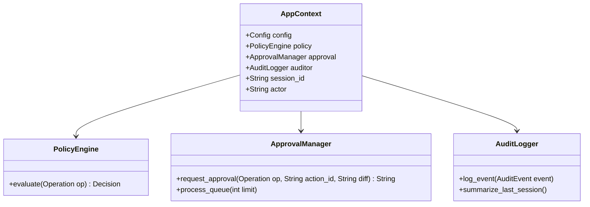
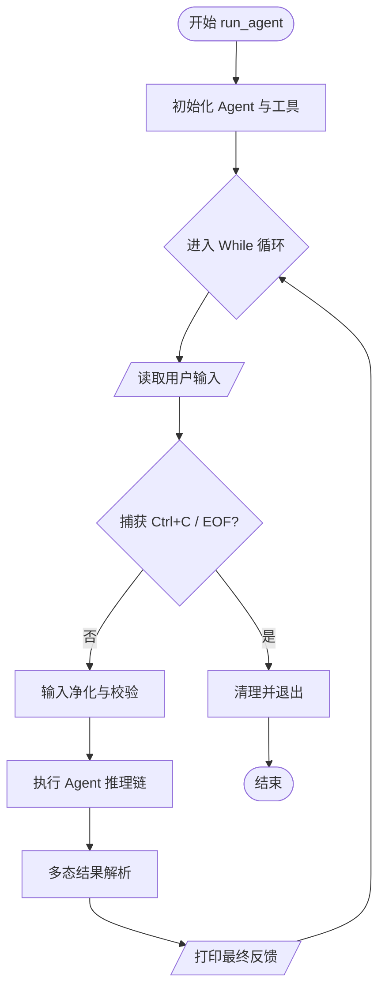
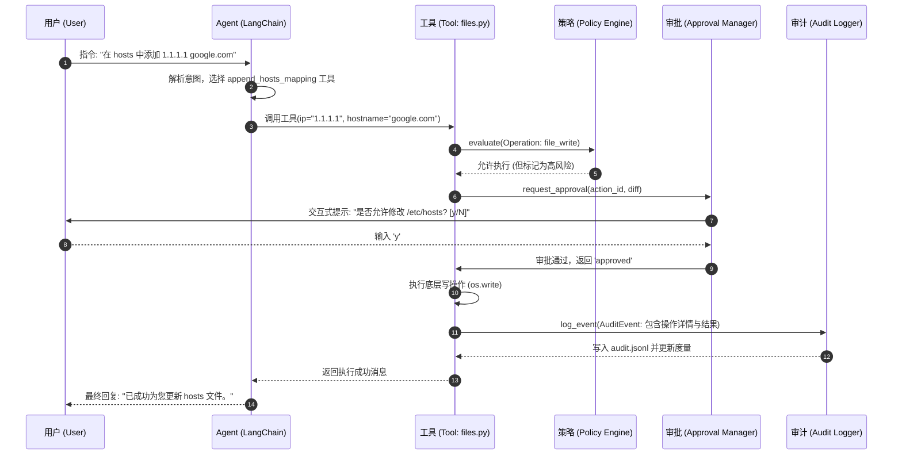
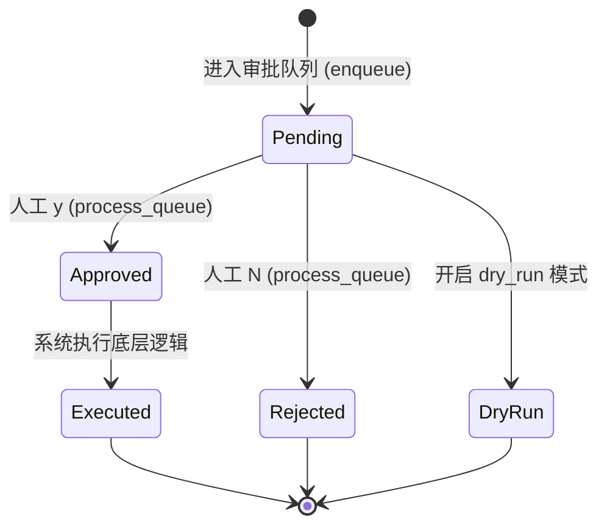

# 工具调度与执行流

## 目录
1. [模块概览](#模块概览)
2. [工具调度设计的核心挑战](#工具调度设计的核心挑战)
3. [核心架构与组件关系](#核心架构与组件关系)
4. [工具注册机制：从函数到 Agent 能力](#工具注册机制从函数到-agent-能力)
   - [LangChain @tool 装饰器的深度应用](#langchain-tool-装饰器的深度应用)
   - [SimpleAgent 适配器模式](#simpleagent-适配器模式)
   - [系统工具的封装艺术](#系统工具的封装艺术)
5. [交互循环：run_agent 的生命周期](#交互循环run_agent-的生命周期)
   - [输入净化：防御不可见字符注入](#输入净化防御不可见字符注入)
   - [交互式 While 循环深度解析](#交互式-while-循环深度解析)
6. [结果处理：解析 LLM 的多态响应](#结果处理解析-llm-的多态响应)
   - [AgentFinish 与中间步骤的解构](#agentfinish-与中间步骤的解构)
   - [健壮的输出提取算法](#健壮的输出提取算法)
7. [执行流与安全架构：四位一体的防护](#执行流与安全架构四位一体的防护)
   - [完整请求-响应序列图](#完整请求-响应序列图)
   - [审批状态机模型](#审批状态机模型)
   - [策略引擎 (Policy) 的前置校验](#策略引擎-policy-的前置校验)
   - [全量审计 (Auditing) 的溯源价值](#全量审计-auditing-的数据价值)
8. [异常处理机制：构建鲁棒的 OS 助手](#异常处理机制构建鲁棒的-os-助手)
9. [核心组件与代码示例](#核心组件与代码示例)
10. [文件参考](#文件参考)

## 模块概览

`oscopilot` 的工具调度与执行流（Tool Scheduling and Execution Flow）是整个系统的中枢神经系统。它不仅负责将用户的自然语言意图转化为具体的可执行动作，还承担着在多变的操作系统环境中维护安全性、一致性和可追溯性的重任。

在传统的 LLM 应用中，工具调用往往是一个简单的“请求-响应”过程。但在 `oscopilot` 面向的操作系统运维场景下，工具调用涉及到高风险的系统变更（如修改 `/etc/hosts`、重启服务等）。因此，该模块的设计超越了简单的接口封装，引入了多层的安全防护与状态管理机制。

**模块统计与覆盖范围**:
- **涉及文件总数**: 20 个 Python 模块，构成了从底层驱动到高层逻辑的完整栈。
- **子模块分布**:
  - `oscopilot/tools/`: 包含 5 个核心工具集（文件、系统信息、服务管理、包管理、MCP 客户端）。
  - `oscopilot/agent_langchain.py`: 负责 Agent 的组装、工具注册逻辑以及主运行循环。
  - `oscopilot/approval.py` & `oscopilot/auditing.py`: 构成安全闭环，负责人工审批流和审计日志记录。
  - `oscopilot/utils.py`: 提供基础的安全净化和标识生成能力。

## 工具调度设计的核心挑战

在设计 `oscopilot` 的调度流时，团队面临着几个关键挑战：
1.  **语义对齐**: 如何确保 LLM 准确理解底层 Python 函数的参数含义和副作用？
2.  **权限控制**: 操作系统中的某些操作是不可逆的，如何在 Agent 执行前进行强制拦截？
3.  **反馈闭环**: 当工具执行失败或产生海量输出时，如何提取最关键的信息反馈给 Agent 进行下一步决策？
4.  **审计合规**: 所有的操作必须是可追溯的，以满足企业级安全审计的要求。

## 核心架构与组件关系

为了支撑复杂的工具调度，`oscopilot` 采用了基于上下文（Context）的组件协作模式。`AppContext` 作为一个容器，持有所有安全组件的实例。

下面的类图展示了 `AppContext` 及其关联的安全组件之间的静态关系：



`AppContext` 是整个系统的生命线。它在 `cli.py` 中被初始化，并贯穿于 Agent 的构建和工具的执行。`PolicyEngine` 负责静态规则校验，`ApprovalManager` 负责动态人工介入，而 `AuditLogger` 则负责记录所有的交互细节。这种设计实现了职责分离，使得我们可以独立地升级安全策略或审计后端。

**Diagram sources**: 
- [oscopilot/context.py](oscopilot/context.py)
- [oscopilot/policy.py](oscopilot/policy.py)
- [oscopilot/approval.py](oscopilot/approval.py)

## 工具注册机制：从函数到 Agent 能力

工具注册是 Agent 能够感知并操作现实世界的起点。`oscopilot` 并没有采用复杂的配置文件，而是通过代码即配置（Code as Config）的方式，利用装饰器模式实现了轻量级的工具定义。

### LangChain @tool 装饰器的深度应用

在 `_build_tools` 函数中，系统通过显式定义的内部函数来封装底层逻辑。`@tool` 装饰器不仅是一个标记，它还负责提取函数的签名和 Docstring，生成符合 OpenAI Tool Calling 规范的 JSON Schema。

```python
def _build_tools(ctx: AppContext):
    @tool("check_cpu_and_top_processes")
    def check_cpu_and_top_processes() -> str:
        """检查 CPU 负载并列出前 5 个高 CPU 进程。
        
        该工具通过 psutil 库获取系统实时负载，能帮助诊断性能瓶颈。
        """
        return system_info.cpu_load_and_top_processes(ctx, limit=5)
```

### SimpleAgent 适配器模式

由于 `create_tool_calling_agent` 返回的 Runnable 对象在某些情况下需要手动维护 `intermediate_steps`（中间步骤），`oscopilot` 引入了一个 `SimpleAgent` 包装类。这种适配器模式屏蔽了底层 LangChain 状态管理的复杂性，使得 `run_agent` 能够以统一的 `invoke` 接口处理各种任务。

**Section sources**:
- [oscopilot/agent_langchain.py](oscopilot/agent_langchain.py)
- [oscopilot/tools/system_info.py](oscopilot/tools/system_info.py)

## 交互循环：run_agent 的生命周期

`run_agent` 是整个程序的入口点，它驱动了用户与系统之间的所有交互。

### 输入净化：防御不可见字符注入

在网络安全领域，提示词注入（Prompt Injection）是一个严峻的威胁。攻击者可能会在输入中嵌入零宽字符（如 `\u200B`）来绕过简单的关键词过滤，或者干扰 LLM 的注意力机制。

`oscopilot/utils.py` 提供的 `ensure_no_invisible` 函数是第一道关卡。它通过正则表达式扫描输入字符串，一旦发现不可见字符即抛出 `InputSanitizationError`。

### 交互式 While 循环深度解析

`run_agent` 的核心是一个无限循环。它不仅负责读取输入，还负责管理会话的生命周期。



在上述流程中，`HandleInterrupt` 的处理尤为重要。通过捕获 `KeyboardInterrupt`，`oscopilot` 确保了即使用户强行中断操作，系统也能优雅地关闭，而不会导致终端回显异常或残留临时文件。

**Diagram sources**: 
- [oscopilot/agent_langchain.py:L114-L152](oscopilot/agent_langchain.py#L114-L152)
- [oscopilot/utils.py:L17-L24](oscopilot/utils.py#L17-L24)

## 结果处理：解析 LLM 的多态响应

LLM 的输出具有不确定性，尤其是在使用 Tool Calling 功能时。Agent 可能会返回一个最终答案，也可能返回一个需要执行的工具调用列表。

### AgentFinish 与中间步骤的解构

在 LangChain 框架中，当 Agent 完成推理后，会返回一个 `AgentFinish` 对象。但在复杂的链式调用中，返回结果可能被封装在 `dict` 或 `list` 中。`run_agent` 实现了一套“剥洋葱”式的提取算法，能够应对各种嵌套深度，确保最终呈现给用户的是简洁明确的 `output`。

**Section sources**:
- [oscopilot/agent_langchain.py](oscopilot/agent_langchain.py)

## 执行流与安全架构：四位一体的防护

`oscopilot` 的执行流不仅是数据的流动，更是信任的传递。

### 完整请求-响应序列图

下面的序列图展示了一个涉及高风险操作（如修改系统文件）的完整生命周期。它体现了 `oscopilot` 如何通过“四位一体”（Agent、Policy、Approval、Auditing）的架构来保障安全。



### 审批状态机模型

对于高风险操作，`ApprovalManager` 维护了一个简单的状态机逻辑，特别是在 `queue` 模式下，操作的生命周期跨越了多个用户会话。



这个状态机确保了高风险操作不会被“静默执行”。即便操作已经入队，它也必须显式地经过 `Approved` 状态才能进入 `Executed`。这种设计为生产环境提供了极高的安全保障。

**Diagram sources**: 
- [oscopilot/approval.py:L24-L30, L61-L186](oscopilot/approval.py#L24-L30)

### 策略引擎 (Policy) 的前置校验

在工具函数（如 `system_info.py`）的起始位置，都会首先构建一个 `Operation` 对象并提交给策略引擎。这种“先授权后执行”的模式确保了即使 Agent 产生了错误的决策，系统也能在执行前将其拦截。

### 全量审计 (Auditing) 的溯源价值

审计模块不仅仅是记录日志。它记录了 `action_id`（全局唯一标识一次操作）、`actor`（操作者）、`session_id` 以及操作前后的 `diff`（如果是文件操作）。这些数据以 JSON Lines 格式存储，为事后溯源提供了坚实的数据基础。

**Section sources**:
- [oscopilot/policy.py](oscopilot/policy.py)
- [oscopilot/auditing.py](oscopilot/auditing.py)

## 异常处理机制：构建鲁棒的 OS 助手

在真实的操作系统中，任何事情都可能出错。`oscopilot` 针对不同层级的异常采取了不同的处理策略：

1.  **工具层异常**: 捕获底层系统调用错误，转化为结构化的 `summary` 反馈给 Agent。
2.  **策略拒绝**: 抛出 `RuntimeError`，由 Agent 捕获并向用户解释原因。
3.  **用户中断**: 捕获 `Ctrl+C`，优雅清理环境并退出循环。

## 核心组件与代码示例

以下是 `run_agent` 中核心交互循环的实现细节，展示了输入处理与结果展示的结合：

```python
# oscopilot/agent_langchain.py

def run_agent(ctx: AppContext, one_shot_prompt: Optional[str] = None) -> None:
    executor = _build_agent(ctx)
    # ...
    while True:
        try:
            text = input("oscopilot> ").strip()
            if not text: continue
            if text.lower() in {"exit", "quit"}: break
            
            # 净化与执行
            text = ensure_no_invisible(text)
            result = executor.invoke({"input": text})
            
            # 结果解析与反馈 (简化逻辑)
            output = result.return_values.get("output") if hasattr(result, "return_values") else str(result)
            print(output)
        except (EOFError, KeyboardInterrupt):
            break
```

## 文件参考

- `oscopilot/agent_langchain.py`: 核心调度逻辑与 Agent 组装。
- `oscopilot/utils.py`: 输入净化与通用工具函数。
- `oscopilot/approval.py`: 人机协作审批流管理。
- `oscopilot/auditing.py`: 全量审计日志记录。
- `oscopilot/tools/system_info.py`: 系统信息查询工具实现。
- `oscopilot/tools/files.py`: 文件读写与安全追加工具实现。
- `oscopilot/policy.py`: 策略评估引擎。
