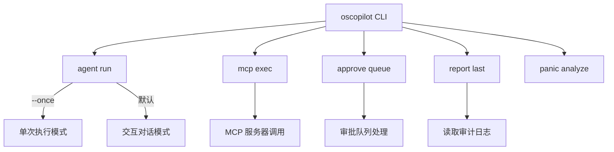
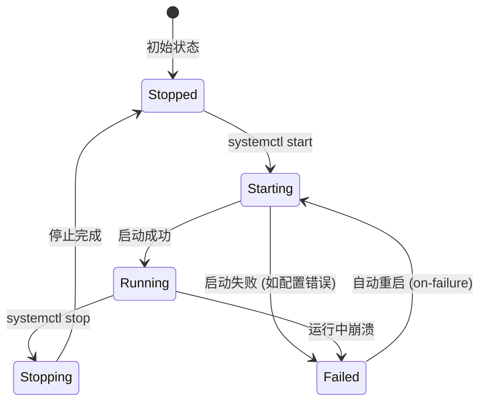
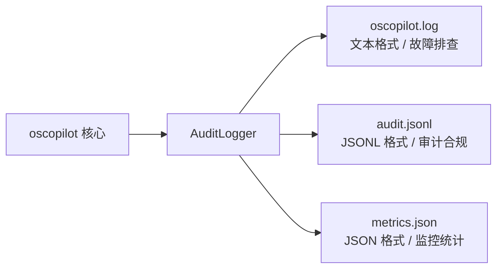
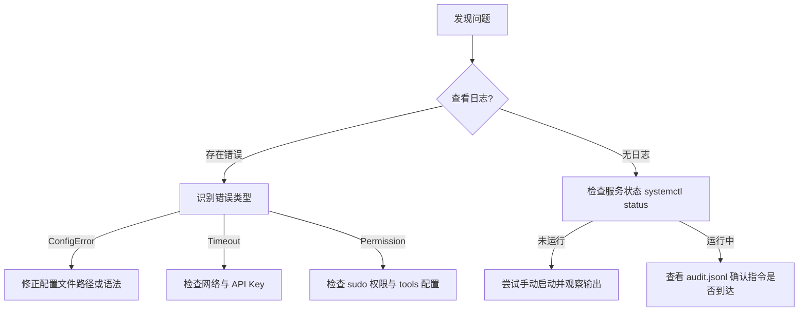

# 部署、运维与 CLI 使用

## 目录
1. [模块概览](#模块概览)
2. [CLI 交互指南](#cli-交互指南)
   - [核心命令与模式](#核心命令与模式)
   - [参数与快捷操作组合](#参数与快捷操作组合)
3. [systemd 服务化部署](#systemd-服务化部署)
   - [服务配置文件详解](#服务配置文件详解)
   - [服务生命周期管理](#服务生命周期管理)
4. [日志管理、审计与监控](#日志管理审计与监控)
   - [日志体系结构](#日志体系结构)
   - [审计日志滚动建议](#审计日志滚动建议)
   - [监控指标对接](#监控指标对接)
5. [故障排查指南](#故障排查指南)
   - [常见连接与配置问题](#常见连接与配置问题)
   - [权限与环境问题](#权限与环境问题)
6. [核心组件分析](#核心组件分析)
7. [文件参考](#文件参考)

## 模块概览

本章节专注于 `oscopilot` 的生产环境部署与日常运维操作。作为一个面向 Linux 操作系统的智能助手，`oscopilot` 不仅提供了丰富的命令行交互能力，还支持通过 systemd 实现后台服务化运行，确保其作为系统级工具的稳定性和可靠性。

在本次代码库探索中，我们识别并分析了以下核心运维相关组件：

- **总文件数**: 20 个 Python 源文件，以及 1 个 systemd 服务单元文件。
- **主要子目录**:
    - `oscopilot/`: 核心逻辑目录，包含 CLI 入口和审计模块。
    - `oscopilot/tools/`: 包含系统管理工具，如 `systemd_tools.py`（虽然主要由 Agent 调用，但也反映了系统交互能力）。
    - `oscopilot/panic/`: 专门用于内核 Panic 分析的子模块。
- **重点覆盖范围**:
    - `oscopilot/cli.py`: CLI 命令定义与分发中心。
    - `oscopilot.service`: systemd 服务单元配置模板。
    - `oscopilot/auditing.py`: 负责生产环境至关重要的审计追踪与日志记录。
    - `oscopilot/config.py`: 定义了部署所需的各项配置参数。

通过本指南，运维人员可以快速掌握如何配置 `oscopilot` 的运行环境，如何通过 CLI 执行诊断任务，以及如何处理运行过程中的常见故障。

## CLI 交互指南

`oscopilot` 的命令行工具基于 `typer` 构建，提供了结构清晰、易于扩展的子命令体系。它支持两种主要的交互模式：**交互式 Agent 模式**和**单次指令模式**。

### 核心命令与模式

CLI 工具的入口为 `oscopilot`（或通过 `python -m oscopilot.cli` 调用）。

#### 1. Agent 运行模式 (`agent run`)
这是最常用的模式，启动一个基于 LangChain 的智能助手，进入交互式对话环境。
- **交互模式**: 直接运行 `oscopilot agent run`，Agent 将等待用户输入自然语言指令。
- **单次指令模式**: 使用 `--once "指令内容"` 参数。在这种模式下，Agent 执行完指定任务后会立即退出，非常适合集成到脚本或自动化流水线中。

#### 2. MCP 工具执行 (`mcp exec`)
直接调用底层 MCP (Model Context Protocol) 服务器提供的诊断工具，绕过 LLM 的自然语言解析，实现高确定性的工具调用。
- 适用于已知故障现象，需要快速获取系统状态（如 CPU、内存、网络连接）的场景。

#### 3. 审批与审计 (`approve`, `report`)
- `approve queue`: 处理积压的操作审批请求。在生产环境中，高风险操作通常需要人工二次确认。
- `report last`: 快速查看上一个会话的执行摘要，包括调用的工具分布和最终结果。

下图展示了 CLI 的命令层级结构与数据流向：



**图表说明**: CLI 作为一个统一的入口，根据子命令将请求分发到不同的功能模块。`agent run` 提供了灵活的交互选择，而 `mcp exec` 和 `panic analyze` 则提供了更具针对性的专业工具。

### 参数与快捷操作组合

为了提高运维效率，建议掌握以下常用的参数组合：

| 任务场景 | 推荐命令组合 | 说明 |
| :--- | :--- | :--- |
| **快速系统诊断** | `oscopilot agent run --once "检查当前系统负载和异常进程"` | 快速获取系统状态报告并退出 |
| **执行特定 MCP 工具** | `oscopilot mcp exec sysom_mcp get_system_load '{}'` | 直接调用底层工具获取结构化 JSON 结果 |
| **批量处理审批** | `oscopilot approve queue --limit 5` | 一次性处理最近的 5 条待审批记录 |
| **内核故障分析** | `oscopilot panic analyze /var/crash/vmcore /usr/lib/debug/vmlinux` | 利用 LLM 分析内核崩溃转储文件 |
| **调试配置加载** | `oscopilot agent run --config ./my_config.yaml` | 使用自定义配置文件启动，不影响全局配置 |

**代码示例：CLI 命令定义片段**
```python
# oscopilot/cli.py

@agent_app.command("run")
def agent_run(
    config: Optional[str] = typer.Option(None, "--config", help="配置文件路径 (YAML)"),
    once: Optional[str] = typer.Option(None, "--once", help="一次性指令，不进入交互"),
):
    """启动基于 LangChain 的 Agent。"""
    from .agent_langchain import run_agent
    ctx = _load_app_context(config)
    run_agent(ctx, one_shot_prompt=once)
```

**Section sources**:
- [oscopilot/cli.py](oscopilot/cli.py)

## systemd 服务化部署

在生产环境中，通常需要将 `oscopilot` 作为后台服务运行，以便实现开机自启和异常自动重启。

### 服务配置文件详解

项目根目录提供的 `oscopilot.service` 是一个标准的 systemd 单元文件模板。

```ini
[Unit]
Description=Oscopilot Linux OS Copilot Agent
After=network.target

[Service]
Type=simple
# 建议以用户服务运行，将本 unit 放在 ~/.config/systemd/user/oscopilot.service
ExecStart=/usr/bin/env oscopilot agent run --config /etc/oscopilot/config.yaml
WorkingDirectory=/etc/oscopilot
Restart=on-failure

[Install]
WantedBy=default.target
```

**关键配置项说明**:
- `ExecStart`: 指定启动命令。通过 `/usr/bin/env` 确保能够找到 Python 环境中的 `oscopilot` 可执行文件。
- `WorkingDirectory`: 设置工作目录，通常建议与配置文件所在目录一致，方便管理相对路径的日志文件。
- `Restart=on-failure`: 当程序非正常退出（退出码非 0）时，systemd 会自动尝试重启服务。

### 服务生命周期管理

运维人员可以使用标准的 `systemctl` 命令来管理 `oscopilot` 服务。



**图表说明**: 该状态机描述了 `oscopilot` 服务在 systemd 管理下的典型生命周期。重点在于 `Failed` 到 `Starting` 的自动转换，这由 `Restart=on-failure` 策略驱动，确保了服务的高可用性。

**部署步骤建议**:
1. 将配置文件放置在 `/etc/oscopilot/config.yaml`。
2. 拷贝 `oscopilot.service` 到 `/etc/systemd/system/` 或 `~/.config/systemd/user/`。
3. 执行 `systemctl daemon-reload` 重新加载配置。
4. 执行 `systemctl enable --now oscopilot` 启动并设置开机自启。

**Section sources**:
- [oscopilot.service](oscopilot.service)
- [oscopilot/config.py](oscopilot/config.py)

## 日志管理、审计与监控

对于运维人员来说，了解系统的运行状况和历史操作至关重要。`oscopilot` 提供了一套完整的审计与日志体系。

### 日志体系结构

`oscopilot` 的日志由 `AuditLogger` 模块统一管理，默认输出到三个不同的文件：

1. **运行日志 (`oscopilot.log`)**: 标准的文本日志，记录程序运行过程中的调试信息、错误警告和关键事件。
2. **审计日志 (`audit.jsonl`)**: 核心审计追踪文件，采用 JSON Lines 格式。每条记录包含时间戳、操作人、会话 ID、调用的工具、参数、执行结果摘要以及策略决策结果。
3. **指标日志 (`metrics.json`)**: 记录工具调用的频率统计，可用于性能分析和使用趋势观察。



**图表说明**: `AuditLogger` 是所有日志产出的中枢。通过将不同用途的数据分流到不同的文件，既保证了故障排查的便捷性，也满足了结构化数据处理的需求。

### 审计日志滚动建议

由于 `oscopilot` 的 `AuditLogger` 使用了标准的 `logging.FileHandler`（见 `oscopilot/auditing.py`），它本身不具备日志滚动（Rotation）功能。如果审计日志增长过快，建议配合 Linux 的 `logrotate` 工具使用。

**logrotate 配置示例 (`/etc/logrotate.d/oscopilot`)**:
```text
/etc/oscopilot/logs/*.log
/etc/oscopilot/logs/*.jsonl
{
    daily
    rotate 7
    missingok
    notifempty
    compress
    delaycompress
    postrotate
        /usr/bin/systemctl kill -s HUP oscopilot.service
    endscript
}
```

### 监控指标对接

`metrics.json` 文件提供了工具调用的实时统计。运维人员可以编写简单的脚本定期读取该文件，并将其推送到 Prometheus 推送网关（Pushgateway）或 Zabbix 等监控系统。

**代码示例：审计记录的结构**
```python
# oscopilot/auditing.py

@dataclass
class AuditEvent:
    timestamp: str      # ISO 8601 时间戳
    actor: str          # 操作主体 (如 oscopilot)
    session_id: str     # 会话唯一标识
    action_id: str      # 单次操作唯一标识
    tool: str           # 调用的工具名
    args: Dict[str, Any] # 调用参数
    result_summary: str = "" # 结果简述
    policy_decision: Optional[str] = None # 策略决策 (allow/deny)
```

**Section sources**:
- [oscopilot/auditing.py](oscopilot/auditing.py)
- [oscopilot/config.py](oscopilot/config.py)

## 故障排查指南

在部署和使用过程中，可能会遇到各种环境或配置问题。以下是常见问题的排查思路。

### 常见连接与配置问题

1. **LLM API 连接超时**:
   - **现象**: Agent 启动后无响应，或日志中出现 `ConnectTimeout`。
   - **解决**: 检查 `config.yaml` 中的 `base_url` 是否正确，确认服务器能否访问该地址。如果是内网环境，需检查代理设置。
   - **验证**: 使用 `curl -v <base_url>` 手动测试连通性。

2. **配置文件未找到**:
   - **现象**: 启动报错 `ConfigError: 未找到配置文件`。
   - **解决**: `oscopilot` 默认查找 `/etc/oscopilot/config.yaml` 和 `~/.config/oscopilot/config.yaml`。请确保文件存在且权限正确。

### 权限与环境问题

1. **执行高风险操作权限不足**:
   - **现象**: 工具调用返回 `Permission denied`。
   - **解决**: 检查 `config.yaml` 中的 `tools.use_sudo` 配置。如果开启了 sudo，确保运行 `oscopilot` 的用户在 `/etc/sudoers` 中有相应的免密权限。

2. **MCP 服务器启动失败**:
   - **现象**: 调用 MCP 工具时报错。
   - **解决**: 检查 `mcp.servers` 配置中的 `command` 和 `args`。确保对应的可执行程序（如 `uv`）已安装且在 PATH 中。

下图提供了一个简单的故障排查决策树：



**图表说明**: 故障排查应始终从日志开始。通过区分配置、网络和权限三类常见错误，运维人员可以快速定位问题根因。如果服务运行正常但功能失效，则需要深入审计日志查看指令的执行细节。

**Section sources**:
- [oscopilot/cli.py](oscopilot/cli.py)
- [oscopilot/config.py](oscopilot/config.py)
- [oscopilot/utils.py](oscopilot/utils.py)

## 核心组件分析

在运维视角下，以下组件的实现细节决定了系统的可维护性：

- **`AppConfig` (config.py)**: 采用 Python `dataclasses` 实现，支持强类型校验。它将配置分为 LLM、策略、审计、审批、MCP 和工具六大模块，这种模块化设计使得运维人员可以针对性地调整特定功能的行为（例如只关闭审批流，而不影响审计记录）。
- **`AuditLogger` (auditing.py)**: 虽然实现简单，但它通过 JSON Lines 格式保证了日志的“追加写”特性，即使在程序意外崩溃时，已写入的审计记录也不会损坏。
- **`typer` CLI 框架 (cli.py)**: 提供了自动化的帮助文档生成（`--help`），降低了运维人员的学习成本。

## 文件参考

以下是本章节涉及的关键源文件，建议在进行深度运维定制前阅读：

- `oscopilot/cli.py`: 命令行入口与参数定义。
- `oscopilot.service`: systemd 服务单元模板。
- `oscopilot/auditing.py`: 审计日志与指标记录逻辑。
- `oscopilot/config.py`: 配置加载与校验逻辑。
- `oscopilot/context.py`: 运行时上下文构建，连接了配置、审计与策略引擎。
- `oscopilot/utils.py`: 包含安全校验（如不可见字符检查）等工具函数。
- `examples/config.example.yaml`: 生产环境配置参考模板。
