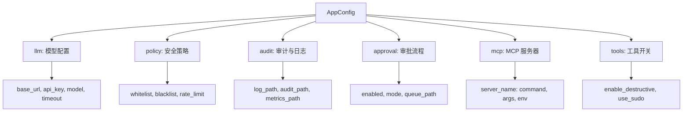
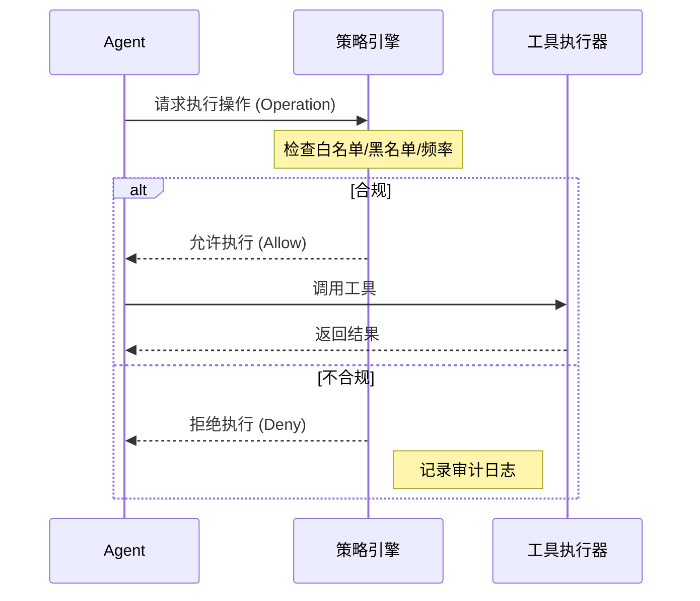
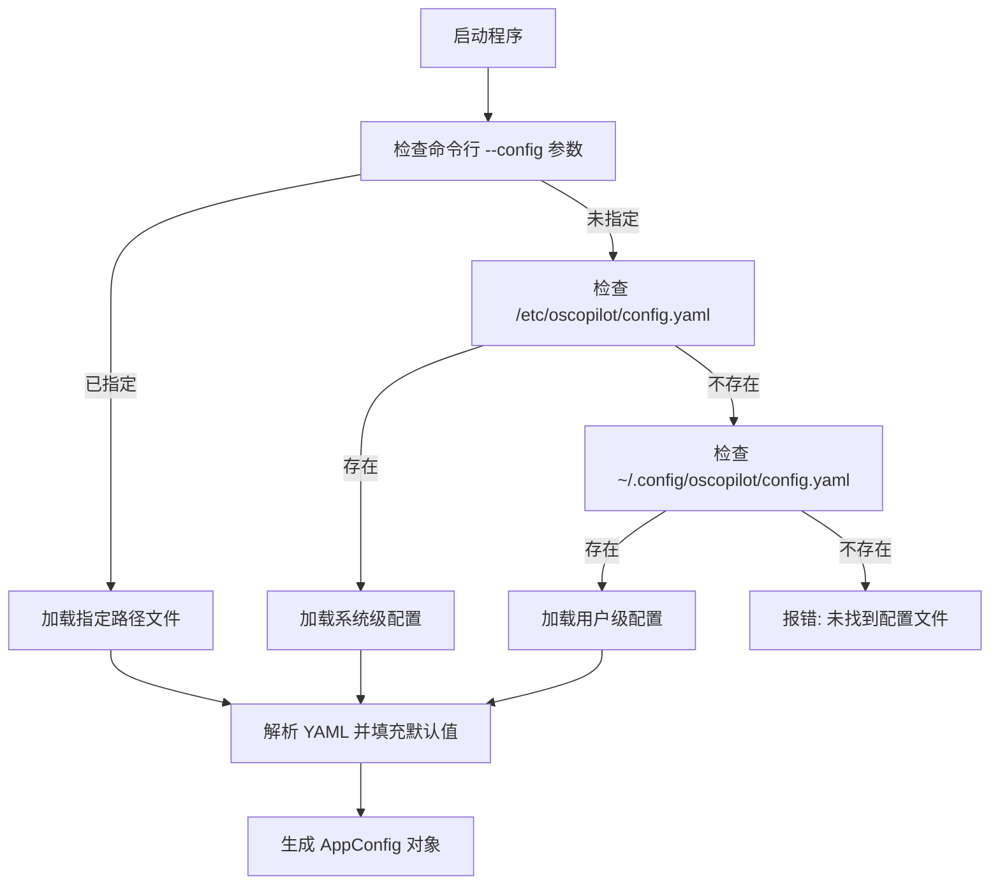

# 配置与环境管理

## 目录
1. [模块概览](#模块概览)
2. [简介](#简介)
3. [配置文件结构](#配置文件结构)
4. [核心组件](#核心组件)
5. [模型配置](#模型配置)
6. [安全策略与工具管理](#安全策略与工具管理)
7. [路径与日志配置](#路径与日志配置)
8. [配置加载流程](#配置加载流程)
9. [环境变量支持](#环境变量支持)
10. [完整配置示例](#完整配置示例)
11. [文件引用](#文件引用)

## 模块概览

本章节涵盖了 oscopilot 的配置体系，这是确保 Agent 在 Linux 系统中安全、高效运行的基础。通过对配置系统的深入理解，用户可以精确控制 Agent 的模型选择、安全边界、审批流程以及工具集的可用性。

- **发现文件总数**: 2 个核心配置文件
- **涉及子模块**: 
    - `oscopilot/config.py`: 配置解析与数据结构定义（深度覆盖）
    - `examples/config.example.yaml`: 配置文件模板与示例（深度覆盖）
- **覆盖范围**: 本文将详细解析配置文件的层级结构、各配置项的含义及其默认值，并探讨配置加载的优先级与环境变量的交互。

## 简介

oscopilot 的配置系统旨在提供灵活且安全的 Agent 行为定制能力。作为一个运行在操作系统层面的 AI 助手，oscopilot 需要在强大的自动化能力与严格的安全约束之间取得平衡。配置系统正是实现这一平衡的关键中枢。

该模块的主要职责包括：
1. **统一配置管理**：通过 YAML 文件集中定义模型参数、安全策略、审计路径等。
2. **多层级加载**：支持从系统级（`/etc`）、用户级（`~/.config`）或命令行指定的路径加载配置。
3. **类型安全**：利用 Python 的 `dataclasses` 提供强类型的配置对象，减少运行时错误。
4. **安全约束**：定义命令白名单、正则校验和操作频率限制，确保 Agent 行为可控。

通过合理的配置，用户可以将 oscopilot 部署为纯交互式的诊断工具，也可以将其配置为受限的自动化运维助手。

## 配置文件结构

oscopilot 使用 YAML 格式进行配置。配置文件被划分为几个逻辑块，每个块对应 Agent 的一个核心功能区域。

下面的图示展示了配置文件的逻辑层级结构：



该结构保证了配置的模块化。例如，如果你只想更换底层模型，只需修改 `llm` 部分；如果你需要调整安全强度，则重点关注 `policy` 和 `approval` 部分。

**Section sources**:
- [config.py](oscopilot/config.py)
- [config.example.yaml](examples/config.example.yaml)

## 核心组件

配置系统的核心实现在 `oscopilot/config.py` 中，它定义了配置的数据模型和加载逻辑。

### AppConfig 类

`AppConfig` 是整个配置体系的根节点，它聚合了所有子配置项。

```python
@dataclass
class AppConfig:
    llm: LLMConfig
    policy: PolicyConfig = field(default_factory=PolicyConfig)
    audit: AuditConfig = field(default_factory=AuditConfig)
    approval: ApprovalConfig = field(default_factory=ApprovalConfig)
    mcp: MCPConfig = field(default_factory=MCPConfig)
    tools: ToolsConfig = field(default_factory=ToolsConfig)
```

### 配置加载函数

`load_config` 函数负责将 YAML 内容转换为 `AppConfig` 实例。它包含了一套默认值逻辑，确保即使配置文件中缺失某些项，系统也能正常启动。

```python
def load_config(path: Optional[str] = None) -> AppConfig:
    # ... 路径查找逻辑 ...
    raw = _load_yaml(cfg_path)
    
    # 手动解析并填充默认值
    llm_raw = raw.get("llm") or {}
    llm = LLMConfig(
        base_url=str(llm_raw.get("base_url", "https://api.openai.com/v1")),
        api_key=str(llm_raw.get("api_key", "")),
        model=str(llm_raw.get("model", "gpt-4o")),
        timeout=int(llm_raw.get("timeout", 30)),
    )
    # ... 其他子配置解析 ...
```

这种手动解析的方式虽然比自动化的库（如 Pydantic）稍显繁琐，但它提供了极高的灵活性，可以在解析过程中进行复杂的类型转换和默认值注入。

**Section sources**:
- [config.py:L70-L77](oscopilot/config.py#L70-L77)
- [config.py:L105-L179](oscopilot/config.py#L105-L179)

## 模型配置

`llm` 部分定义了 Agent 与大语言模型（LLM）交互的参数。oscopilot 兼容 OpenAI API 格式，因此支持包括 OpenAI 官方接口、Azure OpenAI 以及各种国产大模型或私有部署模型（如 vLLM, Ollama）。

| 配置项 | 类型 | 默认值 | 含义 |
| :--- | :--- | :--- | :--- |
| `base_url` | string | `https://api.openai.com/v1` | API 基础地址 |
| `api_key` | string | `""` | 鉴权令牌 |
| `model` | string | `gpt-4o` | 使用的模型名称 |
| `timeout` | int | `30` | 请求超时时间（秒） |

> 💡 **提示**：如果使用本地模型（如 Ollama），请将 `base_url` 设置为本地地址（例如 `http://localhost:11434/v1`），并将 `model` 设置为对应的模型名。

**Section sources**:
- [config.py:L17-L21](oscopilot/config.py#L17-L21)

## 安全策略与工具管理

这是 oscopilot 最具特色的配置部分，直接决定了 Agent 的安全边界。

### 策略配置 (Policy)

策略引擎通过白名单和黑名单机制过滤 LLM 生成的命令。

- `whitelist_commands`: 显式允许执行的工具函数名。
- `blacklist_patterns`: 禁止执行的命令字符串模式（支持正则），例如 `rm -rf /`。
- `parameter_regex`: 对特定参数进行正则校验，防止命令注入。
- `max_operations_per_minute`: 频率限制，防止 Agent 陷入死循环或被恶意利用。

### 工具管理 (Tools)

控制工具集的整体行为。

- `enable_destructive_tools`: 是否允许执行具有破坏性的工具（如文件删除、服务停止）。
- `allowed_write_tools`: 允许执行的写操作工具列表。
- `use_sudo`: Agent 执行系统命令时是否默认使用 `sudo` 权限。

下面的时序图展示了策略引擎如何拦截不合规的操作：



在上述流程中，策略引擎充当了“安全卫士”的角色。每当 Agent 尝试调用一个工具时，策略引擎都会根据配置文件中的规则进行评估。如果操作被拒绝，Agent 将收到一个错误反馈，并通常会尝试寻找其他合规的路径来解决问题。

**Section sources**:
- [config.py:L25-L30](oscopilot/config.py#L25-L30)
- [config.py:L63-L67](oscopilot/config.py#L63-L67)

## 路径与日志配置

oscopilot 的运行过程是高度可追溯的。

- **运行日志 (`log_path`)**: 记录 Agent 的内部运行状态和异常信息。
- **审计日志 (`audit_path`)**: 采用 JSONL 格式记录每一次工具调用的详细参数、执行结果及策略决策。这是进行事后复盘和安全合规检查的核心数据。
- **指标数据 (`metrics_path`)**: 记录 Token 消耗、执行时长等性能指标。
- **审批队列 (`queue_path`)**: 在非交互模式下，待审批的操作会暂存在此文件中。

**Section sources**:
- [config.py:L33-L36](oscopilot/config.py#L33-L36)

## 配置加载流程

oscopilot 遵循“约定优于配置”的原则，会自动在标准路径下寻找配置文件。



配置加载的优先级顺序为：
1. 命令行参数 `--config`
2. 系统级路径 `/etc/oscopilot/config.yaml`
3. 用户级路径 `~/.config/oscopilot/config.yaml`

这种设计既方便了多用户环境下的配置隔离，也支持通过系统管理工具（如 Ansible）进行统一分发。

**Section sources**:
- [config.py:L95-L116](oscopilot/config.py#L95-L116)

## 环境变量支持

虽然 oscopilot 主要依赖 YAML 文件进行配置，但为了方便集成和安全性，部分敏感信息支持通过环境变量间接覆盖。

1. **API Key 覆盖**: 如果 YAML 中的 `api_key` 为空，底层的 LangChain/OpenAI SDK 通常会尝试读取 `OPENAI_API_KEY` 环境变量。
2. **HOME 目录**: 配置文件查找逻辑依赖 `HOME` 环境变量来定位用户级配置目录。

> ⚠️ **安全建议**：在生产环境中，建议通过环境变量传递 `api_key`，或者确保配置文件的权限为 `600`（仅当前用户可读），以防密钥泄露。

## 完整配置示例

以下是一个典型的配置文件示例，展示了如何配置一个具备基础安全防护的诊断 Agent。

```yaml
llm:
  base_url: "https://api.openai.com/v1"
  api_key: "sk-your-token-here"
  model: "gpt-4o"
  timeout: 30

policy:
  whitelist_commands:
    - "systemctl_status"
    - "systemctl_start"
    - "pkg_search"
  blacklist_patterns:
    - "rm -rf /"
  max_operations_per_minute: 20

audit:
  log_path: "./logs/oscopilot.log"
  audit_path: "./logs/audit.jsonl"

approval:
  enabled: true
  mode: "interactive" # 每次高风险操作都会在终端询问用户

tools:
  enable_destructive_tools: false
  use_sudo: false
```

## 文件引用

以下是本文档参考的核心源代码文件：

- [oscopilot/config.py](oscopilot/config.py): 配置类定义与加载逻辑。
- [examples/config.example.yaml](examples/config.example.yaml): 官方提供的配置模板。
- [oscopilot/cli.py](oscopilot/cli.py): 命令行入口，负责调用配置加载函数。
- [oscopilot/agent_langchain.py](oscopilot/agent_langchain.py): 展示了如何将配置应用于 LLM 和工具初始化。
