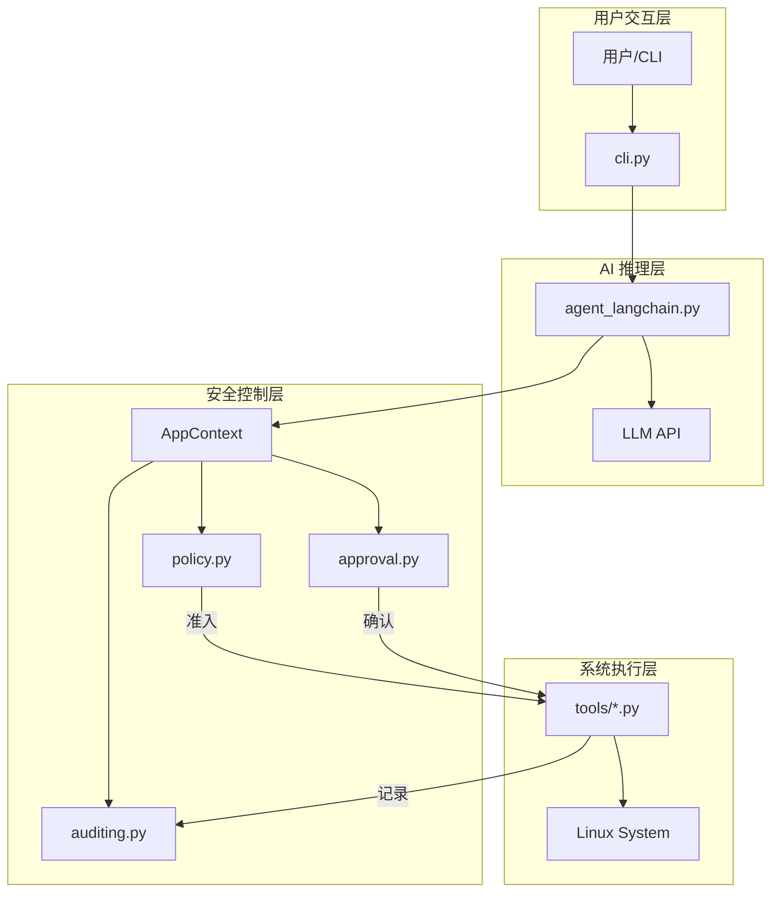
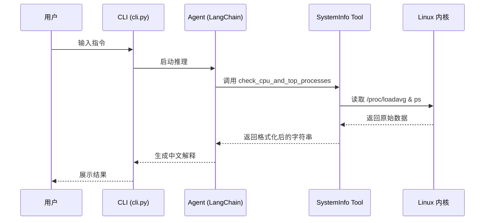

# 项目简介与快速入门

## 目录
1. [项目简介](#项目简介)
2. [模块概览](#模块概览)
3. [核心特性与安全理念](#核心特性与安全理念)
4. [架构设计](#架构设计)
5. [核心组件分析](#核心组件分析)
6. [环境准备](#环境准备)
7. [快速开始](#快速开始)
8. [关键文件索引](#关键文件索引)

## 项目简介

`oscopilot` 是一个专为 Linux 系统运维设计的 AI 驱动助手（Agent）。在现代数据中心和云原生环境中，Linux 系统的运维复杂度日益增加，从基础的资源监控、日志排查到复杂的内核故障分析，运维人员往往需要面对海量的工具和繁琐的操作流程。`oscopilot` 的初衷是利用大语言模型（LLM）的推理能力，结合一套严密的安全性框架，为运维人员提供一个既智能又安全的“副驾驶”。

作为一个最小可用版本（MVP），`oscopilot` 聚焦于以下核心目标：
- **智能诊断**：通过自然语言交互，自动调用系统工具（如 `psutil`、`systemd` 等）获取系统状态并进行智能分析。
- **安全可控**：在 AI 代理执行任何可能改变系统状态的操作时，强制引入策略校验（Policy）和人机审批（Approval）机制。
- **透明审计**：记录所有 AI 执行的指令、输出结果以及审批过程，确保运维行为可追溯。
- **可扩展性**：支持通过 MCP（Model Context Protocol）协议集成外部诊断工具，如 SysOM 等内核分析套件。

`oscopilot` 不仅仅是一个简单的 LLM 封装，它更像是一个运行在 Linux 上的“安全沙箱”，在赋予 AI 执行权限的同时，通过白名单、黑名单、Diff 预览和审计日志等手段，将风险控制在可接受的范围内。

## 模块概览

在开始深入了解 `oscopilot` 之前，我们先通过对源码树的扫描来评估其规模和覆盖范围。

### 代码规模与结构
通过对项目根目录的扫描，我们发现 `oscopilot` 是一个典型的 Python 工程，其核心逻辑集中在 `oscopilot/` 目录下。

- **总文件数**：约 20 个 Python 源代码文件。
- **主要子模块**：
    - `oscopilot/tools/`：封装了具体的系统操作工具，包括文件处理、包管理、系统信息采集等。
    - `oscopilot/panic/`：专注于内核 Panic 分析的专门模块，集成了 vmcore 解析和 LLM 诊断逻辑。
    - `oscopilot/` 根目录：包含 Agent 逻辑、策略引擎、审计系统、审批流以及 CLI 入口。

### 覆盖范围说明
本章节将深入覆盖以下内容：
- 项目根目录的配置与安装流程（`pyproject.toml`, `README.md`）。
- 核心框架层（`context.py`, `policy.py`, `auditing.py`, `approval.py`）。
- CLI 交互入口（`cli.py`）。
- 基础工具集（`tools/system_info.py`, `tools/files.py`）。

对于 `panic/` 模块和 `mcp_client.py` 等高级扩展功能，本章将进行宏观介绍，具体的实现细节将在后续章节中展开。

## 核心特性与安全理念

安全性是 `oscopilot` 的生命线。在 AI 运维领域，最令人担心的是 AI 在没有人工干预的情况下执行了破坏性操作（如 `rm -rf /`）。因此，`oscopilot` 建立了一套多层防御体系。

### 1. 严禁 YOLO 模式
`oscopilot` 在设计上明确拒绝了“自动批准”（Auto-approve）模式。对于任何涉及系统变更的操作，系统必须经过策略引擎的评估和人工的显式确认。这种“人机协同”的模式确保了 AI 是助手的角色，而最终的控制权始终掌握在人类运维人员手中。

### 2. 变更操作的 Diff 预览
对于文件写入等高风险操作，`oscopilot` 会生成统一的 Diff 预览。在执行写入之前，用户可以清晰地看到即将发生的变更。
- **Diff 生成**：使用 `difflib` 生成标准 Diff 格式。
- **哈希审计**：为了防止审计日志被篡改，系统会计算 Diff 的 SHA256 哈希值并记录在审计日志中。

### 3. 策略引擎（Policy Engine）
策略引擎是 `oscopilot` 的第一道防线。它通过配置化的方式定义了 AI 的行为边界：
- **指令白名单**：仅允许执行预定义的命令别名，如 `systemctl_start`。
- **模式黑名单**：通过正则表达式拦截高危字符串，如 `rm -rf` 或 fork 炸弹。
- **参数约束**：限制命令参数的格式，例如包名必须符合特定的命名规范。

### 4. 输入净化与防御
为了应对“提示词注入”（Prompt Injection）攻击，`oscopilot` 在 `utils.py` 中实现了零宽字符防御（Zero-width characters defense），确保所有来自 LLM 或用户的输入在进入系统执行前都经过了净化处理。

## 架构设计

`oscopilot` 采用了分层架构设计，将 AI 推理层与系统执行层完全解耦，并在中间插入了安全控制层。

### 组件交互流程

下图展示了用户发起一个指令后，`oscopilot` 内部各组件的协作流程：



**架构解析**：
1. **用户交互层**：用户通过 `oscopilot` CLI 输入自然语言指令。
2. **AI 推理层**：`agent_langchain.py` 将指令发送给 LLM，LLM 根据可用的工具列表返回需要调用的工具及其参数。
3. **安全控制层**：这是核心所在。`AppContext` 作为一个聚合容器，持有 `Policy`、`Approval` 和 `Auditor` 的实例。在工具执行前，`Policy` 检查操作是否合规；如果涉及变更，`Approval` 模块会阻塞执行并请求用户确认。
4. **系统执行层**：只有通过安全检查的操作才会最终在 Linux 系统上执行，执行结果（包括 stdout/stderr）会实时反馈给 AI 并记录到审计日志中。

**Diagram sources**:
- [oscopilot/cli.py](oscopilot/cli.py)
- [oscopilot/context.py](oscopilot/context.py)
- [oscopilot/agent_langchain.py](oscopilot/agent_langchain.py)

## 核心组件分析

在 `oscopilot` 的代码实现中，有几个关键类定义了系统的行为逻辑。

### 1. AppContext：全局上下文
`AppContext` 是整个应用的“神经中枢”，它在 `oscopilot/context.py` 中定义，负责持有配置信息和各个安全模块的单例。

```python
@dataclass
class AppContext:
    config: AppConfig
    auditor: AuditLogger
    policy: PolicyEngine
    approval: ApprovalManager
    actor: str
    session_id: str
```
通过 `build_app_context` 函数，系统会根据配置文件初始化这些组件，并生成唯一的 `session_id` 用于追踪本次会话的所有行为。

### 2. PolicyEngine：准入控制
策略引擎在 `oscopilot/policy.py` 中实现。它根据 `whitelist_commands` 和 `blacklist_patterns` 来决定一个操作是否被允许。

```python
def evaluate(self, op: Operation) -> Decision:
    # 1. 检查黑名单模式
    for pattern in self.config.blacklist_patterns:
        if re.search(pattern, str(op.args)):
            return Decision(allowed=False, reason=f"匹配黑名单模式: {pattern}")
    
    # 2. 检查白名单指令
    if op.name not in self.config.whitelist_commands:
        return Decision(allowed=False, reason=f"指令 {op.name} 不在白名单中")
        
    return Decision(allowed=True, requires_approval=True)
```
这种设计允许管理员通过简单的 YAML 配置来调整 Agent 的权限范围，而无需修改代码。

### 3. ApprovalManager：人机审批
审批模块支持两种模式：`interactive`（实时交互）和 `queue`（异步队列）。在 `interactive` 模式下，系统会直接在终端打印 Diff 并等待用户输入 `y`。

```python
def request_approval(self, detail: str) -> bool:
    if self.config.mode == "interactive":
        print(f"\n{self.config.prompt_prefix}")
        print(detail)
        choice = input("是否执行? (y/n): ").strip().lower()
        return choice in ("y", "yes")
    # ... queue 模式逻辑
```

**核心组件源码引用**:
- [oscopilot/context.py](oscopilot/context.py)
- [oscopilot/policy.py](oscopilot/policy.py)
- [oscopilot/approval.py](oscopilot/approval.py)

## 环境准备

在部署 `oscopilot` 之前，请确保您的环境满足以下要求。

### 操作系统要求
- **推荐发行版**：Ubuntu 20.04+、Debian 11+、CentOS 7+ 或 RHEL 8+。
- **权限建议**：虽然 `oscopilot` 可以以 root 身份运行，但为了安全起见，**强烈建议**以普通用户身份运行，并仅在必要时通过配置开启 `use_sudo`。

### 软件依赖
- **Python 版本**：Python 3.10 或更高版本。
- **核心依赖库**：
    - `typer`：用于构建强大的 CLI 界面。
    - `langchain` & `langchain-openai`：处理与 LLM 的交互及工具绑定。
    - `psutil`：用于获取系统 CPU、内存等监控指标。
    - `pyyaml`：解析配置文件。

### LLM API 配置
您需要一个兼容 OpenAI 接口的 LLM 服务。可以是 OpenAI 官方服务，也可以是本地部署的兼容接口（如 Ollama 或 vLLM）。您需要准备好：
- `API Key`
- `Base URL`（如果使用非官方接口）
- `Model Name`（推荐使用具有较强推理能力的模型，如 `gpt-4o`）

## 快速开始

本节将引导您在本地环境完成 `oscopilot` 的安装与首次运行。

### 第一步：安装包
首先克隆仓库并使用 `pip` 进行安装。推荐使用开发模式安装，以便随时修改配置。

```bash
cd os-copilot-agent
pip install -e .
```

安装完成后，您可以通过 `oscopilot --help` 验证是否安装成功。

### 第二步：初始化配置
`oscopilot` 默认会从 `/etc/oscopilot/config.yaml` 或 `~/.config/oscopilot/config.yaml` 读取配置。

```bash
mkdir -p ~/.config/oscopilot
cp examples/config.example.yaml ~/.config/oscopilot/config.yaml
chmod 600 ~/.config/oscopilot/config.yaml
```

编辑配置文件，填入您的 LLM 信息：

```yaml
llm:
  api_key: "your-api-key-here"
  model: "gpt-4o"
  base_url: "https://api.openai.com/v1"

policy:
  whitelist_commands: ["check_cpu", "append_hosts"]
```

### 第三步：运行第一个指令（Hello World）
现在，您可以尝试让 `oscopilot` 帮您检查系统状态。这是一个只读操作，通常不需要特殊权限。

```bash
oscopilot agent run --once "检查当前系统的 CPU 负载，并告诉我占用最高的前三个进程是什么。"
```

**预期输出流向**：



在上述流程中，`SystemInfo Tool` 会调用 `psutil` 库来安全地获取数据。由于这是一个查询操作，策略引擎通常会直接放行，且不需要人工审批。

**Quick Start 源码引用**:
- [pyproject.toml](pyproject.toml)
- [oscopilot/cli.py](oscopilot/cli.py)
- [oscopilot/tools/system_info.py](oscopilot/tools/system_info.py)

## 关键文件索引

为了方便后续深入研究，下表列出了本项目中最关键的源文件及其职责。

| 文件路径 | 核心职责 | 关键类/函数 |
| :--- | :--- | :--- |
| `oscopilot/cli.py` | CLI 命令分发与用户输入净化 | `main()`, `agent_run()` |
| `oscopilot/config.py` | YAML 配置解析与数据类定义 | `AppConfig`, `load_config()` |
| `oscopilot/context.py` | 应用上下文管理，连接各个安全模块 | `AppContext`, `build_app_context()` |
| `oscopilot/agent_langchain.py` | LangChain Agent 封装与工具绑定 | `run_agent()`, `_build_tools()` |
| `oscopilot/policy.py` | 基于白名单和正则的策略评估引擎 | `PolicyEngine`, `evaluate()` |
| `oscopilot/auditing.py` | JSON Lines 格式的审计日志记录 | `AuditLogger`, `log_event()` |
| `oscopilot/approval.py` | 交互式与队列式的人机审批流 | `ApprovalManager`, `request_approval()` |
| `oscopilot/tools/files.py` | 带 Diff 预览和审批的安全文件操作 | `append_line_with_approval()` |
| `oscopilot/tools/system_info.py` | 基于 psutil 的系统指标采集 | `cpu_load_and_top_processes()` |
| `pyproject.toml` | 项目元数据与依赖管理 | `[project.scripts]` |

**Section sources**:
- [oscopilot/cli.py](oscopilot/cli.py)
- [oscopilot/config.py](oscopilot/config.py)
- [oscopilot/context.py](oscopilot/context.py)
- [oscopilot/agent_langchain.py](oscopilot/agent_langchain.py)
- [oscopilot/policy.py](oscopilot/policy.py)
- [oscopilot/auditing.py](oscopilot/auditing.py)
- [oscopilot/approval.py](oscopilot/approval.py)
- [oscopilot/tools/files.py](oscopilot/tools/files.py)
- [oscopilot/tools/system_info.py](oscopilot/tools/system_info.py)
- [pyproject.toml](pyproject.toml)
